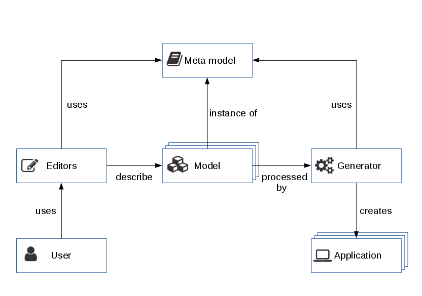

# Introduction

## About ModuleStudio

ModuleStudio (MOST) is a development environment for quick, simple and efficient creation of extensions for the Zikula Application Framework. Based on principles of Model-Driven Software Development (MDSD) it allows to describe web applications with a slim and long-living model. Software developers can create complex Zikula extensions in a few steps and meet individual project requirements with them.

ModuleStudio rapidly simplifies the creation, maintenance and customisation of applications for Zikula. It speeds up this process and ensures quality of those applications at the same time. Developers can design or customise application models in a graphical editor and repeatedly generate source code. In this way, the process is automated speeding up development time and quality many hundred fold. Maintenance and customisation also benefit from this process via graphical modelling and code generation. 

Read more at this page: [What is ModuleStudio](https://modulestudio.de/en/what-is-modulestudio/).

*Replace coding by modelling and simplify your development!*

## Benefits

* **Development time/costs:** avoid wasting weeks for schematical and architecturally motivated code parts (so-called boilerplate code)!
* **Maintainability:** your software is a model - easily changeable and cheaply maintainable! No more efforts for getting your modules up to date for new versions, just regenerate and merge the code!
* **Code quality:** take profit from best practices and established patterns!
* **Architectural compliance:** take most usage from powerful core frameworks and interfaces! Generated applications follow all APIs and guidelines automatically. This is a big step for avoiding insecure and legacy extensions when the framework itself evolves!
* **Reusability:** share and modify your models! Do not make the same work twice!
* **Understandibility:** avoid having to cope with programming rules and framework details! Develop with general MVC (Model View Controller) terminology independent from technical stuff!

More information can be found in these articles:

* [Advantages of ModuleStudio](https://modulestudio.de/en/advantages-of-modulestudio/)
* [How MDSD reduces costs for long-term maintenance of comprehensive software system families](https://modulestudio.de/en/tutorial/how-mdsd-reduces-costs-for-long-term-maintenance-of-comprehensive-software-system-families/)
* [From scaffolding and UML to MDSD and DSL](https://modulestudio.de/en/tutorial/from-scaffolding-and-uml-to-mdsd-and-dsl/)

## Target audience

Although ModuleStudio takes the tedious programming away from you it is still a development tool. This means that you need a basic understanding of what is going on in the generated applications. Otherwise it can lead to frustration if something does not work as expected and you have no idea of how to treat the problem. At the end ModuleStudio is abstracting development concepts; you still need to see the effects and changes caused by amending a certain setting in your model.

* To be able to understand a generated application you need a basic knowledge of HTML and CSS as well as the ability to read PHP code.
* For implementing additional business logic or functionalities you should be able to write custom PHP code.
* For doing advanced customisation you should have gathered some basic skills of Symfony, Doctrine and Twig, too.

## About this manual

This user manual is going to provide all required information to work with ModuleStudio. Furthermore it serves as a reference for all details of the generator. This document should be available in several formats:

* help within ModuleStudio
* online help on our website
* PDF print version

## What is Zikula ?

The Zikula Application Framework is a powerful solution for realising web applications and websites with the help of *modules* and *themes*. It essentially uses the following libraries:

* **Symfony:** a very popular set of reusable PHP components which offers many useful abstractions, like very powerful solutions for validation and web forms.
* **Doctrine:** a set of libraries focused on database storage and object mapping.
* **Twig:** a flexible, fast and secure template engine.
* **jQuery, Bootstrap, Font Awesome:** well-known components for rapid realisation of responsive and interactive frontends.

Since Zikula already provides many basic functions for running web projects, like management for users, groups and permissions as well as means for content management, custom modules can typically focus on implementing additional data structures and behaviour. And this is where ModuleStudio can help you. Whether you do a product database, a social network or a forum: they are different from a functional point of view only. Technically they are equally implemented!

A module is basically very similarly structured as a Symfony bundle. Under the hood Zikula modules and themes are nothing else than special bundle types. The main difference here is that they can be installed, enabled, disabled and uninstalled on runtime using the extension and theme management modules in the Zikula administration area. Also modules can utilise some additional functionality provided by Zikula which are expressed by capabilities. For example modules can work with each other using a flexible hook system.

## Component overview

This section gives you an overview of the main parts of ModuleStudio and how they work together.

### DSL

The inner core of MOST is a domain-specific language (DSL) for Zikula extensions. This language allows a formalised description of applications which is a fundamental requirement to process models automatically with the help of transformations. The DSL consists of the following parts:

* **Meta model:** defines the essential concepts of the ModuleStudio language, that is which model elements may exist and how they are allowed to work with each other. This allows reusing the basic domain concepts at several places, like validation, editors, generators and so on. The meta model is not visible for the user, but used by other components in the background.
* **Constraints:** there are [many validation rules](50-Validation.md#validation) to enrich the modelling language with more precise knowledge. These constraints ensure that the generator can only be started for valid models. For many common problems there are quick fixes offered proposing possible solutions to solve a certain error.

### Editors

The user interface consists of different types of editors which may include event different kinds of how information is described. The following list gives an impression about what is possible as well as the pros and cons. See the [user interface chapter](30-UserInterface.md#user-interface) for more detailed information about the ModuleStudio UI components.

* **Graphical** notations are convenient for modelling edges between different nodes. They are not that well suited for creating huge lists of similar elements for instance. ModuleStudio offers a graphical editor for creating and changing models for describing different applications. This editor consists of different layers and is the primary editor of ModuleStudio. There is a dedicated chapter about the [diagram editor](32-DiagramEditor.md#diagram-editor).
* **Textual** syntax is very nice for rapid creation of structures. It becomes less handy for relationships though. There is a dedicated chapter about the [textual editor](36-TextualEditor.md#textual-editor).
* **Structural** views, for example trees, forms or tables, are another possible viewpoint for describing a model. ModuleStudio earlier included table editors, but these have been removed as their usability was rather clumsy.
* **Hybrid** modelling is where ModuleStudio is heading to in future. This combines different kinds of editors in the same UI. One concrete use case is an [embedded textual editor](32-DiagramEditor.md#embedded-textual-editor) inside the graphical editor allowing to specify details within the context of a certain model element.

### Generator

The generator creates source code for a Zikula extension from a given application model. You can read more about this in the [generator chapter](60-GeneratingApplications.md#generating-applications). Also important is another chapter about [customisation and maintenance](70-CustomisationAndMaintenance.md#customisation-and-maintenance) of generated applications.

### Overview chart

This chart shows how the main components of ModuleStudio are working together.

