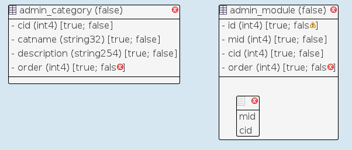
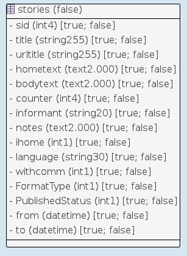
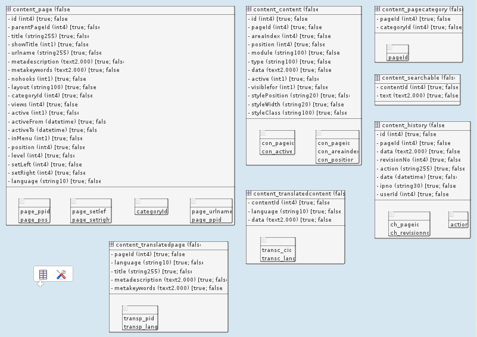

# Getting started

This chapter explains the first steps required for starting creating applications with ModuleStudio.

For now we refer only to existing tutorials as they describe things still quite well.

## Installation

Simply download the archive for your operating system and extract it inside your home directory. You can also choose any other directory, but your user needs to have write access to it. Otherwise the automatic update functionality will not work correctly. As it seems Eclipse has problems with pathes containing space chars, avoid spaces in the directory path to ensure things work correctly.

Afterwards you are ready to start the ModuleStudio executable.

ModuleStudio 0.7.0 and later requires Java 8, but includes it already. So it should start also if you have an older version or no Java installed at all.

### Additional notes for Windows

Because Windows has a limit of 260 characters for pathes, do not choose a too nested directory, but ideally a simple path like `C:\ModuleStudio\`.

If you use Windows 8 or later and enabled the SmartScreen protection starting ModuleStudio will open a blocking window showing the following error message: `Windows SmartScreen prevented an unrecognized program from starting. Running this program might put your PC at risk`.

This does not mean that ModuleStudio includes any kind of malware. Instead this message is only caused by the fact that the executable file is not digitally signed using a certificate yet. To start ModuleStudio nevertheless you should be able to use the right mouse button and choose `allow`. If this is not available click on the `More info` link and on the `Run anyway` button afterwards.

### Additional notes for Linux and MacOSX

Make sure to include the -p flag if you extract the `.tar.gz` to keep the correct permissions (for example: `tar -xpzvf ModuleStudio-linux.gtk.x86_64.tar.gz`).

## First tour

### Creating a new model

First thing you may want to do after starting the ModuleStudio application is creating a new model. Therefore start the e[new application wizard] using the dashboard view or the *File* main menu. It allows you to enter some basic information, like vendor and application name, in a simple form. After that it creates a new project and therein a new model. This model will already contain some common basic container elements for illustration so that you can directly proceed with changing them in order to describe your application in detail.

Please see [this tutorial](http://modulestudio.de/en/tutorial/the-first-zikula-application-in-10-minutes.html) for getting the overall idea.
*TODO replace this link by a similar tutorial -> Let’s do a module together*

There is also a dedicated chapter in this manual collecting [additional web resources](97-Resources.md).

### Open existing models

Projects which have been created before can simply be opened again by selecting them in a list presented in a dialog. 

#### Importing model files

To import an existing model use the corresponding menu or dashboard action. The model will be migrated to the current DSL version and imported into a new project automatically. The name of this project is determined from the file name. So if you want to duplicate a model you need to rename the file before importing it. Otherwise you will see an error message because the project does already exist.

#### Migrating old modules

If you want create a new model for an existing legacy module using DBUtil you can follow the following procedure.

1. First get the file *pntablesToXML.php* from [GitHub](https://github.com/zikula/core/blob/1.4.3/tools/pntablesToXML.php).
2. Use this script to convert your old `pntables.php` file into an xml file.
3. Inside ModuleStudio use the menu entry *File > Open model > Import xml table definition* which will open a file selection dialog. Choose the xml file you just created. As a result you will get a new application model in the `MOST_output/yourmod.mostapp` file.
4. Now import this model using the corresponding menu or dashboard action.
5. In the data editor remove unneeded elements, like table prefixes and default identifier fields, that are primary and foreign keys.
6. Follow validation messages to get remaining stuff sorted properly.

Example import results:

#### Samples

There are some sample models contained in the `examples` folder inside ModuleStudio.

You can also download them from [the examples project](https://github.com/Guite/MostExamples) on GitHub.

## Further helpful pointers for starting

Here are some remarks for getting into ModuleStudio smoothly.

* Each application is being represented by a model. Each project consists of two files: a domain model (`*.mostapp`) and a representation (`*.representation`). The first one is the important thing containing all information relevant for further processing like model-to-model and model-to-code transformations. The representation information is only cosmetical and not neccessary. So if you want to exchange models, only the domain model is needed which can be imported into a new project again anytime.
* Not all settings are directly embedded within the editor. To be able to set all fields refer to the *properties view* at the bottom right. There you can find an element named *domain* relating to a particular element with focus.
* At first start with simple goals. Think about an application needing only three to five database tables (entity objects in the model editor). Keeping your application-specific logic simple helps to understand the architectural concepts of ModuleStudio.

### Detail optimisation - Spelling entities and fields in the model

In model-driven development functional requirements are typically worded in a very concise way. In the end one of the goals of a domain-specific language is a readable and understandable description of a software system, to which also the avoidance of redundancies and unrequired boilerplate code appertains.

This makes for that even small changes in a model can result in bigger differences in the generated source code. One example for such distinctions which are inconsiderable on the first glance touches the spelling of model elements. This section points up the meaning of whether you write an entity name one way or another.

At first the validation of ModuleStudio reacts with an error if one starts designations with a capital. The reason for this is that modeling should keep as simple as possible (in this case without unnecessarily having to use the shift key). If needed the generator can convert `special` into `Special` by itself.

Below we assume an example model containing an entity for products. This entity should get a new field for possible additional shipping costs.

Certainly you can name this field just `additionalshippingcosts`. This will work normally and also won't cause any problems. But it takes away the possibility from the generator to differently format the name depending on the use case.

Recommended for ModuleStudio is the so-called **mixed case** notation: with this the field from above would be named `additionalShippingCosts`. First this is much more readable for humans dealing up with the model and/or the source code. Second the generator can work more flexibly with this name - here are some examples:

* Name of the field for code and Doctrine: `additionalShippingCosts`
* Readable name with capitalisation, for example for a form label: `Additional shipping costs:`
* Readable name without capitalisation, for example for a help text: `Please enter the additional shipping costs`

You get more attractive interfaces in generated applications out of the box, because they are equipped with readable strings. By the way this also simplifies the translation process with Gettext, because the translator can easier understand what a certain notation is intended for.
