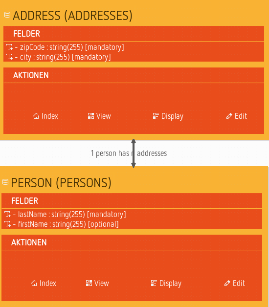
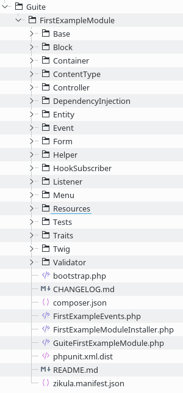

# Getting started

This chapter explains the first steps required for starting creating applications with ModuleStudio.

For now we refer only to existing tutorials as they describe things still quite well.

## Create your first application in 10 minutes

This chapter shows how easy it is to define and generate Zikula applications with ModuleStudio. It shows the overall idea in a quick tour, using an example model. So let's do a module together!

1. Create a new model project using the *New app* icon in the dashboard view or the *File > New application* main menu entry. This opens a wizard dialog.
2. Enter a project name like *FirstExample* and click on the *Next* button.

3. Enter some basic information for your application, like vendor and application name as well as some details about you. The last field is a prefix for the database tables of your application which helps avoiding name collisions if you use several Zikula modules together. Afterwards click on the *Finish* button.

4. Now ModuleStudio creates a new project and therein a new model. This model will already contain some common basic container elements for illustration so that you can directly proceed with changing them in order to describe your application in detail.

5. To start the generator we use the *File > Generate application* main menu entry. Choose an empty target folder (create a new one if needed) and confirm the dialogs. After a short wait, the Zikula application is ready.

## Further helpful pointers for starting

Here are some remarks for getting into ModuleStudio smoothly.

* Every application is described and represented by a model. Each project consists of two files: a domain model (`*.mostapp`) and a representation (`*.representation`). The first one is the important one containing all information relevant for further processing like model-to-model and model-to-code transformations. The representation information is only cosmetical and not neccessary. So if you want to exchange models, only the domain model is needed which can be imported into a new project again anytime.
* Not all settings are directly embedded within the editor. To be able to set all fields refer to the *properties view* at the bottom right. There you can find an element named *domain* relating to a particular element with focus.
* At first start with simple goals. Think about an application needing only three to five database tables (entity objects in the model editor). Keeping your application-specific logic simple helps to understand the architectural concepts of ModuleStudio.
* There are some sample models contained in the `examples` folder inside ModuleStudio. You can also download them from [the examples project](https://github.com/Guite/MostExamples) on GitHub.
* There is also a dedicated chapter in this manual collecting [additional web resources](97-Resources.md).

### Detail optimisation - Spelling entities and fields in the model

In model-driven development functional requirements are typically worded in a very concise way. In the end one of the goals of a domain-specific language is a readable and understandable description of a software system, to which also the avoidance of redundancies and unrequired boilerplate code appertains.

This makes for that even small changes in a model can result in bigger differences in the generated source code. One example for such distinctions which are inconsiderable on the first glance touches the spelling of model elements. This section points up the meaning of whether you write an entity name one way or another.

At first the validation of ModuleStudio reacts with an error if one starts designations with a capital. The reason for this is that modeling should keep as simple as possible (in this case without unnecessarily having to use the shift key). If needed the generator can convert `special` into `Special` by itself.

Below we assume an example model containing an entity for products. This entity should get a new field for possible additional shipping costs.

Certainly you can name this field just `additionalshippingcosts`. This will work normally and also won't cause any problems. But it takes away the possibility from the generator to differently format the name depending on the use case.

Recommended for ModuleStudio is the so-called **mixed case** notation: with this the field from above would be named `additionalShippingCosts`. First this is much more readable for humans dealing up with the model and/or the source code. Second the generator can work more flexibly with this name - here are some examples:

* Name of the field for code and Doctrine: `additionalShippingCosts`
* Readable name with capitalisation, for example for a form label: `Additional shipping costs:`
* Readable name without capitalisation, for example for a help text: `Please enter the additional shipping costs`

You get more attractive interfaces in generated applications out of the box, because they are equipped with readable strings. By the way this also simplifies the translation process with Gettext, because the translator can easier understand what a certain notation is intended for.
