# User interface

This section shows how to use ModuleStudio. Starting with a general demonstration of the user interface it goes step by step through all UI functions and explains their purpose. Note there is also a dedicated chapter showing a [list of keyboard shortcuts](82-KeyboardShortcuts.md#keyboard-shortcuts) which are helpful not only, but especially for advanced users.

## Basic usage

An application project in ModuleStudio consists of two files: one `*.mostapp` file with the actual application model, and one representations file containing data for how the model is displayed in the different editors. The `mostapp` file is the primarily important one for storing and exchanging applications. It can imported into a new ModuleStudio project at any time, so you do not need to keep the representation file with it.

Besides the main menu, the environment can be split into two areas. On the left side there are the *dashboard* view and the *editor* windows. Editors contain the actual notation for changing the model. For the diagram editor this consists of a canvas as well as a *palette* with the available tools. This is where the actual modelling happens. The diagram editor's palette separates the available model elements into several groups, like *Relationships*, *Fields* or *Actions*. It is possible to have multiple elements at the same time in one model for each of these types. The visible groups and tools in the palette depends on which *layers* you have enabled in the diagram. More about these layers will be explained later.

On the right side is an arrangement of different *views*. For example there is an [outline view](33-Views#outline-view) with a miniature display of the editor window and a [properties view](33-Views#properties-view) used to edit properties of model elements.

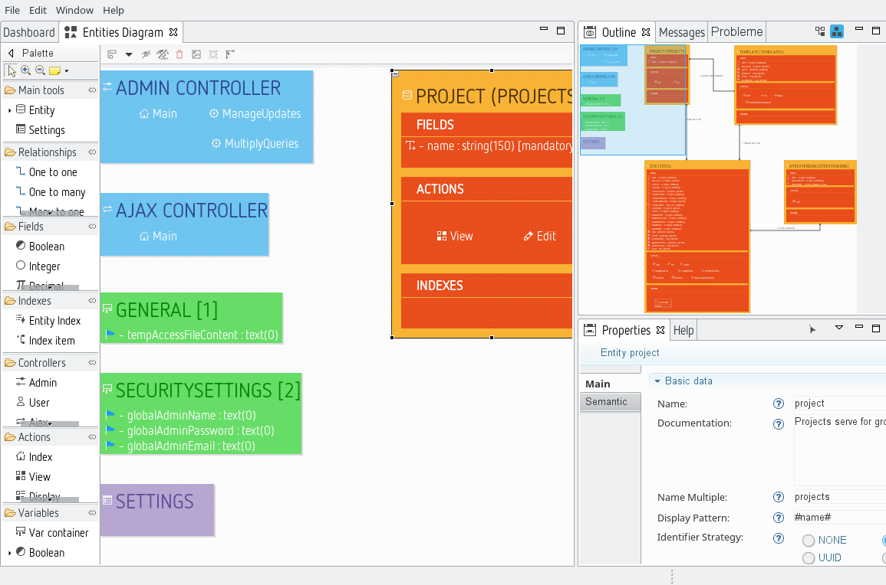

## Main menu

### File menu

The file menu contains actions about handling model files and projects.

*  New application - Starts the wizard for [creating a new model project](20-GettingStarted.md#create-your-first-application-in-10-minutes).
* 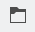 Open model - Displays a sub menu for different ways to open existing models.
*  Open project - Displays a dialog for selecting an existing project to open.
* 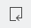 Import model - Displays a dialog for selecting an existing `.mostapp` file to be imported into a new project. Models from earlier versions are [automatically migrated](40-Migration.md#importing-model-files).
* 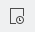 Import xml table definition - Allows to import a XML file containing legacy table definitions into a new project. More details are explained in [the migration chapter](40-Migration.md#migrating-old-modules).
* 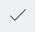 Validate diagram - Manual trigger for [validation](50-Validation.md#triggering-validation).
*  Generate application - Starts the [generation process](60-GeneratingApplications.md#how-it-works).
*  Delete project - Deletes the current project. This action can not be reverted.
* 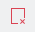 Close - Closes the current editor.
*  Close All - Closes all open editors.
* 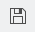 Save - Saves the current editor.
* 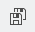 Save All - Saves all open editors.
* 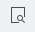 Print Preview - Displays a print preview dialog.
*  Print... - Displays the printing dialog.
* 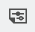 Page Setup... - Displays a dialog for adjusting the page setup for printing.
*  Exit - Closes ModuleStudio.

#### Troubleshooting if you can not save the model

If you get an error message when trying to save your model this means that it is not possible to serialise the object graph you have currently opened in the memory. The probable reason for this is that there exists a reference to an element without a name. Therefore the serialiser sees no way to persist this reference.

For example if you have two entities and a relationship between them then all both entities need a name. Otherwise the relationship can not store it's source or target references.

To fix this just ensure that all existing elements have a name. Since ModuleStudio version 0.7.0 this is actively supported by setting sensitive default values when adding new elements.

### Edit menu

The file menu collects actions regarding working with model element amendments.

* 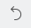 Undo - Reverts the last action.
* 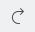 Redo - Repeats the last action which has been reverted before.
*  Cut - Moves selected element(s) into the clipboard.
* 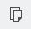 Copy - Copies selected element(s) into the clipboard.
*  Paste - Paste element(s) from the clipboard.
*  Delete - Deletes selected element(s) from the model.
* 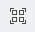 Select All - Selects all elements.
* 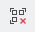 Deselect All - Deselects all elements.

### Window menu

In the window menu you can find actions about managing editors, views and preferences.

* 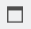 Editor - Displays a sub menu for options with regards to the current editor.
* 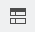 Toggle Split Editor (Horizontal) - Enables/disables horizontal split of the editor window.
* 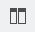 Toggle Split Editor (Vertical) - Enables/disables vertical split of the editor window.
*  Clone - Clones the editor window (adds another one).
*  Appearance - Displays a sub menu for options with regards to the application's appearance.
* 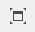 Toggle Full Screen - Enables/disables a full screen mode.
* 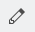 Editors - Displays a sub menu for opening the different editors.
*  Open diagram - Opens the [diagram editor](32-DiagramEditor.md#diagram-editor).
*  Open variables table - Opens the [table editor](35-TableEditors.md#table-editors) for variables.
*  Open entities table - Opens the [table editor](35-TableEditors.md#table-editors) for entities.
* 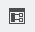 Views - Displays a sub menu for opening the different views. Helpful if you closed one and need it back.
* 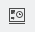 Open dashboard - Opens the [dashboard view](33-Views.md#dashboard-view).
*  Open error log - Opens the [error log view](33-Views.md#error-log-view).
* 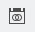 Open outline - Opens the [outline view](33-Views.md#outline-view).
*  Open properties - Opens the [properties view](33-Views.md#properties-view).
* 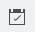 Open problems - Opens the [problems view](33-Views.md#problems-view).
*  Switch theme - Changes the current [theme](#themes).
* 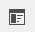 Preferences - Opens the [preferences](#preferences) dialog.

### Help menu

The help menu contains actions related to user assistance.

* 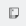 Manual - Opens the [help system](#help-system).
*  Search - Shows the [help view](33-Views.md#help-view) and opens the search function in it.
*  About - Opens the About dialog.

## Main UI components

* [Diagram editor](32-DiagramEditor.md#diagram-editor)
* [Views](33-Views.md#views)
* [Table editors](35-TableEditors.md#table-editors)
* [Textual editor](36-TextualEditor.md#textual-editor)

## Other UI components

### Themes

ModuleStudio offers two different themes: *light* and *dark*. You can change the current theme by either the *Window > Switch theme* main menu entry or using [preferences](#preferences).

While all images in this manual use the light theme, the following image features the *dark* theme to show you the contrast.

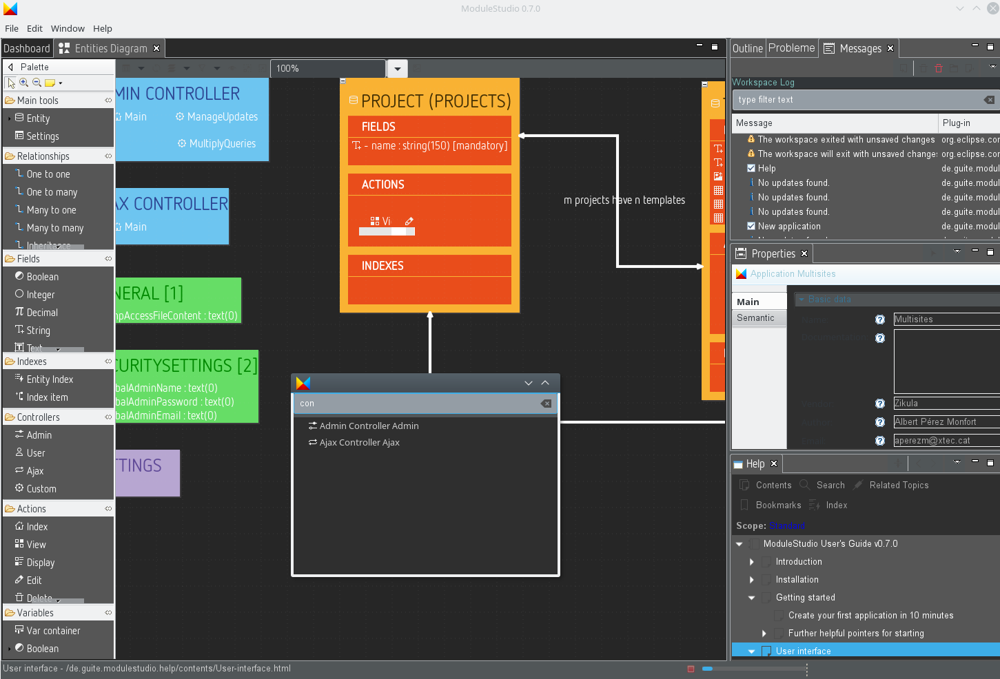

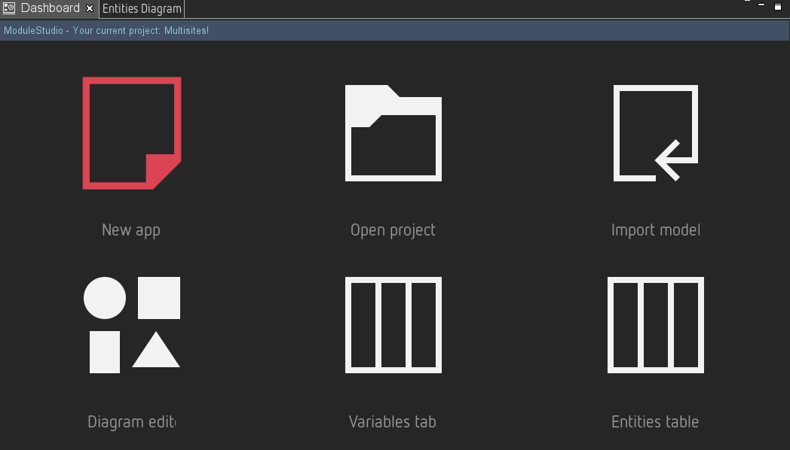

Note that the display may not be correct immediately after switching the theme. So it could be required to exit ModuleStudio and restart it in order to have the new theme setup correctly. Also the dark theme is not fine-tuned yet, it still needs some attention to make it more beautiful. For example some text elements and icons need changed colours to improve readability.

### Preferences

In the preferences section you can adjust several base settings of ModuleStudio. This section explains what these settings do.

#### AutoSave

Here you can enable automatic save for the editors. You can specify an interval in seconds. This is especially interesting as a save operation triggers [validation](50-Validation.md#triggering-validation), too. So if you for example save the model every 30 seconds you can just work and the [problems view](33-Views.md#problems-view) keeps you updated about possible errors automatically.

#### Help

The help section allows you to change some context settings about how help information is displayed. For example you can specify that the [manual](#help-system) should always be opened in an external web browser instead of the included one.

#### ModuleStudio

* *Default theme*: choose whether you like to have the light or dark [theme](#themes) per default.
* *Vendor, Author, Email address, Url*: you can input your default values at this place. The wizard for [creating a new model project](20-GettingStarted.md#create-your-first-application-in-10-minutes) will reuse these values, so you do not have to enter them repeatedly.
* *Ignore model warnings during generation*: enable this option to avoid that a message box appears if your model contains warnings.
* *Override existing files*: if you enable this option the generator will not abort if files exist in the selected output directory. *Use with caution!*
* *Use staging updates*: if that option is activated the auto update function will include unstable releases. Each time you start ModuleStudio it looks for whether updates are available. Per default it searches only for stable releases. With the staging channel you get also updates from every single build which earlier brings you new features, but also includes the risk of breaking things.

#### MostDsl

The *MostDsl* tab is related to the [textual editor](36-TextualEditor.md#textual-editor). It needs some cleanup, because many settings are actually not required. This section explains only those which are most relevant.

* *Syntax Coloring*: here you can change styles for the syntax highlighting. For example you could have keywords in red instead of purple. Or you could have strings in bold style.
* *Templates*: here are the [template proposals](36-TextualEditor.md#template-proposals) defined. You can change them and add new ones if you like.

#### Sirius

This tab is primarily about the [diagram editor](32-DiagramEditor.md#diagram-editor). It needs some cleanup, because many settings are actually not required. This section explains only those which are most relevant.

* *Automatic Refresh*: depending on this option, the contents of opened editors may or may not be automatically updated when the underlying semantic model changes. In manual refresh mode (when *Automatic refresh* is unchecked), you can explicitly request a refresh of the whole editor by either pressing **F5** or clicking on *Refresh* in the context menu (right click).
* *Sirius Diagram*: allows you to disable certain features of the diagram editor. For example you could hide the status line or deactivate animated zoom.
* *Rulers And Grid*: you can enable showing a ruler for new diagrams. If you do not like the grid or the *snap to grid* behaviour feel free to disable it.

### Help system

While you can browse the entire help using the [help view](33-Views.md#help-view) only, you can also open the help system in a dedicated window using the *Help > Manual* main menu entry. This is particularly useful if you have a small screen and need the available space for the editor.

The help system shows the manual using an internal web browser (you can also use an external instead by changing the [preferences](#preferences) accordingly).

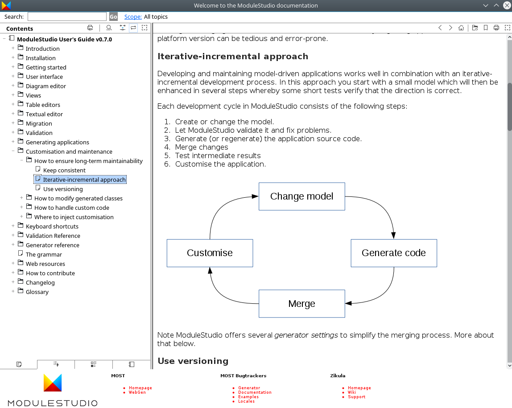

It is worth exploring the functionality offered by this included help. You can not only search for desired topics, there is also a keyword index. Also you can create and manage custom bookmarks for finding interesting sections again with ease.

## Customisation

### Rearrange the UI

Most parts of the user interface can be customised, like one may expect from an Eclipse-based application. Views can be moved and replaced, e.g. you could have them at the left side, on the bottom or in the same tab bar as the editors.

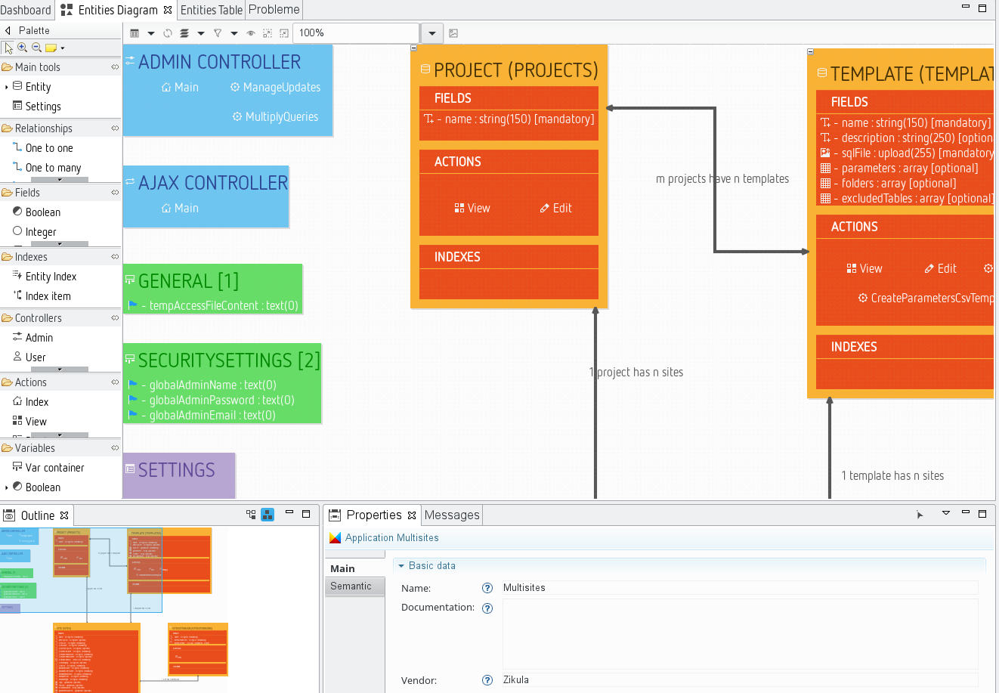

Also you can minimise and maximise views by using the small icons at their top right corner. If a view is minimised their icons appear in a sidebar at the right of the application window. If you click on such an icon the view appears in a modal until the focus is lost again.

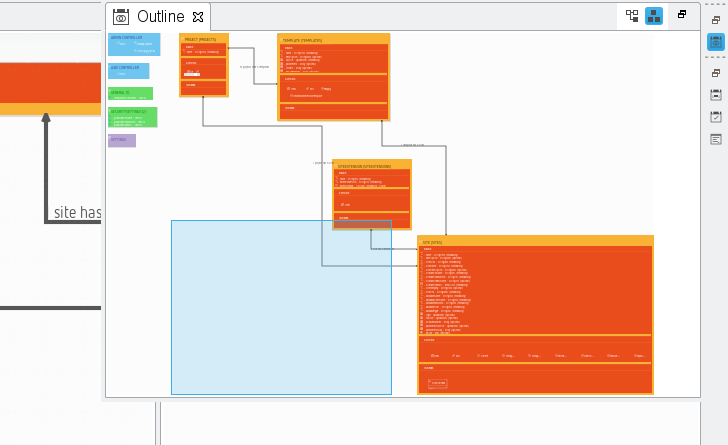

It is even possible to use multiple editors in parallel by arranging them next to each other.

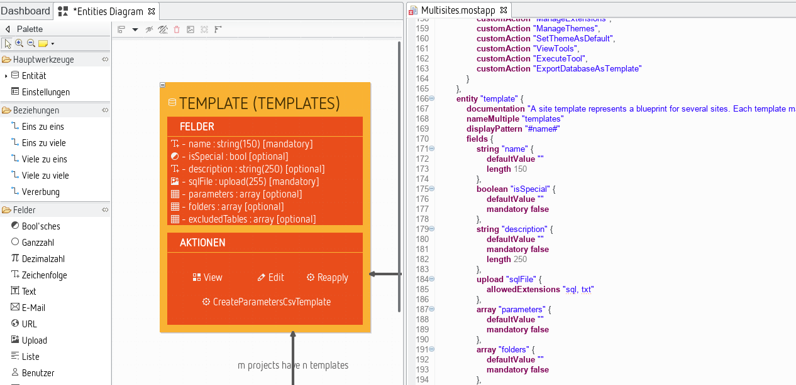

Experiment with these options and use them to meet your personal workflow.

One additional hint about editor synchronisation: If you changed a model, you need to save it to let ModuleStudio reflect the changes in other opened editors.
