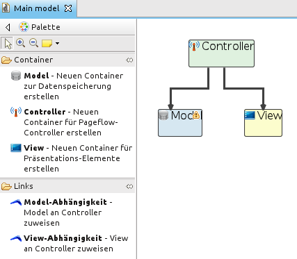
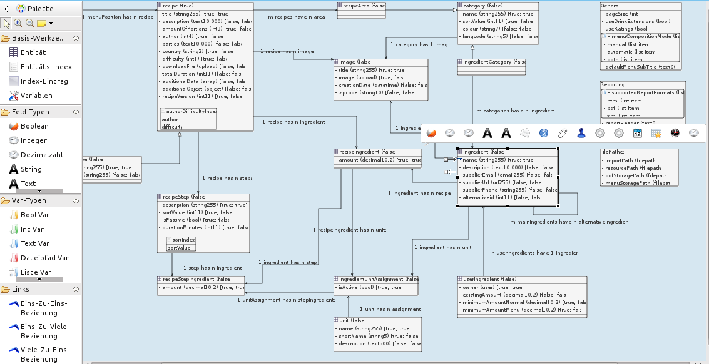
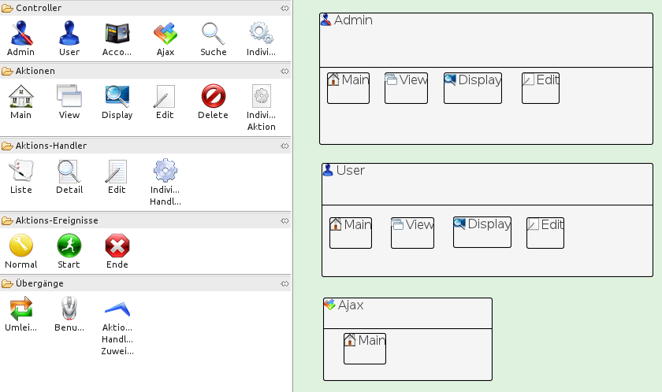

# User interface

## Introduction

This section shows how to use ModuleStudio. Starting with a general demonstration of the user interface it goes step by step through all single editors required for creating a complete model.

At the moment this page consists only of a few links to corresponding tutorials. It will be enhanced at a later stage after the actual modeling language has matured enough to spend work on completing the user interface.

## Basic usage

Please see [this tutorial](http://modulestudio.de/en/tutorial/basic-usage.html).

## Graphical editors

### Main editor

Please see [this tutorial](http://modulestudio.de/en/tutorial/basic-settings-in-main-editor.html).

### Model editor

Please see [this tutorial](http://modulestudio.de/en/tutorial/describing-the-model.html).

### Controller editor

Please see [this tutorial](http://modulestudio.de/en/tutorial/modeling-the-controllers.html).

### Workflow editor

The workflow layer is not implemented yet (planned for version 0.8). This section is just a dummy for future.

## Textual editors

Beginning with ModuleStudio 0.6.0 there is also a textual syntax notation available. Not visible
at once, it will be integrated into the UI step by step.

*Expert tip:* you can use the textual editor already if you like: open the *Open resource* dialog using **Ctrl + Shift + R**, type `*.mostapp` into the filter field and click on the *Open* button.

## Useful hints

Here are some tutorial showing special abilities for certain use cases:

* [Customise palette](http://modulestudio.de/en/tutorial/customise-palette.html)
* [Multiple container elements](http://modulestudio.de/en/tutorial/multiple-container-elements.html)
* [Moving fields with drag n drop](http://modulestudio.de/en/tutorial/moving-fields-with-drag-n-drop.html)
* [Creating multiple elements quickly](http://modulestudio.de/en/tutorial/creating-multiple-elements-quickly.html)
* [Working with multiple windows](http://modulestudio.de/en/tutorial/working-with-multiple-windows.html)

### General keyboard shortcuts

* **F1** - Opens the help system.
* **Ctrl + E** - Display a filterable list of open editors.
* **Ctrl + Shift + E** - Display the *Switch to Editor* dialog.
* **Ctrl + F6** - Display a list of open editors.  
* **Ctrl + PgUp / Ctrl + PgDown** - Navigate to previous / next editor tab.

### Keyboard shortcuts in graphical editors

There are some very handy shortcuts hidden in ModuleStudio. For example it can be worth to experiment with the Ctrl (Alt on Mac) and/or Shift keys when moving or resizing an object.

Here is a [list of all editor shortcuts](http://help.eclipse.org/helios/topic/org.eclipse.gmf.doc/prog-guide/runtime/Developer%20Guide%20to%20Keyboard%20Accessibility.html).

If one has selected a palette tool and creates an object in the diagram it is usually required to select the tool again in order to create another object. If one presses the Ctrl (Alt on Mac) key one can create multiple elements of the same type in one step.

### Keyboard shortcuts in textual editors

The following list shows some basic commands which might be helpful when using the textual editors.

* **Alt + Up** and **Alt + Down** - Move current line or selection one line up / down.
* **Alt + Left** and **Alt + Right** - Go back / forward in the history of editors.
* **Alt + Shift + Up** and **Alt + Shift + Down** - Expand selection to containing element.
* **Alt + Shift + R** - Rename current element as well as all other occurences.
* **F3 or Ctrl + MouseClick** - Follow reference under cursor.
* **Ctrl + Up** and **Ctrl + Down** - Scroll one line up / down.
* **Ctrl + 0** - Pop up outline for easy navigation and filtering.
* **Ctrl + 1** - Quick fix of errors.
* **Ctrl + Shift + C** - Single line comment/uncomment.
* **Ctrl + Shift + /** and **Ctrl + Shift + \** - Block comment/uncomment.
* **Ctrl + /** - Toggle comment for line or selection.
* **Ctrl + Space** - Start content assist suggesting possible values.
* **Ctrl + D** - Delete current line.
* **Ctrl + L** - Go to a certain line.
* **Ctrl + M** - Maximize current editor window.
* **Ctrl + W** - Close current editor tab.
* **Ctrl + Q** - Go to last edit location.
* **Ctrl + Shift + F** - Start the source code formatter.
* **Ctrl + Shift + G** - Find references to current element.
* **Ctrl + Shift + F3** - Locate a certain element.
* **Ctrl + ,** and **Ctrl + .** - Navigate between markers in the current editor.
* **Alt + ←** and **Alt + →** - Go to previous or next edit positions from the editor history list.
* **Ctrl + O** - Quick outline (select editors only).
* **Ctrl + J** - Incremental find. Note: Just press **Ctrl + J** and start typing the search text. Eclipse finds and highlights the next match as you type. Use **Up** or **Down** Arrow keys to jump to the next or previous match.
* **Ctrl + L** - Go to line from editor.
* **Ctrl + Q** - Go to last edit location.
* **Ctrl + Shift + P** - Navigate to matching bracket/brace.

## Textual Grammar

Here is a railroad chart showing the textual grammar elements:

