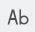

# User interface

This section shows how to use ModuleStudio. Starting with a general demonstration of the user interface it goes step by step through all UI functions and explains their purpose. Note there is also a dedicated chapter showing a [list of keyboard shortcuts](82-KeyboardShortcuts.md#keyboard-shortcuts) which are helpful not only, but especially for advanced users.

## Basic usage

ModuleStudio organises its models in projects. A project is simply a folder within the [workspace directory](15-Installation.md#the-workspace). Each project in ModuleStudio consists of two files:

* a `*.mostapp` file which stores the actual application model;
* a `.project` file for project meta data.

You can always have only one project opened. If you create a new application or open a project, this causes the currently opened project being closed.

The `mostapp` file is the primarily important one for storing and exchanging applications. It can [imported](20-GettingStarted.md#importing-model-files) into a new ModuleStudio project at any time.

Besides the [main menu](#main-menu), the environment can be split into two areas.

1. On the left side there are the *dashboard* view and the *editor* windows. The dashboard view provides you some quick links to commonly used actions from the [main menu](#main-menu); more details are described in the [views chapter](33-Views.md#dashboard-view). Editors contain the actual notation for changing the model.
2. On the right side is an arrangement of different *views*. For example there is an [outline view](33-Views#outline-view) with a miniature display of the editor window and a [properties view](33-Views#properties-view) used to edit properties of model elements. You can change the views in multiple ways, for example you can close, reopen, resize and move them. All these different possible actions are described [below](#customising-the-ui).

## Main menu

### File menu

The file menu contains actions about handling model files and projects.

*  New application - Starts the wizard for [creating a new model project](20-GettingStarted.md#create-your-first-application-in-10-minutes). After you finished the wizard, a new project will be created. If you had another project opened before doing this, it will be closed.
*  Open model - Displays a sub menu for different ways to open existing models. This sub menu contains the following items:

1.  Open project - Displays a dialog for selecting an existing project to open. This dialog contains a list showing all projects which are located in your [workspace](15-Installation.md#the-workspace). If you want to open a project from another location you need to import its model file into a new project which is described in the next action.
2.  Import model - Displays a dialog for selecting an existing `.mostapp` file to be imported into a new project. Models from earlier versions are [automatically migrated](20-GettingStarted.md#importing-model-files).

*  Validate diagram - Allows to trigger the [validation](50-Validation.md#triggering-validation) for your current model manually.
*  Generate application - Starts the [generation process](60-GeneratingApplications.md#how-it-works) for creating application source code from your current model.
*  Copy project - Duplicates the currently opened project using a new name.
*  Delete project - Deletes the current project from the [workspace](15-Installation.md#the-workspace). This action can not be reverted.
*  Close - Closes the current editor. This is the same as clicking on the cross symbol on the top right of its heading tab. If you need the editor again you can reopen it using the [Window main menu](#window-menu) or the [dashboard view](33-Views.md#dashboard-view).
*  Close All - This closes all open editors at once.
*  Save - Saves the current editor.
*  Save All - This saves all open editors at once.
*  Print Preview - Displays a [print preview dialog](32-DiagramEditor.md#print-support).
*  Print... - Displays the [printing dialog](32-DiagramEditor.md#print-support).
*  Page Setup... - Displays a dialog for adjusting the page setup for [printing](32-DiagramEditor.md#print-support).
*  Exit - This closes ModuleStudio.

### Edit menu

The file menu collects actions regarding working with model element amendments.

*  Undo - Reverts the last action. So if you think you made something wrong or unwanted, you can just undo it.
*  Redo - Repeats the last action which has been reverted before. If you have undone an action, but want it again, you can "undo the undo". 
*  Cut - Moves selected element(s) into the clipboard.
*  Copy - Copies selected element(s) into the clipboard.
*  Paste - Paste element(s) from the clipboard.
*  Delete - Deletes selected element(s) from the model. More information about this can be found [here](32-DiagramEditor.md#editing-and-deleting-elements).
*  Select All - Selects all available elements.
*  Deselect All - Deselects all elements. This results in an empty selection.

### Window menu

In the window menu you can find actions about managing editors, views and preferences.

*  Editor - Displays a sub menu for options with regards to the current editor. This sub menu contains the following items:

1.  Toggle Split Editor (Horizontal) - Enables/disables horizontal split of the editor window. This causes that the editor window has two areas (top and bottom) with a separator between. In both areas you can navigate independently allowing you to look at different areas of your model at the same time.
2.  Toggle Split Editor (Vertical) - Enables/disables vertical split of the editor window. This causes that the editor window has two areas (left and right) with a separator between. In both areas you can navigate independently allowing you to look at different areas of your model at the same time.
3.  Clone - Clones the editor window. This adds a second window containing the same editor again. You can [arbitrarily arrange](#customising-the-ui) both windows.

*  Appearance - Displays a sub menu for options with regards to the application's appearance. This sub menu contains the following items:

1.  Toggle Full Screen - Enables/disables a full screen mode.

*  Editors - Displays a sub menu for opening the different editors. This sub menu contains the following items:

1.  Open diagram - Opens the [diagram editor](32-DiagramEditor.md#diagram-editor).
2.  Open text - Opens the [textual editor](36-TextualEditor.md#textual-editor).

*  Views - Displays a sub menu for opening the different views. Helpful if you closed one and need it back. This sub menu contains the following items:

1.  Open dashboard - Opens the [dashboard view](33-Views.md#dashboard-view).
2.  Open error log - Opens the [error log view](33-Views.md#error-log-view).
3.  Open outline - Opens the [outline view](33-Views.md#outline-view).
4.  Open properties - Opens the [properties view](33-Views.md#properties-view).
5.  Open problems - Opens the [problems view](33-Views.md#problems-view).

*  Switch theme - Changes the current [theme](#themes).
*  Preferences - Opens the [preferences](38-Preferences.md#preferences) dialog.

#### Themes

ModuleStudio offers two different themes: *light* and *dark*. You can change the current theme by either the *Window > Switch theme* main menu entry or using [preferences](38-Preferences.md#preferences).

While all images in this manual use the *light* theme, the following image features the *dark* theme to show you the contrast.

Note that the display may not be correct immediately after switching the theme. So it could be required to exit ModuleStudio and restart it in order to have the new theme setup correctly. Also the dark theme is not fine-tuned yet, it still needs some attention to make it more beautiful. For example some text elements and icons need changed colours to improve readability.

### Help menu

The help menu contains actions related to user assistance.

*  Manual - Opens this documentation in a web browser.
*  About - Opens the About dialog.

## Main UI components

Since the available editors and views are the most important parts of the ModuleStudio user interface, they are described in dedicated chapters.

* The [diagram editor](32-DiagramEditor.md#diagram-editor) allows for graphical model creation and amendment.
* Several [views](33-Views.md#views) assist you during your work by providing means for doing specific tasks or showing additional information.
* A [textual editor](36-TextualEditor.md#textual-editor) is also available for advanced users.
* Several configuration options can be defined in the [preferences](38-Preferences.md#preferences).

## Customising the UI

Most parts of the user interface can be customised, like one may expect from an Eclipse-based application. Views can be moved and replaced, e.g. you could have them at the left side, on the bottom or in the same tab bar as the editors.

You can also close editors and views by clicking on the cross symbol on the top right of their heading tab. To reopen them again you need to use the corresponding entry of the *Window* [main menu](#window-menu) sub menus named *Editors* and *Views*.

Also you can minimise and maximise views by using the small icons at their top right corner. If a view is minimised their icons appear in a sidebar at the right of the application window. If you click on such an icon the view appears in a modal until the focus is lost again.

It is even possible to use multiple editors in parallel by arranging them next to each other.

Experiment with these options and use them to meet your personal workflow.
