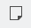
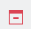
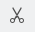
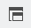
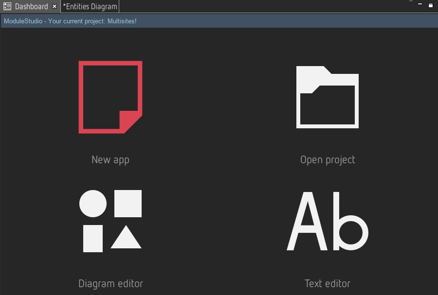
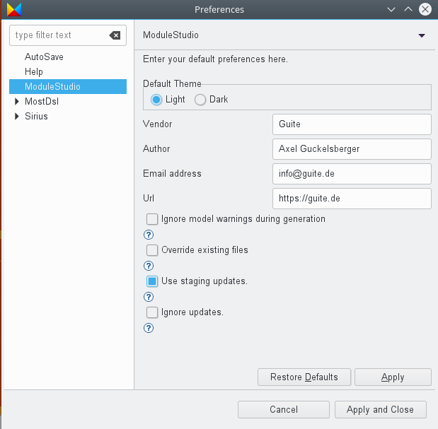
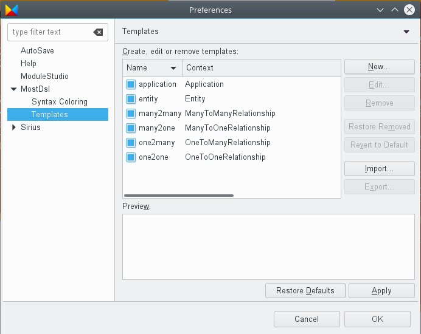

# User interface

This section shows how to use ModuleStudio. Starting with a general demonstration of the user interface it goes step by step through all UI functions and explains their purpose. Note there is also a dedicated chapter showing a [list of keyboard shortcuts](82-KeyboardShortcuts.md#keyboard-shortcuts) which are helpful not only, but especially for advanced users.

## Basic usage

ModuleStudio organises its models in projects. A project is simply a folder within the [workspace directory](15-Installation.md#the-workspace). Each project in ModuleStudio consists of three files:

* a `*.mostapp` file which stores the actual application model;
* a `representations.aird` file containing data for how the model is displayed in the different editors;
* a `.project` file for project meta data.

The `mostapp` file is the primarily important one for storing and exchanging applications. It can [imported](40-Migration.md#importing-model-files) into a new ModuleStudio project at any time, so you do not need to keep the representation file with it.

Besides the [main menu](#main-menu), the environment can be split into two areas. On the left side there are the *dashboard* view and the *editor* windows. Editors contain the actual notation for changing the model. For the diagram editor this consists of a canvas as well as a *palette* with the available tools. This is where the actual modelling happens. The diagram editor's palette separates the available model elements into several groups, like *Relationships*, *Fields* or *Actions*. It is possible to have multiple elements at the same time in one model for each of these types. The visible groups and tools in the palette depends on which *layers* you have enabled in the diagram. More about these layers will be explained later.

On the right side is an arrangement of different *views*. For example there is an [outline view](33-Views#outline-view) with a miniature display of the editor window and a [properties view](33-Views#properties-view) used to edit properties of model elements. You can change the views in multiple ways, for example you can close, reopen, resize and move them. All these different possible actions are described [below](#customising-the-ui).

## Main menu

### File menu

The file menu contains actions about handling model files and projects.

*  New application - Starts the wizard for [creating a new model project](20-GettingStarted.md#create-your-first-application-in-10-minutes).
*  Open model - Displays a sub menu for different ways to open existing models.
*  Open project - Displays a dialog for selecting an existing project to open.
*  Import model - Displays a dialog for selecting an existing `.mostapp` file to be imported into a new project. Models from earlier versions are [automatically migrated](40-Migration.md#importing-model-files).
*  Import xml table definition - Allows to import a XML file containing legacy table definitions into a new project. More details are explained in [the migration chapter](40-Migration.md#migrating-old-modules).
*  Validate diagram - Manual trigger for [validation](50-Validation.md#triggering-validation).
*  Generate application - Starts the [generation process](60-GeneratingApplications.md#how-it-works).
*  Delete project - Deletes the current project. This action can not be reverted.
*  Close - Closes the current editor.
*  Close All - Closes all open editors.
*  Save - Saves the current editor.
*  Save All - Saves all open editors.
*  Print Preview - Displays a print preview dialog.
*  Print... - Displays the printing dialog.
*  Page Setup... - Displays a dialog for adjusting the page setup for printing.
*  Exit - Closes ModuleStudio.

#### Troubleshooting if you can not save the model

If you get an error message when trying to save your model this means that it is not possible to serialise the object graph you have currently opened in the memory. The probable reason for this is that there exists a reference to an element without a name. Therefore the serialiser sees no way to persist this reference.

For example if you have two entities and a relationship between them then all both entities need a name. Otherwise the relationship can not store it's source or target references.

To fix this just ensure that all existing elements have a name. Since ModuleStudio version 0.7.0 this is actively supported by setting sensitive default values when adding new elements.

### Edit menu

The file menu collects actions regarding working with model element amendments.

*  Undo - Reverts the last action.
*  Redo - Repeats the last action which has been reverted before.
*  Cut - Moves selected element(s) into the clipboard.
*  Copy - Copies selected element(s) into the clipboard.
*  Paste - Paste element(s) from the clipboard.
*  Delete - Deletes selected element(s) from the model.
*  Select All - Selects all elements.
*  Deselect All - Deselects all elements.

### Window menu

In the window menu you can find actions about managing editors, views and preferences.

*  Editor - Displays a sub menu for options with regards to the current editor.
*  Toggle Split Editor (Horizontal) - Enables/disables horizontal split of the editor window.
*  Toggle Split Editor (Vertical) - Enables/disables vertical split of the editor window.
*  Clone - Clones the editor window (adds another one).
*  Appearance - Displays a sub menu for options with regards to the application's appearance.
*  Toggle Full Screen - Enables/disables a full screen mode.
*  Editors - Displays a sub menu for opening the different editors.
*  Open diagram - Opens the [diagram editor](32-DiagramEditor.md#diagram-editor).
*  Open variables table - Opens the [table editor](35-TableEditors.md#table-editors) for variables.
*  Open entities table - Opens the [table editor](35-TableEditors.md#table-editors) for entities.
*  Views - Displays a sub menu for opening the different views. Helpful if you closed one and need it back.
*  Open dashboard - Opens the [dashboard view](33-Views.md#dashboard-view).
*  Open error log - Opens the [error log view](33-Views.md#error-log-view).
*  Open outline - Opens the [outline view](33-Views.md#outline-view).
*  Open properties - Opens the [properties view](33-Views.md#properties-view).
*  Open problems - Opens the [problems view](33-Views.md#problems-view).
*  Switch theme - Changes the current [theme](#themes).
*  Preferences - Opens the [preferences](#preferences) dialog.

### Help menu

The help menu contains actions related to user assistance.

*  Manual - Opens the [help system](#help-system).
*  Search - Shows the [help view](33-Views.md#help-view) and opens the search function in it.
*  About - Opens the About dialog.

## Main UI components

Since the available editors and views are the most important parts of the ModuleStudio user interface, they are described in dedicated chapters.

* The [diagram editor](32-DiagramEditor.md#diagram-editor) allows for graphical model creation and amendment.
* Several [views](33-Views.md#views) assist you during your work by providing means for doing specific tasks or showing additional information.
* There are [table editors](35-TableEditors.md#table-editors) which can be used in addition to the diagram editor.
* A [textual editor](36-TextualEditor.md#textual-editor) is also available for advanced users.

## Other UI components

### Themes

ModuleStudio offers two different themes: *light* and *dark*. You can change the current theme by either the *Window > Switch theme* main menu entry or using [preferences](#preferences).

While all images in this manual use the *light* theme, the following image features the *dark* theme to show you the contrast.

Note that the display may not be correct immediately after switching the theme. So it could be required to exit ModuleStudio and restart it in order to have the new theme setup correctly. Also the dark theme is not fine-tuned yet, it still needs some attention to make it more beautiful. For example some text elements and icons need changed colours to improve readability.

### Preferences

In the preferences section you can adjust several base settings of ModuleStudio. This section explains what these settings do.

#### AutoSave

Here you can enable automatic save for the editors. You can specify an interval in seconds. This is especially interesting as a save operation triggers [validation](50-Validation.md#triggering-validation), too. So if you for example save the model every 30 seconds you can just work and the [problems view](33-Views.md#problems-view) keeps you updated about possible errors automatically.

#### Help

The help section allows you to change some context settings about how help information is displayed. For example you can specify that the [manual](#help-system) should always be opened in an external web browser instead of the included one.

#### ModuleStudio base preferences

* *Default theme*: choose whether you like to have the light or dark [theme](#themes) per default.
* *Vendor, Author, Email address, Url*: you can input your default values at this place. The wizard for [creating a new model project](20-GettingStarted.md#create-your-first-application-in-10-minutes) will reuse these values, so you do not have to enter them repeatedly.
* *Ignore model warnings during generation*: enable this option to avoid that a message box appears if your model contains warnings.
* *Override existing files*: if you enable this option the generator will not abort if files exist in the selected output directory. *Use with caution!*
* *Use staging updates*: if that option is activated the auto update function will include unstable releases. Each time you start ModuleStudio it looks for whether updates are available. Per default it searches only for stable releases. With the staging channel you get also updates from every single build which earlier brings you new features, but also includes the risk of breaking things.

#### MostDsl

The *MostDsl* tab is related to the [textual editor](36-TextualEditor.md#textual-editor). It needs some cleanup, because many settings are actually not required. This section explains only those which are most relevant.

##### Syntax colouring

Here you can change styles for the syntax highlighting. For example you could have keywords in red instead of purple. Or you could have strings in bold style using another font.

##### Templates proposals

This shows the available [template proposals](36-TextualEditor.md#template-proposals) defined for the textual editor.

You can change them and add new ones if you like.

Inside the input field you can use [content assist](36-TextualEditor.md#content-assist) like in the textual editor, too.

#### Sirius

This tab is primarily about the [diagram editor](32-DiagramEditor.md#diagram-editor). It needs some cleanup, because many settings are actually not required. This section explains only those which are most relevant.

* *Automatic Refresh*: depending on this option, the contents of opened editors may or may not be automatically updated when the underlying semantic model changes. In manual refresh mode (when *Automatic refresh* is unchecked), you can explicitly request a refresh of the whole editor by either pressing **F5** or clicking on *Refresh* in the context menu (right click).

##### Sirius Diagram

This section allows you to disable certain features of the diagram editor. For example you could hide the status line or deactivate animated zoom.

The illustration above shows the default value of all these preferences.

* *Show connector handles*: This has no effect for ModuleStudio yet, but is planned for future.
* *Show popup bars*: Defines whether [pop-up bars](32-DiagramEditor.md#pop-up-bars) are used or not.
* *Enable animated layout*: If checked, then when you launch an automatic layout to [arrange elements](32-DiagramEditor.md#arrange-elements), the shapes will move smoothly to their final location. This makes the arrangement operation take a little longer, but it is easier to follow where your elements have been moved.
* *Enable animated zoom*: If checked, when you change the [zoom value](32-DiagramEditor.md#zooming-the-diagram), ModuleStudio will show intermediate steps to smooth the change.
* *Enable anti-aliasing*: If checked, the graphics on the diagram will use anti-aliasing. This preference does not take effect on all platforms.
* *Show status line*: This has no effect at the moment.

* *Auto-size containers during arrange-all action*: Container elements which have an explicit size are normally not resized during an [Arrange All](32-DiagramEditor.md#arrange-elements). This can be problematic if the elements they contain are re-arranged so that the container's size is not appropriate anymore. When this preference is enabled, the arrange all action will treat all containers as if they are "auto-sized", and adjust their size to the computed arrangement for their content. After the arrange all action is finished, the containers which had an explicit size before will still have an explicit size (although potentially different); they are only switched to auto-size mode during the arrange all action.
* *Move unlinked notes during layout*: If checked, then the [Arrange All](32-DiagramEditor.md#arrange-elements) will consider all [notes](32-DiagramEditor.md#palette-standard-tools) on the diagram and arrange them. If unchecked, only the notes which are attached to non-note diagram elements are moved by the layout; the rest (which are considered just comments on the diagram itself), are not touched.
* *Automatically mark moved elements as pinned*: If checked, then as soon as you explicitly move a element (node or container) on the diagram, ModuleStudio will mark it as pinned and consider it should not be moved by the automatic layout. This setting is probably going to be disabled by default (and hidden) in future.
* *Synchronized mode for new diagrams*: If checked, all newly created diagrams will initially be in synchronised mode. You should **not** disable this to avoid unwanted side effects. This option is probably going to be hidden in future.
* *Remove/hide note when the annotated element is removed/hidden*: If checked, then notes attached to a diagram element will be deleted if the element is deleted, or hidden if the element is hidden.

#### Appearance

The *Appearance* preferences page (see below) gives you two preferences to control whether or not to show the labels on shapes (nodes and containers) and connectors (edges). It also allows you to customise the default font and colours used for some basic diagram elements. Diagram configurations already specify default values for these style attributes, so in practice these preferences are mostly useful for notes.

#### Connections

This page allows changing some edge-related options.

* *Show link between edge and its labels on selection*: if enabled this shows links between an edge and its labels if one of these is selected. Read more at [the corresponding section](32-DiagramEditor.md#display-attachment-link-between-edge-and-its-labels).
* *Enable user specific line style*: this allows you to change the edge style. By default ModuleStudio uses rectilinear edges. The following screenshot shows an example using the oblique style instead.

#### Printing preferences

The printing section provides default options for the page layout used for printing diagrams. You can also change them using `File > Page Setup...` in the main menu, but the preferences centrally define the default values.

##### Rulers and grid

This page (see below) contains preferences to control whether or not new diagrams should initially show the rulers and/or grids, and whether to enable the *snap to grid* and *snap to shapes* behaviours by default. The preferences on this page are only taken into account as starting values for new diagrams. Each diagram has its own configuration of rulers and grid. 

* **Show rulers for new diagram:** Display an horizonal and vertical ruler according to *Ruler units* property.
* **Show grid for new diagrams:** Display a grid in background of the diagram according to *Grid Spacing* property.
* **Snap to grid for new diagrams:** Capability to allow edit parts to snap to the grid when editing (during creation, moving or resizing). It is also possible to have connection bend-points snap to it. Grid snapping and visibility are two distinct properties, and it is possible to enable one without the other.
* **Snap to shapes for new diagrams:** That feature allows you to quickly align parts being dragged or resized to other parts in the diagram or that share the same parent (e.g: actions inside a controller or entity can only snap to each other). The snap is effective on top, bottom, right, left and center of the figure. Feedback is shown in the form of a gray line when a part is being attached to another part.

By pressing the **F4** shortcut key in the [diagram editor](32-DiagramEditor.md#diagram-editor), it is possible to temporarily enable the snap to all shapes currently visible on the diagram. 

### Help system

While you can browse the entire help using the [help view](33-Views.md#help-view) only, you can also open the help system in a dedicated window using the *Help > Manual* main menu entry. This is particularly useful if you have a small screen and need the available space for the editor.

The help system shows the manual using an internal web browser (you can also use an external instead by changing the [preferences](#preferences) accordingly).

It is worth exploring the functionality offered by this included help. You can not only search for desired topics, there is also a keyword index. Also you can create and manage custom bookmarks for finding interesting sections again with ease.

## Customising the UI

Most parts of the user interface can be customised, like one may expect from an Eclipse-based application. Views can be moved and replaced, e.g. you could have them at the left side, on the bottom or in the same tab bar as the editors.

You can also close a view by clicking on the cross symbol on the top right of its heading tab. To reopen it again you need to use the corresponding entry of the *Window* [main menu](#window-menu). There is one exception: the [help view](33-Views.md#help-view) is reopened using the *Help* [main menu](#help-menu).

Also you can minimise and maximise views by using the small icons at their top right corner. If a view is minimised their icons appear in a sidebar at the right of the application window. If you click on such an icon the view appears in a modal until the focus is lost again.

It is even possible to use multiple editors in parallel by arranging them next to each other.

Experiment with these options and use them to meet your personal workflow.

One additional hint about editor synchronisation: If you changed a model, you need to save it to let ModuleStudio reflect the changes in other opened editors.
