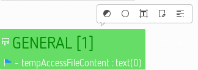
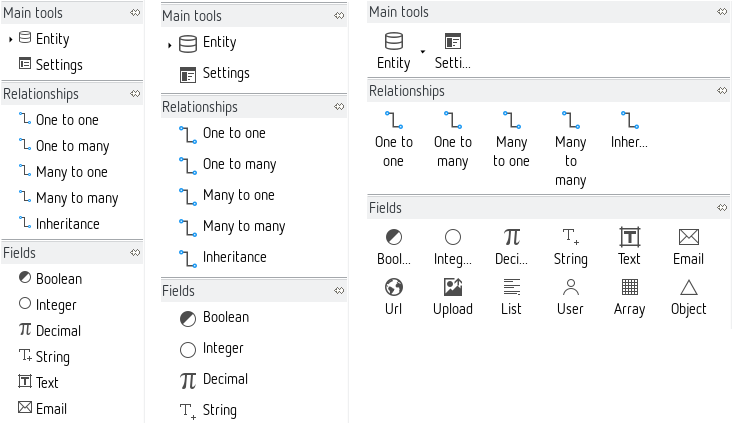

# Diagram editor

The diagram editor represents a model in a graphical way and offers several convenience functions to aid in the modelling process.

A diagram editor is divided in three areas:

1. the main graphical area, which shows the elements and supports direct interaction with them;
2. the *palette* (per default at the left side), which gives access to additional tools (for example creation tools to add new elements to the diagram);
3. the *tabbar* at the top of the graphical area, which provides additional, more global operations.

In addition to these areas which are immediately visible inside the diagram editor, it is also possible to interact with the diagram and its elements through the [properties view](33-Views.md#properties-view) and through contextual menus available on the graphical elements themselves and on the diagram's background. The [outline view](33-Views.md#outline-view) shows a graphical overview of the diagram which can be used to navigate inside it if the whole diagram is not visible in the main area.

This chapter is structured in two parts. The [first part](#diagram-features-overview) gives an overview of all the main features, and is organised from a functional perspective. For example it contains a section which explains the different ways available to control which elements are hidden or not on a diagram, with links to the corresponding parts of the reference section. The [second part](#diagram-reference) is a reference and describes all the features available by looking at each of the main areas of the diagram editor (the palette, the tab-bar etc.).

## Diagram features overview

### Pop-up bars

The user interface objects appearing in pop-up bars are buttons in a bubble-like shape. The buttons are generally used to create elements in the context of the diagram element below the mouse location.

In the above picture, the mouse pointer was left motionless over a variables container. The pop-up bar appeared and offered a list of variable elements to create within this container.

The tools which appear are the same as the ones available on the palette, but it can be more convenient sometimes to use the pop-up bar instead of going back to the palette to select the tool.

### Print support

Using the *File > Page Setup...* you can adjust the parameter used when printing a diagram.

If you activate the *Use workspace settings* option at the top of the dialog the second tab *Configure workspace settings* becomes active. Click on it to open the [printing preferences](30-UserInterface.md#printing-preferences) in a separate window.

When you want to print a diagram you can preview it before starting the actual process using the *File > Print Preview* action.

The final print dialog looks like this (the *Advanced Options* window can be reached using the *Properties...* button next to the printer selection):

### Moving the diagram

When the diagram is larger than the editor area, you can move it in all directions by pressing the middle-button and dragging the mouse (keeping the button pressed).

### Zooming the diagram

There is a variable zoom function which can be controlled by several ways. There are icons for this in the [palette](#palette) (see [palette standard tools](#palette-standard-tools)) and a drop-down list at the top right in the [tab-bar](#tab-bar). The zoom function can also be accessed by using the combination of the keyboard key **Ctrl** and the mouse wheel - as is used in many browsers, which makes it an intuitive option. In this case, the zoom is done on the mouse location instead of the center of the editor. 

### Resizing elements

It is possible to resize shapes by dragging them until they are the size that you want.

There are specific shortcuts to change the resize behaviour:

* **Ctrl** (or **Alt** for Mac users): Centered resize (expands the shape on both opposite sides).
* **Shift**: Resize that keeps the ratio.
* **Alt** (or **Ctrl** for Mac users): Resize without snap (temporarily disables the snap during the resize if it is activated).
* **F3**: Resize with children location relative to the parent. If the shape is resized to the left, upwards, or both, the children (contained nodes) are moved with the same offset than the resize.
* **F4**: Resize with snap to all shapes (if the [snap to shapes preference](30-UserInterface.md#rulers-and-grid) is activated).

### Moving elements

There are specific shortcuts to change the move behavior:

* **Shift**: Constrained move (only vertical or horizontal move is authorised at once).
* **Alt** (or **Ctrl** for Mac users): Ignore snap while dragging (temporarily disables the snap during the move if it is activated).
* **F3**: Move the edge source and target if pressed during the edge move. See the [move edge group](#move-edge-group) subsection below for more details.
* **F4**: Move with snap to all shapes (if the [snap to shapes preference](30-UserInterface.md#rulers-and-grid) is activated).

### Manage edges

#### Snap back edge labels

All visible edge labels can be snapped back to their default position by using the action *Snap back label(s)*. This action is available within the edge contextual menu under the format section *Format > Snap back label(s)*:

This action is also available individually for each visible label of an edge. To use it, you have to use the action *Snap Back* under the label's contextual menu *Format > Snap Back*:

The result of this action is visible here:

#### Move bend-points

It is possible to snap the bend-points to all shapes by pressing **F4** shortcut key during the move. This feature is only available if the [snap to shapes preference](30-UserInterface.md#rulers-and-grid) is activated. As for *snap to grid*, and unlike to snap for node, there is no visual feedback (gray grid line) drawn during the move.

#### Remove bend-points

You can define some bend-points (or inflection points) on an edge. It is possible to remove all these bend-points to retrieve the original straight edge. The action is available within the edge context menu (*Remove bend-points*) or by using the shortcut **Ctrl + Shift + -**. This action is only available on edges with a *straight* routing style.

#### Straighten an edge

There are four actions to straighten an edge, i.e. to transform an edge to an horizontal, or vertical, straight edge (with only one starting point and one ending point).

These actions are available on edge contextual menu *Layout > Straighten*:

After choosing *To top* the edge looks like this:

After choosing *To bottom* the edge looks like this:

The options *To left* and *To right* work in the same way for vertically aligned edges.

The action can be disabled (grayed menu) in some conditions:

* The action is not possible because it does not respect the source or target node boundaries.
* The source and the target of the edge are not on the same "axis" (left and right sides, or, top and bottom sides).
* A straighten action will be disabled if the edge centering constraint will be violated. For oblique edges, the action is disabled if at least one side is centered. For rectilinear edges, the action is disabled if the moved side is centered.
* The source or the target of the edge is another edge.
* The source and the target is the same element.

The action is available (menu is displayed) if the selection contains only edges (note and text attachments are not considered as edges).

#### Display attachment link between edge and its labels

It is possible to display an attachment link between an edge and its labels when edge or label is selected. This is not the default behaviour but it can be activated by [a preference](30-UserInterface.md#connections).

If an edge is selected, one attachment is displayed for all associated labels. If a label is selected, only the attachment between the edge and this label is displayed.

### Changing elements layout

#### Arrange elements

Another important function is *Arrange*. You can, for example, select all elements and use this function to automatically arrange them.

*TBD*

#### Align elements

*TBD*

#### Distribute elements

*TBD*

#### Order elements

*TBD*

### Reset diagram or container origin

*TBD*

### Hiding elements

*TBD*

### Validating the model

*TBD*

### Filters

*TBD*

### Exporting images

*TBD*

### Batch images export

You can export diagrams as an image file, which supports a number of image formats.

*TBD*

### Port shifting - Port drag and drop

*TBD*

### Copy/paste of format

*TBD*

### Diagram element pinning

*TBD*

### Layouting mode: arrange your diagrams without modifying semantic models

*TBD*

### Synchronized/Unsynchronized diagram

*TBD*

### Using Regular Expressions to find diagram elements

*TBD*

### Quick outline

*TBD*

### Style customisations

*TBD*

## Diagram reference

*TBD*

### Graphical area

*TBD*

### Palette

*TBD groups, basic tools at the top, pinning, etc.*

### Tab-bar

*TBD*

### Properties view

*TBD*

### Outline

*TBD*

## Layers

Layers allow to hide or show different concerns of the model which helps to keep focus on what is relevant for the moment. For example if you are currently not working on entity indexes, you can hide them by disabling the index layer. When disabling a layer both corresponding diagram elements and palette entries are hidden.

### Base layer

The base layer is always enabled. Beside the application itself it contains entities, relationships and maybe generator settings.

#### Application properties

The diagram canvas corresponds to the application described by the model. Some basic settings should be defined here which are available in the properties view.

The most important fields should be already set because the new application wizard gathered the required information. This includes the application name, the database table prefix, the project home page (url) as well as the name and the email address of the developer.

The *version* field defines the version number of the application in the form `x.y.z`. The *license* field specifies under which license the application is developed. Here LGPL is the default, but you are free to change this.

A more advanced field is *capabilities*: it allows you to specify capability names which are used in Zikula to express certain functions a module is offering. This allows for a loose coupling between modules. For example you can let `MyProductsModule` depend on `MyCustomerModule`, but this is a very tight coupling. With capabilities you could instead let the products module query Zikula for `any module which is able to handle customers`. You can read more about this in the [CapabilityApi description](https://github.com/zikula/core/blob/1.4/src/docs/Core-2.0/Api/CapabilityApi.md).

*TBD*

#### Entities and relationships

Entities and relationships define the data layer for an application. This represents the managed database tables as well as how the objects behave within the working application.

When a new entity is created, the editor needs to know three things: the name for the entity in singular, and in plural, and a field specifying whether the entity is leading. In every application there must be one entity marked as leading. This is used as the default object type.

The modelling of entities is the most important step in defining the data layer, but this process is incomplete without defining the relationships between them. To add a relationship choose the connection type in the palette and activate the tool with a mouse click. Next click on the source entity and (without releasing the mouse button) drag the mouse to the target entity, where the button is released. The editor cleverly determines the names for both sides of the relationship from the singular or plural names of the connected entities. If you want to create a self-relationship, a simple click on the corresponding entity is enough.

*TBD*

#### Settings

*TBD*

### Fields layer

Inside a new entity you can create a first string field named for example `name`. Additional fields are easily created with the popup bar that appears when the mouse hovers over the fields container within the entity. This is significantly faster than moving the mouse to the palette and back all the time. There are several different field types available. You should experiment with them to get to know them better.

*TBD*

### Controller layer

Controllers define the interaction between the user and a Zikula module - what the user sees, and what he can do. We define, therefore, which user functions should exist at this place in the model.

If you enable the controller layer you see two additional palette groups, that are *controllers* and *actions*. The controllers represent different areas of an application. For example, there is a controller for the admin area, and another for the user area. Every controller contains one or more actions. Each action represents a callable function.

Let's look at the controller elements first. With admin and user controllers we can create the administrative and user-oriented areas of the Zikula application. These two are also the most commonly required areas, but others are possible. The ajax controller represents a special controller type containing ajax functionality. (Strictly seen admin, user and ajax controllers are legacy concepts, because Symfony allows any functions in every controller. In a future version controllers this will be considered also in the DSL (see [this issue](https://github.com/Guite/MostGenerator/issues/715)). With the individual controllers arbitrary additional controller elements with their own names can be added.

Note that each entity implicitly acts as a controller, too. So if you created a `person` entity, this represents also a person controller. For this reason both controllers and entities contain actions.

The available action elements are self-explanatory. It should be mentioned, however, that delete is only there for backwards compatibility. Every form generated from an edit action contains a delete button already. From older modules, one might be used to having the delete confirmation question on a separate page. Also here, there is an element for additional entries that one can use to model method stubs for additional actions in the controller classes.

*TBD*

### Index layer

An index tells the database to optimise a table for searches by specific fields. Every index gets a name and has a certain type. The index can contain different entries which must be named exactly like an existing field from the same entity.

*TBD*

### Variables layer

Variables are generated as basic settings in the application. You can create one or more container elements for variables on the canvas. These containers can hold the definition of several variables. Variables can be created for boolean values, integers, text fields, file paths and lists.

*TBD*

### Workflow layer

The workflow layer is not implemented yet (planned for version 0.8). This section is just a dummy for future. You can still configure a bunch of different workflows for your entities (see [generator reference](87-GeneratorReference.md#entity-workflow-type)).

## Customisation

### Customise palette
 
The palette in ModuleStudio can be customised in several ways. First of all it can be repositioned by moving it with drag n drop by dragging its heading. So if you prefer having it on the right side feel free to move it. In addition, the width of the palette can be changed. A little bit less obvious is the ability to hide the palette completely; the small arrow on the palette heading serves for that.

Let's look at the palette content. It is important having an overview of the tools in the palette, especially for smaller screen resolutions. The elements are divided into groups, though, which can be opened and closed using mouse clicks. Single groups can also be fixed with a pin so that they are not automatically closed when other groups are opened.

The appearance of the elements can be adjusted to individual tastes. Clicking the right mouse button on the palette provides the option *Use Large Icons* and a sub-menu called *Layout*.

One should experiment with the different settings to get a feeling for the different possibilities. The choice to use small or large icons is stored for each layout type.
