# Diagram editor

The diagram editor represents a model in a graphical way and offers several convenience functions to aid in the modelling process. This chapter gives an overview of all the main features and is organised from a functional perspective.

A diagram editor is divided in three areas:

1. the main graphical area, which shows the elements and supports direct interaction with them;
2. the *palette* which gives access to additional tools (for example creation tools to add new elements to the diagram);
3. the *tabbar* at the top of the graphical area, which provides additional, more global operations.

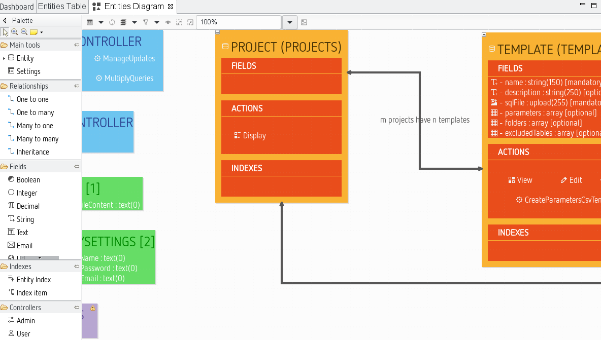

In addition to these areas which are immediately visible inside the diagram editor, it is also possible to interact with the diagram and its elements through the [properties view](33-Views.md#properties-view) and through contextual menus available on the graphical elements themselves and on the diagram's background. The [outline view](33-Views.md#outline-view) shows a graphical overview of the diagram which can be used to navigate inside it if the whole diagram is not visible in the main area.

## Palette

The diagram editor has a palette of tools, which by default is docked on the left hand side of the main graphical area. The top row of the palette contains some general, while the rest contains tools specific to each [layer](#layers).

### Managing the palette

By default, the palette appears with a pre-defined size on the left hand side of the diagram.

*Resizing*. You can resize it to take more or less horizontal space by dragging the vertical separator between the palette and the diagram with your mouse.

*Folding*. You can also fold the palette to hide it almost completely by clicking on the triangular icon in the corner of the palette header. When folded, you can restore it by clicking again on the same triangular icon.

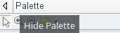

You can also keep it folded except when needed: when it is folded, a single click in the vertical folded area will reveal the palette temporarily so that you can select a tool. It will automatically hide again if you select a tool or click elsewhere.

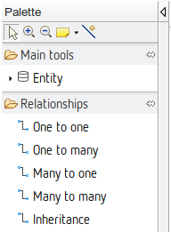

*Moving*. If you prefer, you can move the palette to the right side of the diagram editor by dragging the palette's header with the mouse, or right-clicking on the header and choosing *Dock On > Left* or *Dock On > Right*. 

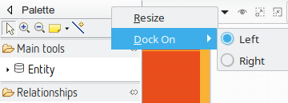

### Palette standard tools

A few general tools are available in the top row of the palette, just below the header.

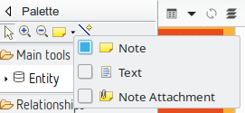

*Selection*. The selection tool is the default one initially selected when you open a diagram. To select an element on a diagram while this tool is active, simply click on it. To select several elements at the same time, you can either draw a rectangle on the diagram, or click on each element individually while keeping the **Ctrl** key pressed. When selecting elements which are already selected using this method, by clicking on them or drawing a rectangle around them, they are removed from the selection. You can combine both methods (de/selection by single click or by zone) to build complex selection incrementally by always keeping the **Ctrl** key pressed.
The selection of several elements by drawing a rectangle on the diagram has two modes:

* Selection from left to right: all the elements completely contained in the rectangle will get selected
* Selection from right to left: all the elements that intersect the rectangle will get selected

Selected elements have an outline and anchors drawn on their border. Note that when a selection contains multiple elements, exactly one of them has black selection anchors; the rest have white anchors. The element with the black anchors is called the primary selection, and some tools treat it differently than the others (for example alignment tools).

*Zoom*. Next in the palette come two buttons to control the zoom level of the main diagram area. When the *Zoom in* (resp. *Zoom out*) button is active, clicking anywhere on the diagram will increment (resp. decrement) the zoom level by 25%. The current zoom level is visible in the tabbar when no diagram element is selected (see the [section on zooming](#zooming-the-diagram) for more ways to control the zoom level).

*Notes and note attachments*. The diagram editor supports the creation of notes and text elements, which can be attached to diagram elements. These elements are purely graphical annotations, and have no effect on the semantic model. The three tools used to create them are available in a combo-box in the palette's top row. By default, the *Note* tool (represented by a yellow sticky note) is selected. If you click on the small arrow next to the sticky note, a menu appears where you can select which of the three tools to enable: *Note*, *Text* or *Note attachment*. These elements are primarily interesting when you are discussing a model with other persons. They allow you to explain your design decisions and asking open questions with regards to how well the requirements are met.

*Notes* and *Text* elements are created in a similar way: either a single click somewhere on the diagram (which creates an element with a default size), or a click-drag to create the element with a custom initial size. Once created, you can edit the text inside the note or text zone using the standard "direct edit" behaviour (**F2**, a slow double click, or by directly starting to enter alpha-numeric text). The only difference between notes and text zones is the visual presentation; notes have a yellow background (by default) and a border which represents a sticky note with a folded top-right corner.

*Note attachments* can be created to link either notes or text zones to diagram elements (including other notes and text attachments). To create an attachment, activate the tool and then click once on the source element and once on the target element. You can also click and drag from the source to the target elements.

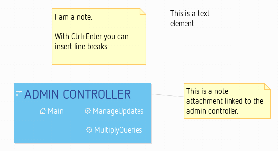

### Palette contents

Below the palette's header, which contains the general tools described above, you will find all the specific modelling tools. Note that depending on which [layers](#layers) are currently enabled, some tools may or may not be visible.

*Tool Drawers*. Tools in the palette are organised in expandable drawers to group them by category. To expand a drawer and show its content, simply click once in the drawer's header. Click again to fold it back and hide its tools. When you expand a drawer, some others may be folded automatically if there is not enough space to show all of them. To prevent this, you can "pin" a drawer opened by clicking on the "pin" icon in the drawer's title area when it is expanded. This will force it to be kept opened, and its tools available, at all times.

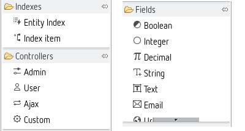

*Tool groups*. Most entries in the palette correspond to a single tool, but some of them represent tool groups. Tool groups are identified by a small right-facing arrow on the left of the tool's icon. They behave like combo-boxes: click on the arrow to expand the group and reveal all the tools available in this group. Click on the tool you want to activate to make it the default and close the group. You can then use the selected tool as any other, but you have to re-open the pop-up menu if you want to enable a different one. When the group is expanded, you can click on the "pin" icon to the right to of the top-most tool to force the group to stay expanded, so that you can easily have access to all the tools.

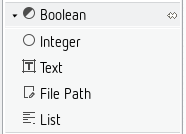

The appearance of the palette tools can be adjusted to individual tastes. Clicking the right mouse button on the palette provides the option *Use Large Icons* and a sub-menu called *Layout*.

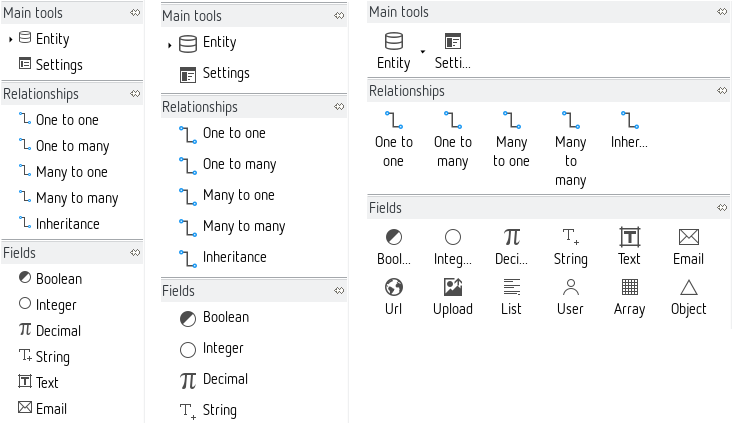

One should experiment with the different settings to get a feeling for the different possibilities. The choice to use small or large icons is stored for each layout type.

### Using the tools from the palette

There are different interaction modes possible for the tools available in the palette. The basic pattern is to select the tool in the palette with a simple left-click on in it the palette, and then apply it once on the diagram.

Normally, when you have used a tool once, it does not stay selected; if you want to reuse it a second time, you have to re-select it in the palette. If you want to apply the same tool several times in a row, simply hold the **Ctrl** key pressed while using it; it will stay "armed" until you release the **Ctrl** key or select another tool.

To deselect a tool without executing it, simply press the **Esc** key, or select another one (for example the default *Selection* tool).

When a tool is selected and you move the mouse on the diagram, you will notice that the mouse cursor's shape changes depending on where it is, to indicate whether or not the selected tool can be applied at this particular location. For example some elements can only be created at the top-level of the diagram (in the diagram's background itself), and not inside other elements. For such a tool, if you put the cursor on top of another diagram element, the mouse cursor will change to indicate the action is not allowed. Note that the exact shape of the mouse cursor depends on the operating system.

*Direct Action Tools*. Direct action tools are the simplest and most common one. They require a single click somewhere on the diagram (as long as it is allowed). The most common direct action tools are element creation tools. For example there is a palette entry named *Entity*: if you click on it and afterwards click on the diagram canvas a new entity element is added to your model.

*Edge Creation Tools*. Edge creation tools add relationships (for example a *Many to many* relation) to your model; they are a little more complex, in that they require the specification of both the source and target element of the new edge. Once the tool is selected, there are two possible usage modes:

1. First do a single click on the source element, then move the mouse to the target element (which may be the same) and click a second time to finish the edge creation.
2. Alternatively, you can click on the source element, keep the mouse button pressed, move the mouse to the target element and release it there. Both methods are equivalent.

If you want to create a self-relationship (where source and target elements are identical), a simple click on the corresponding element is enough.

*Tools With Selection Dialog*. Some complex tools may require additional information to perform their jobs. In particular, tools with selection dialogs will open a dialog box when you use them on a diagram element to ask for more information. The details will vary from tool to tool, but to complete the interaction simply select the requested information and finish the dialog/wizard.

*Other Tools*. While not used yet, it may be possible that tools have more complex interaction patterns. These will usually be custom tools very specific to a particular use case which would be explicitly described in this manual.

## Refreshing the diagram

The *Refresh* operation will force an update of the diagram's content according to the latest version of the underlying semantic model. The default operational mode is to automatically refresh the diagram's content whenever any relevant change is detected in the semantic model (e.g. caused by another editor). In additional you can also manually use the *Refresh* operation whenever you want the diagram to take into account changes in the model. Sometimes it may be necessary to invoke an explicit, manual refresh using this operation if ModuleStudio got confused.

You can invoke the refresh either by the tab-bar  or with the **F5** keyboard shortcut or using the canvas' context menu.

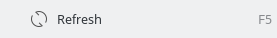

## Layers

The various kinds of elements which can appear on a diagram, and the tools which are available to manipulate them, are organised in Layers. The diagram has a default layer which is always enabled, but also has additional layers which are optional. You can enable or disable the optional layers at will, to hide or reveal new kinds of elements. So layers allow to hide or show different concerns of the model which helps to keep focus on what is relevant for the moment.

The set of layers currently enabled can be controlled using the drop-down menu in the tab-bar. Mandatory layers can not be disabled and are not displayed in this menu. Simply click on the button to reveal the menu, and check or un-check the optional layers you want to have enabled or disabled.

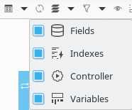

For example if you are currently not working on entity indexes, you can hide them by disabling the index layer. When disabling a layer both corresponding diagram elements and palette entries are hidden.

### Default layer

The default layer is always enabled. Beside the application itself it contains entities, relationships and generator settings.

#### Application properties

The diagram canvas corresponds to the application described by the model. Some basic settings should be defined here which are available in the [properties view](33-Views.md#properties-view).

The most important fields should be already set because the new application wizard gathered the required information. This includes the application name, the database table prefix, the project home page (url) as well as the name and the email address of the developer.

You can see a detailed description for all properties in the [generator reference](87-GeneratorReference.md#application).

#### Entities and relationships

Entities and relationships define the data layer for an application. This represents the managed database tables as well as how the objects behave within the working application.

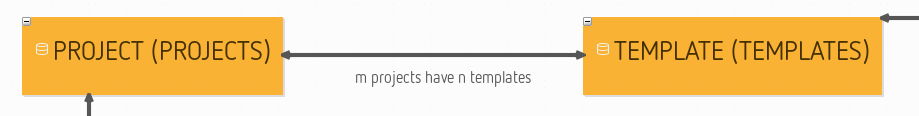

When a new entity is created, the editor needs to know three things: the name for the entity in singular, and in plural, and a field specifying whether the entity is leading. In every application there must be one entity marked as *leading*. This is used as the default object type.

The modelling of entities is the most important step in defining the data layer, but this process is incomplete without defining the relationships between them which are represented by edges in the diagram. To add a relationship [use the palette](#using-the-tools-from-the-palette) like described above. The diagram editor cleverly determines the names for both sides of the relationship from the singular or plural names of the connected entities.

#### Generator settings

A settings container element allows you to take influence on the generator's behaviour. The details are described in the [generator reference](87-GeneratorReference.md#settings-container).

### Fields layer

Inside a new entity you create several fields for persisting different properties of this entity.

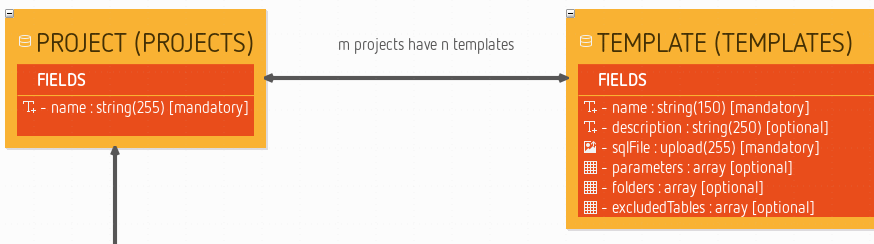

These fields are easily created with the [pop-up bar](#pop-up-bars) that appears when the mouse hovers over the fields container within the entity. This is significantly faster than moving the mouse to the palette and back all the time. There are several different field types available. Most of them represent [Doctrine mapping types](http://docs.doctrine-project.org/en/latest/reference/basic-mapping.html#doctrine-mapping-types), but there are also some additional ones which are Zikula-specific (e.g. a user fields) or just for convenience (like upload fields).

Note you can also add fields using copy and paste. So if you for example want to add four upload fields to an entity simply create the first one. Afterwards select and copy it. Then you can select the outer fields element and easily paste the field multiple times.

### Index layer

An index tells the database to optimise a table for searches by specific fields. Every index gets a name and has a certain type (normal or unique). The index can contain different entries which must be named exactly like an existing field from the same entity.

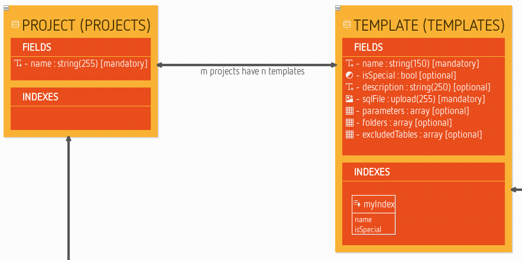

### Controller layer

Controllers define the interaction between the user and an application - what the user sees, and what he can do. We define, therefore, which user functions should exist at this place in the model.

Note that each entity implicitly acts as a controller, too. So if you created a `person` entity, this represents also a person controller. If you enable the controller layer you see an additional palette group named *actions*. Every entity contains one or more actions representing functions which can be called or visited by the user.

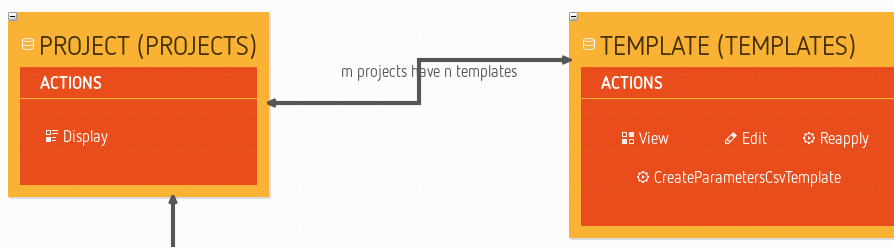

The available action elements are self-explanatory. It should be mentioned, however, that *delete* is only there for backwards compatibility. Every form generated from an *edit* action contains a delete button already (given the user has the required permissions). From older modules, one might be used to having the delete confirmation question on a separate page. Also there is an element for additional entries (custom action) that one can use to model method stubs for additional actions in the generated controller classes.

### Variables layer

Variables are generated as basic settings in the application. You can create one or more container elements for variables on the canvas.

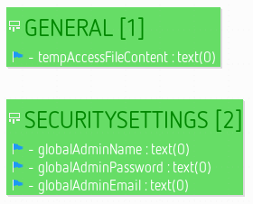

These containers can hold the definition of several variables. Variables can be created for boolean values, integers, text fields, file paths and lists.

## Pop-up bars

The user interface objects appearing in pop-up bars are buttons in a bubble-like shape. The buttons are generally used to create elements in the context of the diagram element below the mouse location.

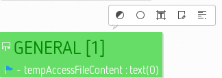

In the above picture, the mouse pointer was left motionless over a variables container. The pop-up bar appeared and offered a list of variable elements to create within this container.

The tools which appear are the same as the ones available on the palette, but it can be more convenient sometimes to use the pop-up bar instead of going back to the palette to select the tool. Like in the palette, too, the tools are limited by enabled/disabled [layers](#layers).

## Diagram navigation

### Moving the diagram

When the diagram is larger than the editor area, you can move it in all directions by pressing the middle-button and dragging the mouse (keeping the button pressed). You can also use the [outline view](33-Views.md#outline-view) for navigating in large diagrams.

### Zooming the diagram

There is a variable zoom function which can be controlled by several ways. There are icons for this in the [palette](#palette) (see [palette standard tools](#palette-standard-tools)) and some options at the top right in the tab-bar.

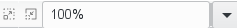

The *Zoom in* and *Zoom out* buttons behave similarly to their equivalents in the palette. The combo-box shows the current zoom level and allows you to choose among some pre-defined levels. You can also manually enter a specific zoom level (e.g. "42") and hit **Enter** to apply it.

The zoom function can also be accessed by using the combination of the keyboard key **Ctrl** and the mouse wheel - as is used in many browsers, which makes it an intuitive option. In this case, the zoom is done on the mouse location instead of the center of the editor. 

### Opening other editors

You can open the [table editors](35-TableEditors.md#table-editors) directly from the diagram using the canvas' context menu.

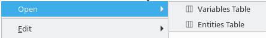

## Working with diagram elements

### Resizing elements

It is possible to resize shapes by dragging them until they are the size that you want.

There are specific shortcuts to change the resize behaviour:

* **Ctrl** (or **Alt** for Mac users): Centered resize (expands the shape on both opposite sides).
* **Shift**: Resize that keeps the ratio.
* **Alt** (or **Ctrl** for Mac users): Resize without snap (temporarily disables the snap during the resize if it is activated).
* **F3**: Resize with children location relative to the parent. If the shape is resized to the left, upwards, or both, the children (contained nodes) are moved with the same offset than the resize.
* **F4**: Resize with snap to all shapes.

Furthermore there are two special functions with regards to resizing.

*Make Same Size*. When multiple elements are selected, clicking on this tool will resize all of them to have the same size (both width and height). The element used for reference to decide the size to apply is the last selected. This action is available in both the tab-bar and the context menu.

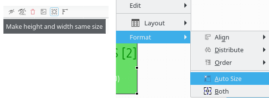

The results looks like this:

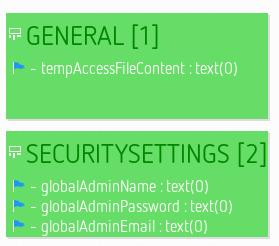

*Auto Size*. This button marks the selected elements as auto-sized. Auto-sized elements will adjust their width an height dynamically according to their contents.

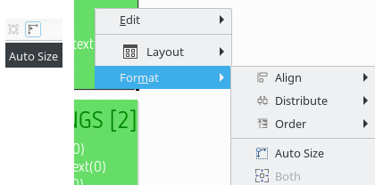

### Moving elements

There are specific shortcuts to change the move behaviour:

* **Shift**: Constrained move (only vertical or horizontal move is authorised at once).
* **Alt** (or **Ctrl** for Mac users): Ignore snap while dragging (temporarily disables the snap during the move if it is activated).
* **F3**: Move the edge source and target if pressed during the edge move.
* **F4**: Move with snap to all shapes.

### Editing and deleting elements

To change elements primarily the [properties view](33-Views.md#properties-view) is used. There is also a direct edit feature which allows you to change the most important properties of an element right at it. You can start direct editing for a selected element by either pressing **F2**, doing a slow double click, or by directly starting to enter alpha-numeric text. Depending on the element type direct edit may include several properties at once.

To delete one or more selected elements you can either:

* just press the **Del** key;
* use the delete icon in the tab-bar;

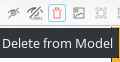

* or the context menu.

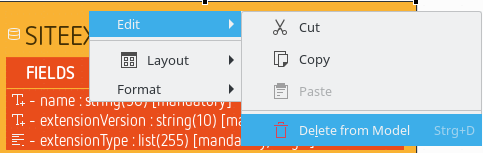

### Reposition fields and variables

Quite often you want to change the position of a field or a variable within its container. You can do this using the context menu.

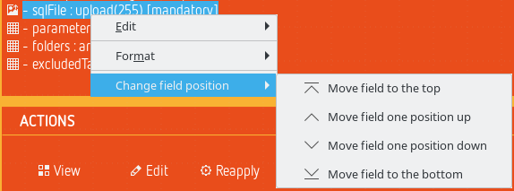

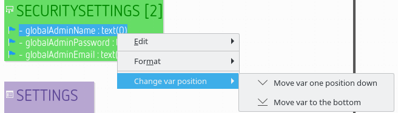

Of course this seems a bit cumbersome. Note earlier versions of ModuleStudio allowed to do this using drag n drop. This is currently not possible, but going to be re-implemented very soon.

### Move fields between entities

You can use drag n drop to move fields into another entity. This is especially interesting if you refactor an existing model, for example to merge two entities sharing a common structure. Note this also works with having multiple fields selected, so you can move several fields into another entity in one step.

Similarly you can also move actions or indexes into other entities and variables into other variable containers.

### Manage list entries

There are two elements, list fields and list variables, which contain a number if list items. To work with these, just do a double-click on the field/variable element. This opens a dialog for editing the list items.

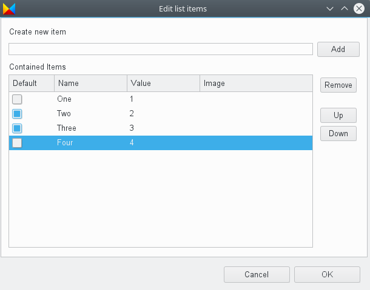

You can add new items to the table and remove existing ones with the equally named buttons. To change the values simply click on the corresponding table cell. You can also reorder the existing entries using the *Up* and *Down* buttons.

## Manage edges

### Snap back edge labels

All visible edge labels can be snapped back to their default position by using the action *Snap back label(s)*. This action is available within the edge contextual menu under the format section *Format > Snap back label(s)*:

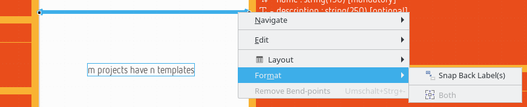

This action is also available individually for each visible label of an edge. To use it, you have to use the action *Snap Back* under the label's contextual menu *Format > Snap Back*:

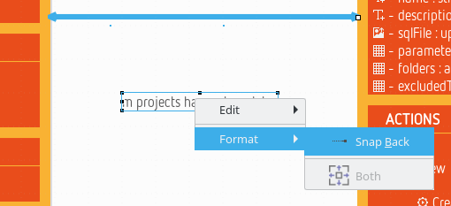

The result of this action is visible here:

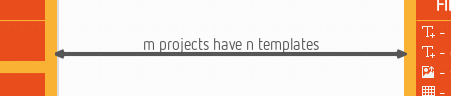

### Move bend-points

It is possible to snap the bend-points to all shapes by pressing **F4** shortcut key during the move. As for *snap to grid*, and unlike to snap for node, there is no visual feedback (gray grid line) drawn during the move.

### Remove bend-points

You can define some bend-points (or inflection points) on an edge. It is possible to remove all these bend-points to retrieve the original straight edge. The action is available within the edge context menu (*Remove bend-points*) or by using the shortcut **Ctrl + Shift + -**. This action is only available on edges with a *straight* routing style.

### Straighten an edge

There are four actions to straighten an edge, i.e. to transform an edge to an horizontal, or vertical, straight edge (with only one starting point and one ending point).

These actions are available on edge contextual menu *Layout > Straighten*:

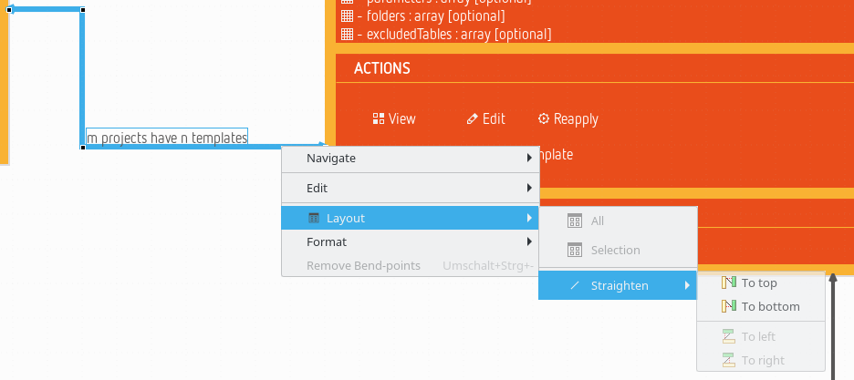

After choosing *To top* the edge looks like this:

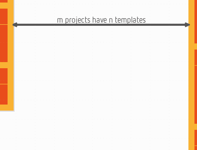

After choosing *To bottom* the edge looks like this:

The options *To left* and *To right* work in the same way for vertically aligned edges.

The action can be disabled (grayed menu) in some conditions:

* The action is not possible because it does not respect the source or target node boundaries.
* The source and the target of the edge are not on the same "axis" (left and right sides, or, top and bottom sides).
* A straighten action will be disabled if the edge centering constraint will be violated. For oblique edges, the action is disabled if at least one side is centered. For rectilinear edges, the action is disabled if the moved side is centered.
* The source or the target of the edge is another edge.
* The source and the target is the same element.

The action is available (menu is displayed) if the selection contains only edges (note and text attachments are not considered as edges).

### Display attachment link between edge and its labels

It is possible to display an attachment link between an edge and its labels when edge or label is selected. This is not the default behaviour but it can be activated by [a preference](38-Preferences.md#connections-settings).

If an edge is selected, one attachment is displayed for all associated labels. If a label is selected, only the attachment between the edge and this label is displayed.

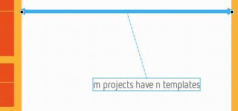

## Changing elements layout

### Arrange elements

If no element is selected you can automatically arrange all elements using the tab-bar. The same action is also available in the context menu of the diagram canvas.

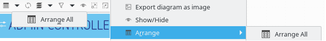

As soon as elements are selected you can also arrange only these using the context menu, too.

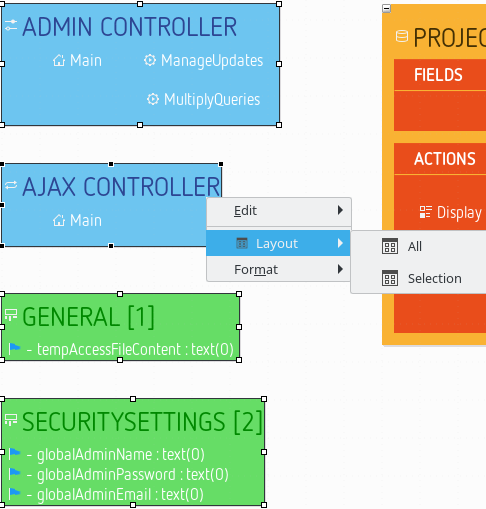

### Align elements

When you have selected some elements you can take influence on their alignment.

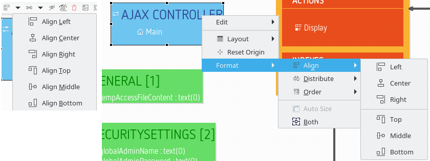

The following screenshot has right-aligned two containers.

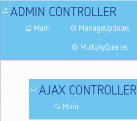

Additionally the diagram will show gray helper lines to support correct alignment when moving elements:

### Distribute elements

There are also actions available which allow to distribute shapes:

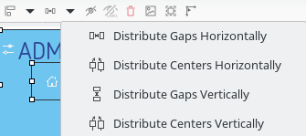

The same action is also available in the context menu (*Format > Distribute*).

* *Distribute centers horizontally*: Distributes the selected shapes so that the gap between horizontal centers of each selected shapes will be the same.

* *Distribute gaps horizontally*: Distributes the selected shapes so that the gap between the left side and the right side of each consecutive shapes will be the same.

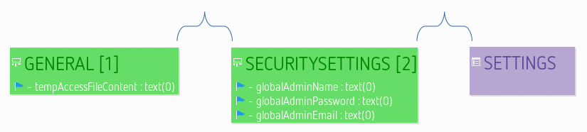

* *Distribute centers vertically*: Distributes the selected shapes so that the gap between vertical centers of each selected shapes will be the same.
* *Distribute gaps vertically*: Distributes the selected shapes so that the gap between the bottom side and the top side of each consecutive shapes will be the same.

Only the top level shapes of the selection are retained for these actions: if inner shapes or edges are selected, they are ignored.

These actions are enabled only if the selected shapes have the same direct parent. At least three shapes should be selected to enable distribute actions.

#### First and last shapes

For all distribute actions, the first and the last shapes do not move. The first and last shapes do not depend on the selection order. They depend on the location of each selected shapes and the chosen action.

For horizontal distribution with uniform gaps:

* the first shape is the leftmost one (with the minimum x location). If several shapes have the same x location, the highest one is the first.
* the last shape is the rightmost one (with the right side with the maximum x coordinate). If several shapes are aligned to the right, the lowest one is the last.

For horizontal centered distribution:

* the first shape is the leftmost one (with its center at the minimum x coordinate). If several shapes are aligned on center, the one with the highest center is the first.
* the last shape is the rightmost one (with its center at the maximum x coordinate). If several shapes are aligned by center, the one with the lowest center is the last.

For vertical distribution with uniform gaps:

* the first shape is the highest one (with the minimum y location). If several shapes have the same y location, the leftmost one is the first.
* the last shape is the lowest one (with the bottom side with the maximum y coordinate). If several shapes are aligned to the bottom, the rightmost one is the last.

For vertical centered distribution:

* the first shape is the highest one (with its center at the minimum y coordinate). If several shapes are aligned on middle, the leftmost one is the first.
* the last shape is the lowest one (with the bottom side with the maximum y coordinate). If several shapes are aligned by middle, the rightmost one is the last.

### Order elements

When you have selected some elements you can take influence on their z-order.

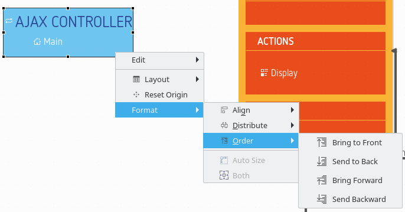

These actions can be useful if you have several elements overlapping each other and want to control which one is above the others.

## Hiding and showing elements and labels

### Hiding elements

Every graphical element on a diagram except compartments can be hidden explicitly. To do that, select the element(s) you want to hide. Then, choose *Hide Element* from the tab-bar. The graphical element is now hidden from view.

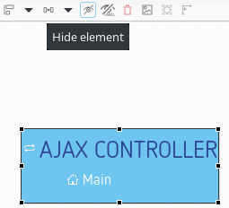

It is also possible to hide an element from the [outline view](33-Views.md#outline-view). Choose outline mode to see the semantic model in a tree viewer. You can now right click on an element and choose *Hide element*.

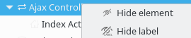

### Revealing hidden elements

On the outline view, in outline mode, you can see every model element. The elements that are hidden have their names displayed in italic style and their icon is decorated with a yellow dot in the top left corner. To reveal one of this element, simply right click on it and choose *Show element*.

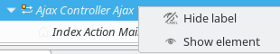

Another possibility is a *Show/Hide* button the tab-bar provides when there is no selected element on the diagram.

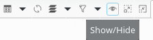

This button opens a dialog to manage the shown and hidden elements on the diagram with a tree view, using various selection buttons (Check all, Uncheck all, Expand All and Collapse all) and various filters (all elements, only checked elements and only unchecked elements).

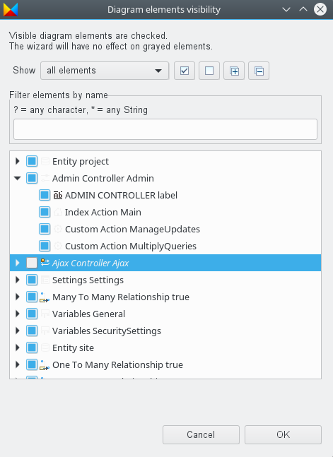

Some elements might be grayed in this tree (e.g. compartments), their selection will have no effect. Their grayed status indicates that they can not be hidden from the wizard but their children might support it.

You can also use [regular expressions](#using-regular-expressions-to-find-diagram-elements) to easily retrieve the elements you want to hide/reveal.

### Hiding labels

It is also possible to hide the label of graphical elements. The approach is the same as for other elements, except that there are a specific button named *Hide label*.

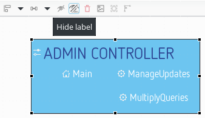

It is also possible to hide or reveal a label from the outline view, in outline mode. The elements whose label is hidden have their names displayed in italic style and their icon is decorated with a *L* in the bottom right corner. To reveal a label, simply right click on it and choose *Show label*.

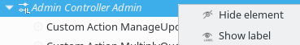

When there is no selected element on the diagram, the *Show/Hide* tab-bar button/dialog allows to manage the labels too.

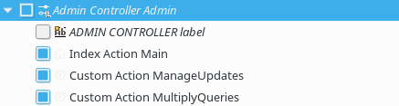

Additional notes about different diagram elements:

* Labels of containers, lists and compartments may be hidden by default. You can choose to display them using the outline or Show/Hide tree view.
* It is also possible to hide the edge labels. The approach is the same than the nodes labels.

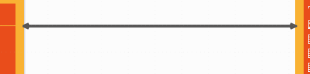

### Hiding icons of labels on shapes or connectors

When working on big diagrams, you may want to hide the icons of the labels on all shapes or connectors, in order to improve the readability of your representations. To do so, open the preferences (*Window > Preferences*) and select the [Appearance](38-Preferences.md#appearance) category. The options *"Hide label icons on shapes"* and *"Hide label icons on connectors"* will allow you to do so.

By default, no shapes neither connectors are hidden. If you check both options, next time you will open your diagram, all label icons of shapes and connectors will be hidden.

## Embedded textual editor

ModuleStudio is going to move towards hybrid modelling, combining different kinds of editors in the same UI. One concrete use case for this is that the [textual editor](36-TextualEditor.md) can be used inside the diagram editor. This may be handy to specify a large amount of properties directly for example.

If you double-click data objects (mapped super classes and entities), variable containers, settings containers and relationships an embedded textual editor is opened right at this position. This embedded editor provides many features of the main textual editor, like syntax highlighting, content assist and template proposals. Some advanced features are not part of the embedded editor (yet) though: for example folding is not available and problems as well as quick fixes are not shown.

One benefit of the embedded editor though is that it relates to the context of one specific element instead of showing the entire model at once. So it is interesting for modifying the *inner structure* of a certain element only.

To save your changes and close the embedded editor press **Ctrl + Enter**. If you press **Esc** the editor is closed without saving. For other shortcuts see the [corresponding chapter](82-KeyboardShortcuts.md).

The following screenshot shows an embedded textual editor for an entity:

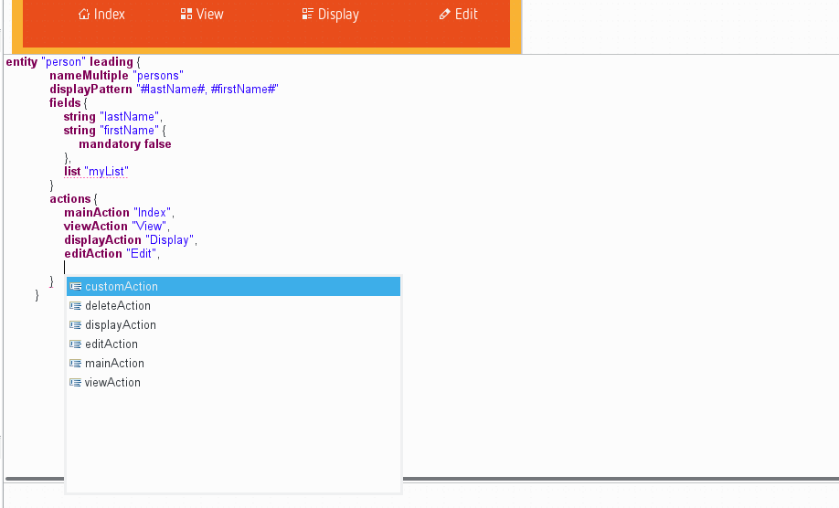

And here is an example for a relationship:

It is even possible to have multiple embedded editors open concurrently. The following example shows the previous editor for a relationship with an additional editor for the generator settings opened.

You can also open the embedded editor for *any element* (also e.g. for single fields) by right-clicking it and using the *Open embedded Xtext editor* action in the context menu.

Note this embedded editor is in **experimental state**, some fine-tuning tasks and extensions are still to be done!

## Other diagram features

### Hide children

If an entity has outgoing relationships you can hide them together with their target elements using a small "minus" symbol. This is transitive, so the children's children are hidden, too. See the following screenshot showing how this works:

### Reset diagram or container origin

This action is available within the diagram or containers contextual menu ("Reset Origin").  It aims to move all diagram (or container) elements so that the diagram (or container) retrieves its origin while keeping the element layout. This action can be launched on several containers at same time.

Specific cases:

* Elements hidden by the user are not considered to compute the shift size but are shifted as the other shapes. That means if an hidden element is located at the top-left corner, the diagram coordinates will turn negative if the user reveals it after having executed the "Reset Origin" action.
* Edges hidden because of a masked source or target are taken in account to compute the diagram bounds.

### Exporting images

You can export a diagram to an image file. To do that right-click on the diagram and choose the menu *Export diagram as image*  or use the image icon in the tab-bar.

On the first export of diagram as image the name is set by default with the representation name. After there is an history to select the last export (note the small arrow next to the file input field). You can choose the directory in which to create the file using the *Browse* button. After selecting the file path, you can choose the image format.

If you do not specify the file extension, the extension is determined from the selected image format. If you enter a path with an unsupported extension the file path is created with the wrong extension with selected extension in image format append to.

Notes:

* Due to some technical limitations, not all export format support all the features of diagrams. The JPG format is the one which currently produces the best result in terms of fidelity to what you see in the diagram editor.
* This function is only visible for convenience, since the generator [exports the diagram anyway](60-GeneratingApplications#the-generation-workflow).

### Using regular expressions to find diagram elements

#### Expression rules

Several dialogs of the diagram editor (like the *Show/Hide* dialog) allow you to filter diagram elements using regular expressions.

Those regular expressions support only the * * * and *?* wild-cards.

1. All diagram elements whose name is **beginning** with the given regular expression is conform to this regular expression;
2. Case is not relevant (i.e. *a* and *A* are strictly equivalent);
3. A *?* wild-card can be used to replace exactly one character in the search
4. A * * * wild-card can be used to replace exactly zero or more characters in the search.

#### Expression examples

Consider that you have a diagram containing the following diagram elements:

* myEntity1 (Entity)
* MyEntity2 (Entity)
* myField1 (Entity field)
* myField2 (Entity field)
* isaBot (Entity field)
* isaBoot (Entity field)
* isaBT (Entity field)

Elements matching the regular expression "m" are all elements that starts with the letter *m* (any case):

* myEntity1
* MyEntity2
* myField1
* myField2

Notice that you will obtain the same result with "my".

Elements matching the regular expression "isab?t" are the following elements:

* isaBot

As *?* stands for **exactly** one character, *isaBoot* and *isaBt* aren't matching this regular expression.

Elements matching the regular expression "*1" are all elements that contain the *1* character:

* myEntity1
* myField1

Elements matching the regular expression "my*a*2" are the following elements:

* myEntity2
* myField2

Here you can notice that for *myField2* the first * represents no character.

### Quick outline

Beside the [outline view](33-Views.md#outline-view) there is also a *quick outline* you can open using **Ctrl + O**.

The input field at the top allows for easy filtering. This allows you to rapidly search text in the displayed name or the contained string attributes of your model elements.

The star, `*`, is a joker character, allowing you to search with more complicated patterns. Regarding this, an element is found if there is a word in its name or one of its attributes that match with the text in the filter, so if you want to search within words too, add `*` at the start of your pattern. Also, you can navigate along the matching elements with `↑` and `↓`, and go to the selected element in your editor with **Enter** or by double-clicking on it.

### Print support

Using the *File > Page Setup...* you can adjust the parameter used when printing a diagram.

If you activate the *Use workspace settings* option at the top of the dialog the second tab *Configure workspace settings* becomes active. Click on it to open a separate window which allows to change the default values.

When you want to print a diagram you can preview it before starting the actual process using the *File > Print Preview* action.

The final print dialog looks like this (the *Advanced Options* window can be reached using the *Properties...* button next to the printer selection):

