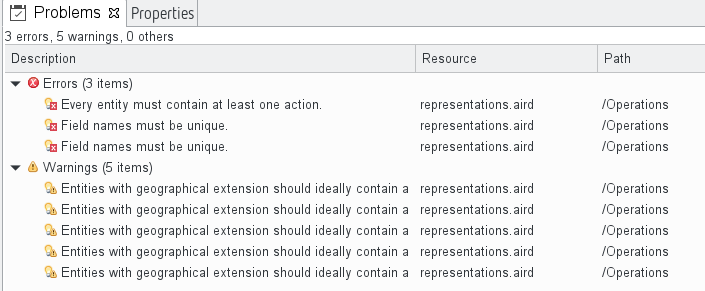
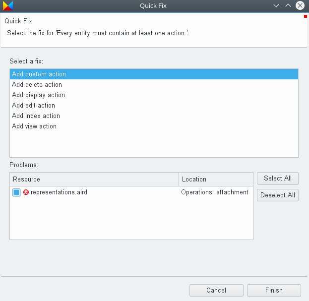

# Views

This chapter explains the available views and shows their functions in detail.

## Dashboard view

The dashboard view is just a control panel providing you quick links to some commonly used functions. All of these are also available in the main menu, but can be faster reached using the dashboard.

*  New application - Starts the wizard for [creating a new model project](20-GettingStarted.md#create-your-first-application-in-10-minutes).
*  Open project - Displays a dialog for selecting an existing project to open.
*  Diagram editor - Opens the [diagram editor](32-DiagramEditor.md#diagram-editor).
*  Text editor - Opens the [textual editor](36-TextualEditor.md#textual-editor).

## Error log view

The error log view, which is named *Messages*, collects any log entries.

By default the log entries are sorted by their date in descending order. You can resort them by clicking on the table column headers. If you click on them again the sorting direction will be changed from ascending to descending.

It is possible to change the width of a column by placing the cursor between two column headers and moving the separator.

Additionally above the table there is a filter field which allows you to search for keywords.

### Log view options

The log view offers the following options available in the right upper corner:

*  Export log - Saves the log into a file.
*  Clear log viewer - Removes all entries from the log view.
*  Delete log - Deletes all log entries permanently.
*  Open log - Opens the log file using an internal text editor.
*  Restore log - Loads the log file into the view again (after it was cleared).
*  Further options - Opens a sub menu which allows you to disable the log for new events and hide the filter field if you do not need it.

### Log entry options

The context menu of a single log entry offers a bunch of actions. Most of them are identical to the general [log view options](#log-view-options). In addition there are the following ones:

*  Copy - Copies the [event details](#event-details-dialog) into the clipboard.
*  Restore log - Opens a dialog showing the [event details](#event-details-dialog).

The [event details](#event-details-dialog) dialog for an entry can also be opened by double-clicking on the corresponding table row.

### Event details dialog

The dialog for a log event shows several details about the event, like the responsible plug-in, the severity, date and message. For errors there is also a stack trace shown.

At the right of the message field there are two additional buttons.

*  Copy - Copies the event details into the clipboard.
*  Show filter dialog - Opens a filter dialog allowing you to change some advanced options.

The log filter dialog looks like this:

As you see you can define different types of filters for the log. For example you could suppress *OK* events completely or limit the log to the current session only.

## Outline view

The outline view shows a miniature display of the [diagram editor](32-DiagramEditor.md#diagram-editor) window. If the diagram canvas is larger than the window a rectangle appears showing which part of the diagram is currently visible. You can drag this rectangle with your mouse to navigate in the diagram. Also you can click on the outline to move to this point directly.

Using the two icons at the top right you can switch between the diagram display and a tree display. This tree shows the model in a hierarchical way.

If you click on an entry the diagram navigates to it accordingly.

The input field at the top allows for easy filtering. This allows you to rapidly search text in the displayed name or the contained string attributes of your model elements.

The star, `*`, is a joker character, allowing you to search with more complicated patterns. Regarding this, an element is found if there is a word in its name or one of its attributes that match with the text in the filter, so if you want to search within words too, add `*` at the start of your pattern. Also, you can navigate along the matching elements with `↑` and `↓`, causing the diagram moving to the selected element immediately.

When using the diagram editor it is also possible to use the outline view for hiding and revealing elements and/or their labels. More information can be found [here](32-DiagramEditor.md#hiding-and-showing-elements-and-labels).

## Properties view

The properties view allows you to change the properties of model elements. Depending on your currently selected element it may contain no, one or multiple tabs. For most elements the following tabs are used:

* **General:** basic settings like name, documentation or length of a field.
* **Constraints:** anything affecting validation, for example a minimum width for an image upload field.
* **Behavior:** all aspects relating functional enhancements.

Each tab may contain one or multiple sections which can be collapsed and expanded. Using a form-based interface different property types are represented by various types of widgets, like text fields, checkboxes, radio buttons or drop-down lists.

Next to each field there is a question mark which shows a description on hover.

## Problems view

The problem view shows errors and warnings detected by the [validation](50-Validation.md#validation) functionality in a table.

The icons of the problems may contain a bulb indicating that [quick fixes](#quick-fixes-for-problems) are available.

You can sort the problems by clicking on the table column headers. If you click on them again the sorting direction will be changed from ascending to descending.

It is possible to change the width of a column by placing the cursor between two column headers and moving the separator.

### Problem entry options

The context menu of a single problem entry offers a bunch of actions.

*  Go to - Navigates to the model element having the error in the [diagram editor](32-DiagramEditor.md#diagram-editor). If the diagram editor is not open, it will be opened automatically.
*  Copy - Copies the [problem details](#problem-details-dialog) into the clipboard.
*  Delete - Deletes the problem entry from the view. This can also be done using the `Del` key. After validation has been executed next time, the problem will be added to the view again if it still existing.
*  Select All - Selects all entries.
*  Quick Fix - Opens a dialog for proposed [quick fixes](#quick-fixes-for-problems).
*  Properties - Opens a dialog showing the [problem details](#problem-details-dialog).

Double-clicking on a problem entry causes the same as *Go to*.

### Problem details dialog

The dialog for a problem shows several details about it.

### Quick fixes for problems

If any quick fixes are available for a certain problem you can choose one of them in the quick fix dialog:

After you selected a proposed fix and clicked on the *Finish* button, the corresponding action will be performed on the model and validation will be executed again. Afterwards the changes should be reflected in the diagram and the problem should be gone.

## Help view

With the help view you can use the [help system](30-UserInterface.md#help-system) inside ModuleStudio instead of having it in a separate window. The view can be opened using the *Help > Search* main menu entry.

Most functions from the help system are also available within the help view, like tabel of contents, keyword index and bookmarks.

It is possible to decrease or increase the font size used in the help view. For this use the small arrow at the toolbar to show a menu.

Note if you search for a keyword, this keyword is highlighted in the results.

### Searching on web sites

The help view allows you to extend a search to different websites, like the (German) Zikula support site and documentation for Symfony, Doctrine and Twig.

### Advanced search options

Clicking on the *Advanced Settings* link opens a dialog which lets you further customise the search function.

For the local help (that is, the manual) you can restrict which topics (chapters) should be included into a search process.

You can also disable web search engines or rename them. 

Finally you could even create additional search engines using the *New...* button.

So you could have several *Local Help* entries, each referencing different topics of the manual. Or you could add a web search pointing to some website offering further information you find useful. You only need the search results URL and replace the keyword by `{expression}`. You can even use a web search engine if a site does not provide a search function. For example for the Twig documentation the URL template used is `https://www.google.com/?q={expression}+site:twig.sensiolabs.org`.

