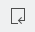

# Views

This chapter explains the available views and shows their functions in detail.

## Dashboard view

The dashboard view is just a control panel providing you quick links to some commonly used functions. All of these are also available in the main menu, but can be faster reached using the dashboard.

*  New application - Starts the wizard for [creating a new model project](20-GettingStarted.md#create-your-first-application-in-10-minutes).
*  Open project - Displays a dialog for selecting an existing project to open.
*  Import model - Displays a dialog for selecting an existing `.mostapp` file to be imported into a new project. Models from earlier versions are [automatically migrated](40-Migration.md#importing-model-files).
*  Diagram editor - Opens the [diagram editor](32-DiagramEditor.md#diagram-editor).
*  Variables table - Opens the [table editor](35-TableEditors.md#table-editors) for variables.
*  Entities table - Opens the [table editor](35-TableEditors.md#table-editors) for entities.

## Error log view

The error log view, which is named *Messages*, collects any log entries.

By default the log entries are sorted by their date in descending order. You can resort them by clicking on the column headers. If you click on them again the sorting direction will be changed from ascending to descending.

It is possible to change the width of a column by placing the cursor between two column headers and moving the separator.

Additionally above the table there is a filter field which allows you to search for keywords.

### Log view options

The log view offers the following options available in the right upper corner:

*  Export log - Saves the log into a file.
*  Clear log viewer - Removes all entries from the log view.
*  Delete log - Deletes all log entries permanently.
*  Open log - Opens the log file using an internal text editor.
*  Restore log - Loads the log file into the view again (after it was cleared).
*  Further options - Opens a sub menu which allows you to disable the log for new events and hide the filter field if you do not need it.

### Log entry options

The context menu of a single log entry offers a bunch of actions. Most of them are identical to the general [log view options](#log-view-options). In addition there are the following ones:

*  Copy - Copies the [event details](#event-details-dialog) into the clipboard.
*  Restore log - Opens a dialog showing the [event details](#event-details-dialog).

The [event details](#event-details-dialog) dialog for an entry can also be opened by double-clicking on the corresponding table row.

### Event details dialog

The dialog for a log event shows several details about the event, like the responsible plug-in, the severity, date and message. For errors there is also a stack trace shown.

At the right of the message field there are two additional buttons.

*  Copy - Copies the event details into the clipboard.
*  Show filter dialog - Opens a filter dialog allowing you to change some advanced options.

The log filter dialog looks like this:

As you see you can define different types of filters for the log. For example you could suppress *OK* events completely or limit the log to the current session only.

## Outline view

The outline view shows a miniature display of the [diagram editor](32-DiagramEditor.md#diagram-editor) window. If the diagram canvas is larger than the window a rectangle appears showing which part of the diagram is currently visible. You can drag this rectangle with your mouse to navigate in the diagram. Also you can click on the outline to move to this point directly.

Using the two icons at the top right you can switch between the diagram display and a tree display. This tree shows the model in a hierarchical way.

If you click on an entry the diagram navigates to it accordingly.

The input field at the top allows for easy filtering. This allows you to rapidly search text in the displayed name or the contained string attributes of your model elements.

The star, `*`, is a joker character, allowing you to search with more complicated patterns. Regarding this, an element is found if there is a word in its name or one of its attributes that match with the text in the filter, so if you want to search within words too, add `*` at the start of your pattern. Also, you can navigate along the matching elements with `↑` and `↓`, causing the diagram moving to the selected element immediately.

## Properties view

*TBD*

## Problems view

*TBD*

### Quick fixes for problems

*TBD*

## Help view

*TBD*

### Searching on Zikula support sites

*TBD*
