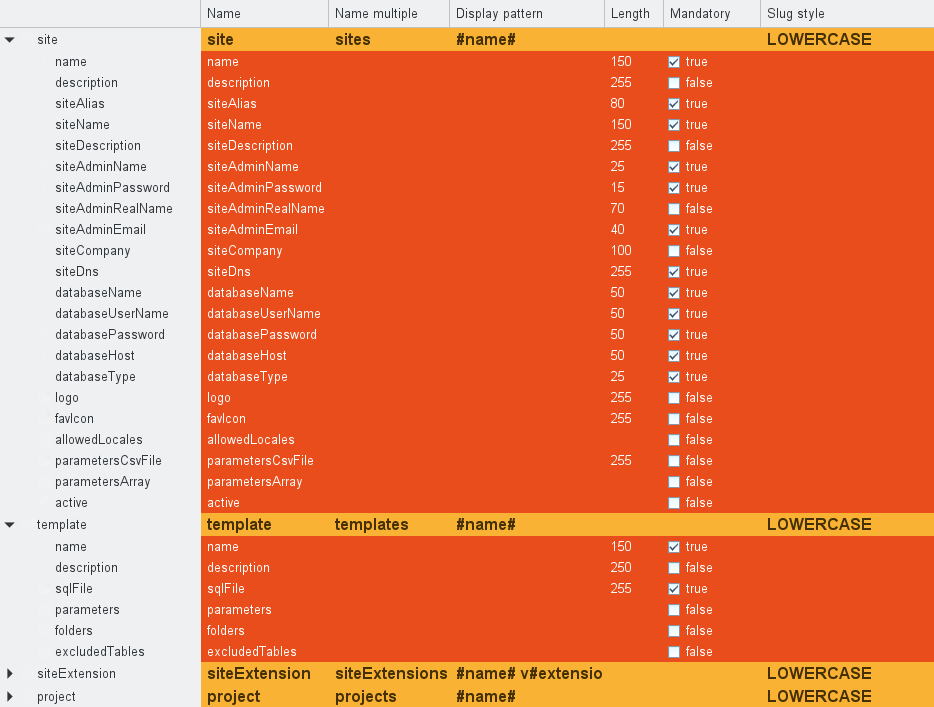
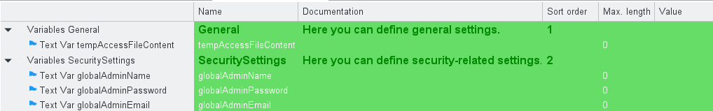

# Table editors

ModuleStudio has two table editors which are maybe more convenient for some tasks than the diagram editor.

For example of you need to add many fields to an entity this could be done faster in the entity table.

Similarly there is also a table for variables available.

## Creating, renaming and deleting tables

*TBD*

## Refreshing tables

*TBD*

## Adding and removing lines and columns

*TBD*

## Hiding lines and columns

*TBD*

## Changing the width of a column

*TBD*

## Sorting by column

*TBD*

## Sorting by line

*TBD*

## Editing cell values

*TBD*

## Quick outline in table editors

*TBD*

## Export table data

*TBD*

