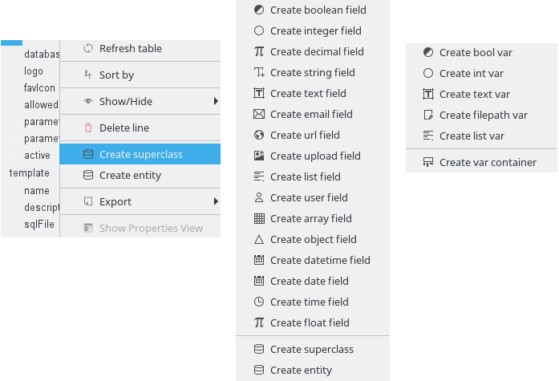
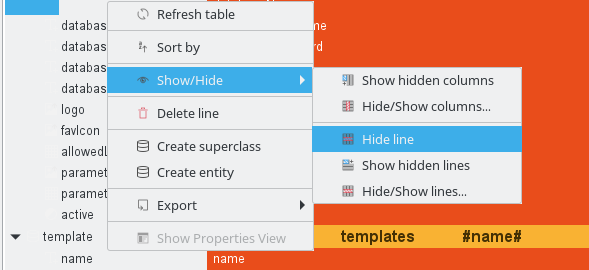
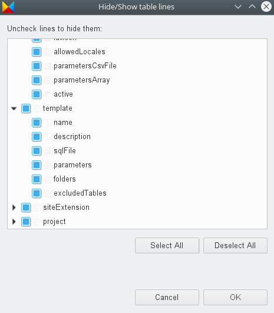
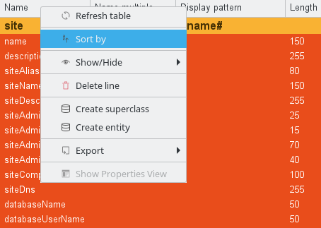
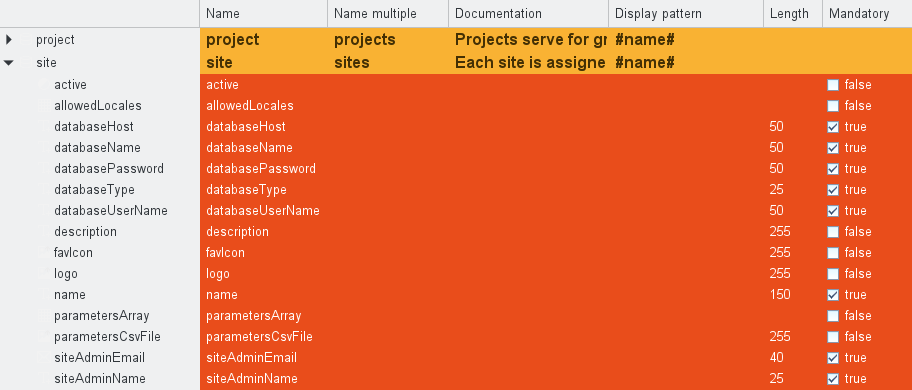
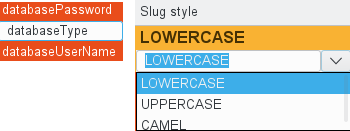
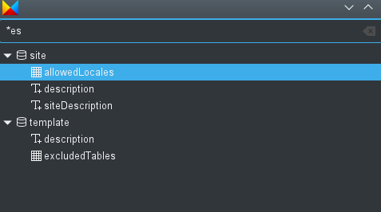
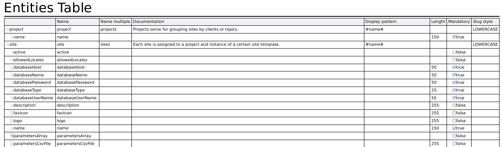
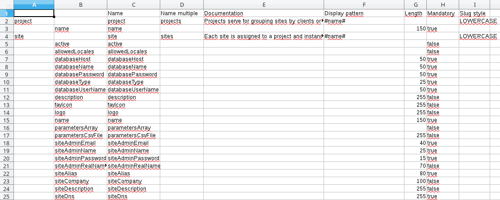

# Table editors

ModuleStudio has two table editors which present information in a structured form and are maybe more convenient for some tasks than the diagram editor.

For example of you need to add many fields to an entity this could be done faster in the entity table.

Similarly there is also a table for variables available.

As you see tables support sub-lines, which can be expanded or folded to show/hide some details, and share the same kinds of interactions.

Note that while tables do not show all possible options which can be set for elements, you can still use the [properties view](33-Views#properties-view) like in the diagram editor, too. The currently displayed values are only the most essential ones. We require **your feedback** to decide which properties should be shown additionally in the tables.

## Refreshing tables

Depending on the value of the *Automatic refresh* Sirius preference (accessible through *Window > Preferences > Sirius*), the contents of opened tables may or may not be automatically updated when the underlying semantic model changes. In manual refresh mode (when *Automatic refresh* is unchecked), you can explicitly request a refresh of the whole table by either pressing **F5** or clicking on *Refresh table* in the context menu (right click). 

## Adding and removing lines and columns

Tools to create new lines and columns appear in the context menu of table elements. Note that you must have a table element selected for the creation tools to appear in the context menu.

The behaviour of the tool may depend on the selected element. For example you need to have a parent element selected to show creation tools for possible child elements.

## Hiding lines and columns

You can control the visibility on individual lines and columns using the *Show/Hide* context menu, available on every table cell.

Selecting a cell and choosing *Show/Hide > Hide line* will hide the corresponding line. To reveal a hidden line, you can use either *Show/Hide > Hide/Show lines*, and select individually which lines should be visible or hidden. You can also use the *Show/Hide > Show hidden lines*, which makes all the hidden lines visible again in one operation. 

The same operations can be performed on column using the corresponding operations in the *Show/Hide* menu for columns.

Note that the visibility status of lines and columns are persisted: if you save and close a table with lines and/or columns hidden, they will still be hidden when you re-open the table later.

## Changing the width of a column

It is possible to change the width of a column by placing the cursor between two column headers and moving the separator. The columns' width is persisted: if you save and close your table, re-opening it later will restore the widths you set.

## Sorting by column

To sort the lines of a table by the values in a specific column, select one of the cells of the desired column, and in the context menu (right click), select the *Sort by* entry. You can also click directly on the table column's header.

The sorting is performed in the lexicographical order of the labels in the sort column. If a table contains sub-lines, the lines are sorted level by level: top-level lines are sorted relative to each other, then direct sub-lines of each line are sorted among themselves, etc.

The initial order of lines (when no sorting is active) is the "intrinsic" order of the elements, as defined by the table's configuration. When you first activate sorting, lines are sorted in ascending order. If you sort a second time, they are sorted in descending order. Any operation which refreshes the table's content (a manual refresh or a model change when in automatic refresh mode - see [above](#refreshing-tables)) resets the lines' ordering to the intrinsic order and disables any sorting.

## Editing cell values

When you select a cell in a table, the *Properties view* will contain two tabs named *Main* and *Semantic*. These tabs show all properties of all semantic elements associated to the cell (there may be several elements), and you can edit each property individually. Note that because the *Semantic* tab shows all the raw properties of the semantic elements, it may be dangerous to edit them directly. In contrast the *Main* tab contains more user-oriented property sheets. The *Semantic* tab is going to be removed in a later version, but is currently also shown as a fallback.

The values shown in the tables may also changed directly in the cells (this is called *direct edit*). To activate the edition of a cell, select it and then either:

* hit the **Enter** key;
* hit the **F2** key;
* double-click on it;
* or type any alpha-numeric character (for text edition only).

The editor offered depends on the contents of the cell. It may be:

* a combo-box if the content can only be a value in a pre-defined list (enumeration);
* a check-box if the content is a boolean;
* a text editor in all the other cases;
* a dialog box for many-valued references.

For combo-boxes, you can start typing the beginning of the value to filter the content of the combo-box.

For check-boxes, you can either click or use the **Space** key to directly change the value of the check-box.

For plain text edition, to facilitate the mass data entry you can begin to directly enter the desired value without first start editing. If the first character typed is alpha-numeric, the text editor will be directly activated. If the property edited with the cell is declared as multi-line, a multi-line text editor is proposed for editing the content of the cell. There is a difference between Windows and Linux for this feature.

* On Linux, the height of the line fits its content. So if the text of one of the cells of a line is 4 lines high, the height is calculated accordingly. When editing, the editor appears on the location of the cell, several lines are visible at the same time.
* On Windows, a restriction requires that all lines have the same height. So all the text will be shown on one line. When editing, a single line is visible and you must use the up/down arrow to display the other lines.

Under all systems, to finish the edition of a multi-line text, you need to use **Ctrl + Return**. Hitting **Return** will simply add a new line. 

## Quick outline

The [outline view](33-Views.md#outline-view) does not work with the table editors. But there is also a *quick outline* you can open using `Ctrl + O`.

The input field at the top allows for easy filtering. This allows you to rapidly search text in the displayed name or the contained string attributes of your table elements.

The star, `*`, is a joker character, allowing you to search with more complicated patterns. Regarding this, an element is found if there is a word in its name or one of its attributes that match with the text in the filter, so if you want to search within words too, add `*` at the start of your pattern. Also, you can navigate along the matching elements with `↑` and `↓`, and go to the selected element in your editor with `Enter` or by double-clicking on it.

## Print table data

Although the print preview is not available for table editors, you can still print tables using `File > Print...` in the main menu.

## Export table data

You can export tables as a CSV file using the context menu (right click).  Afterwards you can use this CSV for further processing. The following screenshot shows an example opened in LibreOffice Calc.

