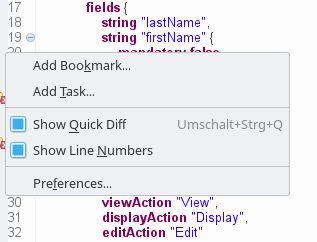

# Textual editor

ModuleStudio also includes a textual syntax notation.

The textual editor can be used in two different ways:

1. **Included in the diagram editor:** see [this section](32-DiagramEditor.md#embedded-textual-editor).
2. **Standalone:** to use the textual editor in a separate window open the *Open resource* dialog using **Ctrl + Shift + R**, type `*.mostapp` into the filter field and click on the *Open* button. A question pops up asking whether you want to add the Xtext nature to the project. Select *No*. Afterwards the editor window should appear.

## Basic features of textual editor

The following screenshot shows a model opened in the textual editor:

As you can see the editor offers syntax highlighting and folding. The minus symbols on the left side allow collapsing parts which are currently not relevant for you. If you hover a collapsed block it's content is shown in a tooltip.

## Line numbers

If you click with the right mouse button on the left column a context menu opens offering some options. Particularly you can enable line numbers which may help with navigation.

## Content assist

The next important feature is auto completion (content assist) which can be triggered by pressing **Ctrl + Space**. Depending on the current cursor position it suggests different possible keywords or names to insert.

## Template proposals

At some points you will also see template proposals. These allow inserting a whole code block, for example for relationships:

After inserting such a template you can easily go through all placeholders using the `Tab` key.

Note you can change existing template proposals and add new ones in the [preferences](38-Preferences.md#template-settings).

## Quick fixes

Of course error markers are also shown in the textual editor. Furthermore it also provides the quick fixes you already know from the [problems view](33-Views.md#problems-view). If quick fixes are available for a problem you see a small yellow bulb next to the error marker. Simply click on it and choose the desired quick fix. In the following example a string field is marked as `language`, but has a too small length for this.

## Quick outline

The [outline view](33-Views.md#outline-view) does also work with the textual editor. But there is also a *quick outline* you can open using **Ctrl + O**.

The input field at the top allows for easy filtering. This allows you to rapidly search text in the displayed name or the contained string attributes of your model elements.

The star, `*`, is a joker character, allowing you to search with more complicated patterns. Regarding this, an element is found if there is a word in its name or one of its attributes that match with the text in the filter, so if you want to search within words too, add `*` at the start of your pattern. Also, you can navigate along the matching elements with `↑` and `↓`, and go to the selected element in your editor with **Enter** or by double-clicking on it.
