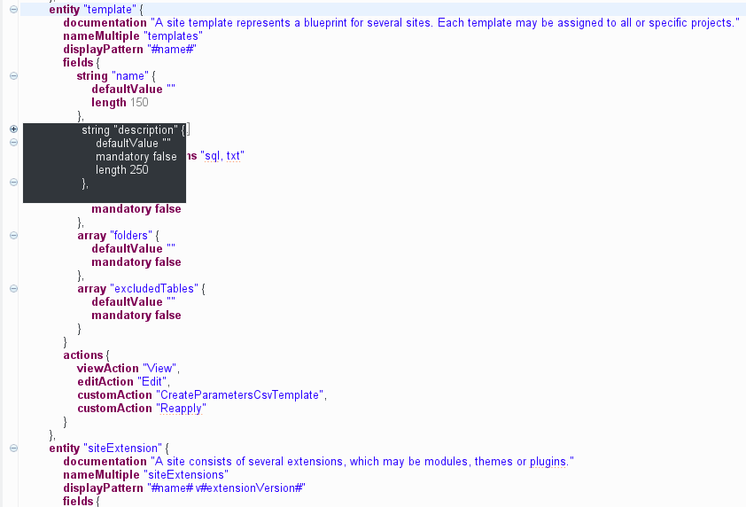
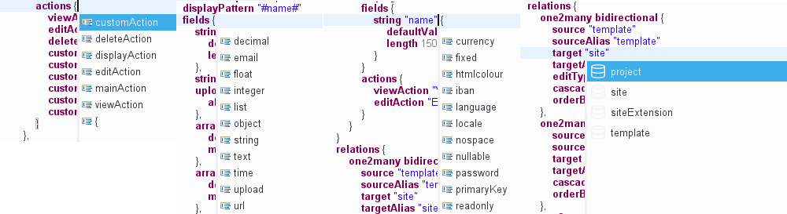
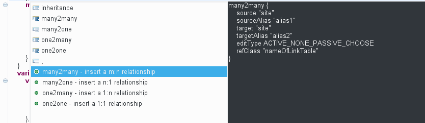
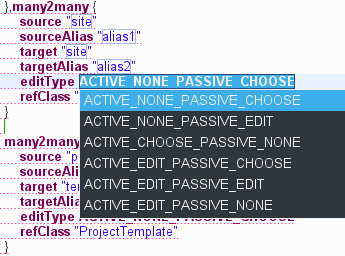
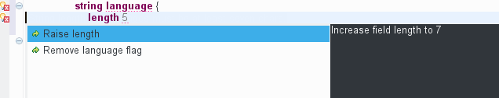
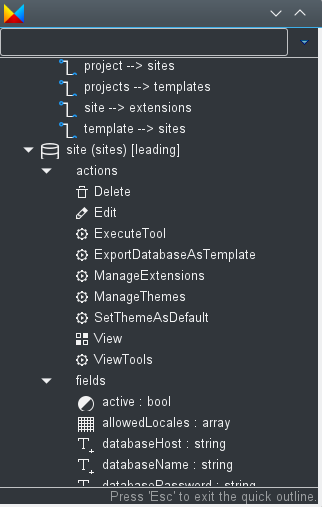

# Textual editor

Beginning with ModuleStudio 0.6.0 there is also a textual syntax notation available. Not visible at once, it will be integrated into the UI step by step. ModuleStudio is going to move towards hybrid modelling, combining different kinds of editors in the same UI. One concrete use case is an embedded textual editor inside the graphical editor allowing to specify details on entity level.

*Expert tip:* you can use the textual editor already if you like: open the *Open resource* dialog using **Ctrl + Shift + R**, type `*.mostapp` into the filter field and click on the *Open* button.

## Basic features of textual editor

The following screenshot shows a model opened in the textual editor:

As you can see the editor offers syntax highlighting and folding. The minus symbols on the left side allow collapsing parts which are current not relevant for you. If you hover a collapsed block it's content is shown in a tooltip.

## Content assist

The next important feature is auto completion (content assist) which can be triggered by pressing **Ctrl + Space**. Depending on the current cursor position it suggests different possible keywords or names to insert.

## Template proposals

At some points you will also see template proposals. These allow inserting a whole code block, for example for relationships:

After inserting such a template you can easily go through all placeholders using the `Tab` key.

## Quick fixes

Of course error markers are also shown in the textual editor. Furthermore it also provides the quick fixes you already know from the [problems view](33-Views.md#problems-view). If quick fixes are available for a problem you see a small yellow bulb next to the error marker. Simply click on it and choose the desired quick fix. In the following example a string field is marked as `language`, but has a too small length for this.

## Quick outline

The [outline view](33-Views.md#outline-view) does also work with the textual editor. But there is also a *quick outline* you can open using `Ctrl + O`.

The input field at the top allows for easy filtering. This allows you to rapidly search text in the displayed name or the contained String attributes of your table elements elements.

The star, `*`, is a joker character, allowing you to search with more complicated patterns. Regarding this, an element is found if there is a word in its name or one of its attributes that match with the text in the filter, so if you want to search within words too, add `*` at the start of your pattern. Also, you can navigate along the matching elements with `↑` and `↓`, and go to the selected element in your editor with `Enter` or by double-clicking on it.

## Relationships between multiple models

*Expert tip:* the textual editor even allows you to create relationships between entities of different applications which is not possible using the diagram editor yet. For this add a `referedApplications` element (see [generator reference](87-GeneratorReference.md#referred-application)) specifying the other model you want to reference. Caution: use this only if you definitely know the consequences of creating Doctrine joins across different bundles. If you are unsure consider other ways of letting both modules work together instead.
