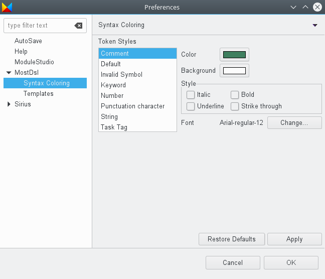

# Preferences

In the preferences section you can adjust several base settings of ModuleStudio. This chapters explains what these settings do.

## AutoSave

Here you can enable automatic save for the editors. You can specify an interval in seconds. This is especially interesting as a save operation triggers [validation](50-Validation.md#triggering-validation), too. So if you for example save the model every 30 seconds you can just work and the [problems view](33-Views.md#problems-view) keeps you updated about possible errors automatically.

## Help preferences

The help section allows you to change some context settings about how help information is displayed. For example you can specify that the [manual](30-UserInterface.md#help-system) should always be opened in an external web browser instead of the included one.

## ModuleStudio base preferences

* *Default theme*: choose whether you like to have the light or dark [theme](30-UserInterface.md#themes) per default.
* *Vendor, Author, Email address, Url*: you can input your default values at this place. The wizard for [creating a new model project](20-GettingStarted.md#create-your-first-application-in-10-minutes) will reuse these values, so you do not have to enter them repeatedly.
* *Ignore model warnings during generation*: enable this option to avoid that a message box appears if your model contains warnings.
* *Override existing files*: if you enable this option the generator will not abort if files exist in the selected output directory. *Use with caution!*
* *Use staging updates*: if that option is activated the auto update function will include unstable releases. Each time you start ModuleStudio it looks for whether updates are available. Per default it searches only for stable releases. With the staging channel you get also updates from every single build which earlier brings you new features, but also includes the risk of breaking things.
* *Ignore updates*: enable this option if you do not want ModuleStudio searching for updates.
* *Disable error tracking*: by default ModuleStudio tracks errors and exceptions; enable this option if you do not want that.

## Advanced sections

The following preference pages are mainly intended for advanced users and are usually not required to be changed.

### MostDsl

The *MostDsl* tab is related to the [textual editor](36-TextualEditor.md#textual-editor).

#### Syntax colouring

Here you can change styles for the syntax highlighting. For example you could have keywords in red instead of purple. Or you could have strings in bold style using another font.

#### Template settings

This shows the available [template proposals](36-TextualEditor.md#template-proposals) defined for the textual editor.

You can change them and add new ones if you like.

Inside the input field you can use [content assist](36-TextualEditor.md#content-assist) like in the textual editor, too.

### Sirius

This tab is primarily about the [diagram editor](32-DiagramEditor.md#diagram-editor). It needs some cleanup, because many settings are actually not required. This section explains only those which are most relevant.

* *Automatic Refresh*: depending on this option, the contents of opened editors may or may not be automatically updated when the underlying semantic model changes. In manual refresh mode (when *Automatic refresh* is unchecked), you can explicitly request a refresh of the whole editor by either pressing **F5** or clicking on *Refresh* in the context menu (right click).

#### Sirius Diagram

This section allows you to disable certain features of the diagram editor. For example you could hide the status line or deactivate animated zoom.

The illustration above shows the default value of all these preferences.

* *Show connector handles*: This has no effect for ModuleStudio yet, but is planned for future.
* *Show popup bars*: Defines whether [pop-up bars](32-DiagramEditor.md#pop-up-bars) are used or not.
* *Enable animated layout*: If checked, then when you launch an automatic layout to [arrange elements](32-DiagramEditor.md#arrange-elements), the shapes will move smoothly to their final location. This makes the arrangement operation take a little longer, but it is easier to follow where your elements have been moved.
* *Enable animated zoom*: If checked, when you change the [zoom value](32-DiagramEditor.md#zooming-the-diagram), ModuleStudio will show intermediate steps to smooth the change.
* *Enable anti-aliasing*: If checked, the graphics on the diagram will use anti-aliasing. This preference does not take effect on all platforms.
* *Show status line*: This has no effect at the moment.

* *Auto-size containers during arrange-all action*: Container elements which have an explicit size are normally not resized during an [Arrange All](32-DiagramEditor.md#arrange-elements). This can be problematic if the elements they contain are re-arranged so that the container's size is not appropriate anymore. When this preference is enabled, the arrange all action will treat all containers as if they are "auto-sized", and adjust their size to the computed arrangement for their content. After the arrange all action is finished, the containers which had an explicit size before will still have an explicit size (although potentially different); they are only switched to auto-size mode during the arrange all action.
* *Move unlinked notes during layout*: If checked, then the [Arrange All](32-DiagramEditor.md#arrange-elements) will consider all [notes](32-DiagramEditor.md#palette-standard-tools) on the diagram and arrange them. If unchecked, only the notes which are attached to non-note diagram elements are moved by the layout; the rest (which are considered just comments on the diagram itself), are not touched.
* *Automatically mark moved elements as pinned*: If checked, then as soon as you explicitly move a element (node or container) on the diagram, ModuleStudio will mark it as pinned and consider it should not be moved by the automatic layout. This setting is probably going to be disabled by default (and hidden) in future.
* *Synchronized mode for new diagrams*: If checked, all newly created diagrams will initially be in synchronised mode. You should **not** disable this to avoid unwanted side effects. This option is probably going to be hidden in future.
* *Remove/hide note when the annotated element is removed/hidden*: If checked, then notes attached to a diagram element will be deleted if the element is deleted, or hidden if the element is hidden.

#### Appearance

The *Appearance* preferences page (see below) gives you two preferences to control whether or not to show the labels on shapes (nodes and containers) and connectors (edges). It also allows you to customise the default font and colours used for some basic diagram elements. Diagram configurations already specify default values for these style attributes, so in practice these preferences are mostly useful for notes.

#### Connection settings

This page allows changing some edge-related options.

* *Show link between edge and its labels on selection*: if enabled this shows links between an edge and its labels if one of these is selected. Read more at [the corresponding section](32-DiagramEditor.md#display-attachment-link-between-edge-and-its-labels).
* *Enable user specific line style*: this allows you to change the edge style. By default ModuleStudio uses rectilinear edges. The following screenshot shows an example using the oblique style instead.

#### Printing preferences

The printing section provides default options for the page layout used for printing diagrams. You can also change them using `File > Page Setup...` in the main menu, but the preferences centrally define the default values.

##### Rulers and grid

This page (see below) contains preferences to control whether or not new diagrams should initially show the rulers and/or grids, and whether to enable the *snap to grid* and *snap to shapes* behaviours by default. The preferences on this page are only taken into account as starting values for new diagrams. Each diagram has its own configuration of rulers and grid. 

* **Show rulers for new diagram:** Display an horizonal and vertical ruler according to *Ruler units* property.
* **Show grid for new diagrams:** Display a grid in background of the diagram according to *Grid Spacing* property.
* **Snap to grid for new diagrams:** Capability to allow edit parts to snap to the grid when editing (during creation, moving or resizing). It is also possible to have connection bend-points snap to it. Grid snapping and visibility are two distinct properties, and it is possible to enable one without the other.
* **Snap to shapes for new diagrams:** That feature allows you to quickly align parts being dragged or resized to other parts in the diagram or that share the same parent (e.g: actions inside a controller or entity can only snap to each other). The snap is effective on top, bottom, right, left and center of the figure. Feedback is shown in the form of a gray line when a part is being attached to another part.

By pressing the **F4** shortcut key in the [diagram editor](32-DiagramEditor.md#diagram-editor), it is possible to temporarily enable the snap to all shapes currently visible on the diagram. 

