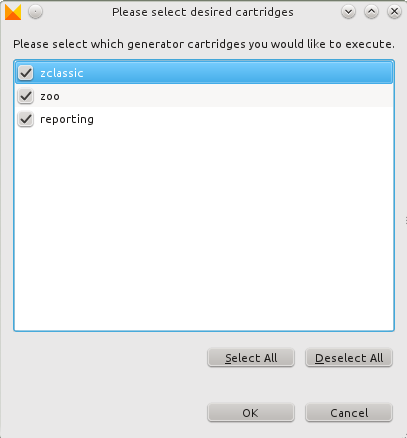

# Generator

## Introduction

The main use case for ModuleStudio application models is the creation of Zikula extensions. This section describes how the generator works and which artifacts are created from which model elements.

## Basic idea

Every application consists of different types of code parts. While some code is unique for each application, most parts can be derived from that and is therefore very similar for a whole software systems family. Those code parts are known as *boilerplate code*.

A very simple example will make this clear very quickly:

    /**
     * imagine some long comments about this class here
     * @ORM\Entity ...
     * some more annotations
     */
    class Person
    {
        /**
         * imagine some long comments about this field here
         * @ORM\Column ...
         * some more annotations
         */
        protected $firstName;

        /**
         * imagine some long comments about this field here
         * @ORM\Column ...
         * some more annotations
         */
        protected $lastName;
    }

This code has obviously not very much knowledge which is essential for this certain application. Reduced to what is really required from a functional view one would get something like:

    entity person {
        string firstName
        string lastName
    }

Thought a little further the generator helps reaching a constantly high code quality, as all implementation details are always considered completely. For example if a new extension is activated for an entity this is not forgotten anywhere inside the code.

## How it works

There is a tutorial showing how calling the generator within ModuleStudio looks like: [Using the generator](http://modulestudio.de/en/tutorial/using-the-generator.html). The only requirement is that you have opened your application model and there are no [validation errors](40-Validation.md#validation) left.

### Input dialogs

First you have to select which generator cartridges you want to execute.

## The workflow

The rough steps of the generator workflow are as follows:

1. Ask for input parameters (for example desired output folder and cartridges).
2. Empty output directory.
3. Export dumps of editor diagrams.
4. Read input model.
5. Perform validation.
6. Transformation to add primary and foreign key fields.
7. Call generator inner workflow for each selected cartridge.

