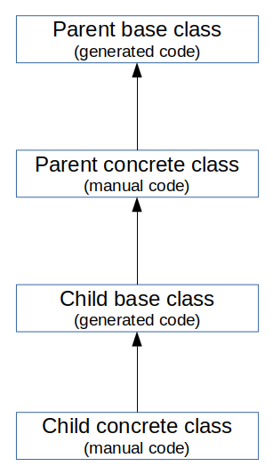

# Customisation and maintenance

This section gives a few hints for changing arbitrary things in your generated applications while keeping in sync with upcoming releases of Zikula and ModuleStudio.

## How to ensure long-term maintainability

To prevent losing the [benefits of ModuleStudio](10-Introduction.md#benefits) in future you have to follow a few simple basic rules in your development process.

### Keep consistent

When using ModuleStudio then your model is not only some sort of bootstrapping or documentation artifact. The model describes or better **is** the real application. Thus it is important for the sustainable maintenance of an application that the model does not become obsolete. It should always represent the current functionality of the project, otherwise one has to do extra work, later, to return it to a consistent state. This is especially important when one wants to regenerate the code at some later date, for example, when a new generator version introduces bug-fixes, or supports a new Zikula version with improved functionality.

To avoid losing the abstraction of model-driven development all changes to functional project requirements should be applied to the model first. Therefore you should do all important changes (like renaming an entity or other amendments, adding or moving fields, introducing new configuration settings, etc.) on model level although it might look a bit inconvenient first. Do not let your model become obsolete, as this would mean losing lots of advantages. You will thank yourself when generating again with a newer version, because manually migrating applications to a new platform version can be tedious and error-prone.

### Iterative-incremental approach

Developing and maintaining model-driven applications works well in combination with an iterative-incremental development process. In this approach you start with a small model which will then be enhanced in several steps whereby some short tests verify that the direction is correct.

Each development cycle in ModuleStudio consists of the following steps:

1. Create or change the model.
2. Let ModuleStudio validate it and fix problems.
3. Generate (or regenerate) the application source code.
4. Merge changes
5. Test intermediate results
6. Customise the application.


Note ModuleStudio offers several *generator settings* to simplify the merging process. More about that below.

### Use versioning

Using a version control system, like git or svn, gives you another additional level of rollback safety and is a good idea anyway. It also simplifies process for performing tests and doing an automatical deployment (e.g. to a test server). If you are interesting in automating such things, look at CI systems like [Jenkins](https://jenkins.io) or [Travis](https://travis-ci.org/) (there are many more).

## How to modify generated classes

### Generated class structure

Normally all created classes are generated twice. Thereby an empty concrete class inherits from an abstract base class containing the whole generator code. The motivation behind this separation is keeping your own code free and separated from generated artifacts.


Example base class:

```php
<?php
namespace MyModule\Entity\Base;

abstract class AbstractPersonEntity
{
    // generator code
}
```

Example child class:

```php
<?php
namespace MyModule\Entity;

use MyModule\Entity\Base\AbstractPersonEntity;

class PersonEntity extends AbstractPersonEntity
{
    // manual code
}
```

Whenever you want to change the default implementation you can add corresponding extensions. If you recognise that you are doing the same changes again and again please [submit them as patches](95-HowToContribute.md#how-to-contribute) for the generator.

### Structure with inheritance hierarchies

One exception for this scheme is inheritance. If you add inheritance relationships to a model, the generator considers this inheritance for all classes which are created for each single entity. This naturally includes the entity classes itself, but also additional classes like repositories or additional entities for extensions like attributes, categories, log entries, translations and more.

As explained above all generated concrete classes inherit from corresponding abstract base classes. As soon as an entity does inherit from another one, there will be no base class created for it. Instead the concrete implementation class will inherit from the concrete class of the parent entity.



Example inheriting child class:

```php
<?php
namespace MyModule\Entity;

class CustomerEntity extends PersonEntity
{
    // manual code
}
```

## How to handle custom code

### Document your changes

Document your changes to simplify the merging process you will have to do after regeneration. For example after you added some fields later on, or you got a new generator version fixing some bugs, and so on you will want to know again where you did which changes for which reason.

Best practice is to use application properties called `skipFiles` and `markFiles` allowing you to specify your amendments inside the model. The generator will then either not generate these files (skip) or create them with a custom file name containing `.generated`.

If you just implemented a child class which was generated empty anyway, you can use `skipFiles`. Personally I use `markFiles` for almost everything, but that's a matter of taste. There is also an additional setting named `generateOnlyBaseClasses` which can be helpful sometimes, too.

### How to merge re-generated files

How this is done best, depends primarily on your personal workflow. But it is more simple than it looks like.

If you documented your changes like shown above you could just copy the new files into your working directory. Afterwards you can search for all marked files (`*.generated.*`) and compare them with the original ones, ensuring that you miss no change.

Before committing the new version you can show the differences using `git diff`. This allows you doing a review before you push the changes into the main repository.

## Where to inject customisation

### Understand the module structure

If you do not know yet how a Zikula module is structured look at the [SpecModule](https://github.com/zikula/SpecModule) which acts as an example module demonstrating the main parts and what they are used for. Remember a Zikula module is a special kind of Symfony bundle, so you might check out [further web resources](89-WebResources.md#web-resources) to learn more about it.

### Use overriding

All cosmetic enhancements can be done by template overriding in Zikula. The Zikula theme system allows for both theme and system overrides. More information can be found in the [SpecTheme docs](https://github.com/zikula/SpecTheme/#resource-overrides).

So when custom templates are placed outside the module this is fine for development. It is even recommended for the module developer to keep things separated during development (and in Git) so that he can always distinguish (and compare) generated and customised templates, since this makes things easier if the module is regenerated again in future.

When using a module in production things are a bit different. A site owner may want to further customise some templates, so the system-wide resources directory should not be used by the module itself out of the box. This is not really a technical problem, but just a question of how the deployment process should be. You can for example move the overridden templates into the module before a release.

If you need additional display-oriented logic, simply create a Twig extension encapsulating your efforts in a file which is not affected by the generator at all.

### Code additions

Perform logical enhancements in the generated implementation classes. These extend from abstract base classes containing the actual generator implementation code. So almost all concrete classes are empty waiting for your custom extension.

If you need to add complex behaviour put this into dedicated helper classes outside of generated files. Using the dependency injection from Symfony's service container you can use this helper class where you need it, keeping the additional code for children of generated classes small.

After using an edit form the user is redirected to the referrer by default. You can easily customise the redirect behaviour by appending a `returnTo` parameter to the edit URL. For example let's imagine a customer entity having a bidirectional relationship to many addresses. Using the `returnTo` parameter you can assign certain pages like `display`, `view` and even related items like `customerDisplay`. You can also use arbitrary return URLs this way, for example to redirect the user to a *thank you* page.
