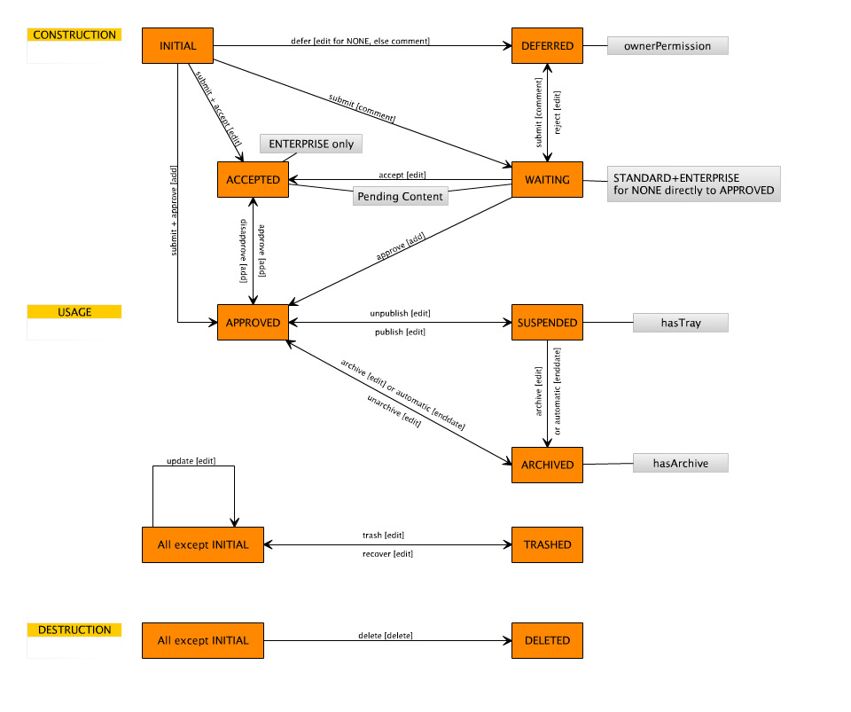

# Generator reference

This reference goes through all available model elements as well as their properties, describing what the generator does with this information and which things are still missing in the created implementation. Also it shows which artifacts are created from which model elements.

Most screenshots in this section are taken from the example application called *RecipeManager*.

## Describing behavioural aspects

As Zikula uses Symfony and the Doctrine ORM layer, the data layer in ModuleStudio allows to precisely express the different concepts and available functions. For example you can use a huge amount of validation constraints and special field types.

From each entity in the data layer there are entity classes and repository classes created. Therewith the contained fields as well as their properties are accordingly reflected. For many data types and basic properties, like *unique*, *readonly* or *notnull* this happens with a one to one adaption. Several things are shortened for convenience in ModuleStudio though. Furthermore there are some additional data types, like for example for users, email addresses, urls and file uploads. An email field is treated by the generator as a string field in Doctrine which has the email validator activated.

Validators are generally not explicitly written in MOST, but simply defined using properties. So there are for example attributes like *nospace*, *country*, *ipaddress*, *htmlcolor* and many more for string fields. Date and time fields have according properties for *past* and *future*.

The different types of relations in Doctrine are all offered, too. For inheritance relationships the strategy can be selected (single table, joined). All other connection types store a name for the two entities on both sides (source alias and target alias) as well as the referenced fields (source field and target field). Because the primary id fields of entities are not part of the model, but automatically added before the generation, the string `id` is allowed and also set per default. By changing these fields it is possible to describe also relations referencing other fields. Beside this it is possible to have multiple relationships between the same entities and also self relations, as long as their alias settings are unique. Finally you can also define how the cascading behaviour should look like, again supporting all options offered by Doctrine.

The ModuleStudio DSL also supports several behavioural extensions for Doctrine, like for example trees, translatable fields, slugs and loggable entities. There are also some Zikula-specific additions by the way, like the behaviours Attributable, Categorisable, MetaData and StandardFields.

Event listeners or subscribers are not explicitly described in the models, but some base implementations are already generated though which can be implemented in the empty subclasses if needed.

## Application layer

### Language elements

#### Named object

This is the common base class of almost all model elements.

It includes the following properties:

* **name** - The name of the element.
* **documentation** - A description for documenting the element.

If a documentation is defined for an entity this will be shown right after the heading of the corresponding view template. So you could for example add a description for the *person* entity explaining what persons are and what information they store. If a user then navigates to the persons list he knows immediately what he is looking at.

#### Application

Represents an application described by the model.

It includes the following basic properties which are mainly, but not only used to create meaningful file headers:

* **vendor** - The vendor of the application. Usually this is the name of a company or institution. Starting with Zikula 1.4 the vendor and name of an application are combined to a unique name. This makes it possible to have for example multiple News modules installed from different vendors.
* **author** - The author of the application. Usually this is the full name of the developer.
* **email** - The email address of the developer.
* **license** - The license of this application. Defaults to LGPL. If either GPL or LGPL are used the generator creates corresponding license files, too.
* **url** - The homepage of the developer.
* **version** - The application version. Must conform to the pattern `x.y.z` - for example `1.0.0` which is also the default value. Will be used in the version class (Zikula 1.3.x) or the composer file (Zikula 1.4.x) of the created application.

An application has some more fields for specifying specific aspects:

* **capabilities** - A comma-separated list of capability names the application offers. Capabilities are used in Zikula to express certain functions a module is offering. This allows for a loose coupling between modules. For example you can let `MyProductsModule` depend on `MyCustomerModule`, but this is a very tight coupling. With capabilities you could instead let the products module query Zikula for `any module which is able to handle customers`. You can read more about this in the [CapabilityApi description](https://github.com/zikula/core/blob/1.4/src/docs/Core-2.0/Api/CapabilityApi.md). Note the generator uses these just for specifying them in the generated module's version class (Zikula 1.3.x) or the composer file (Zikula 1.4.x). There is no further support for the capabilities you want to provide yet.
* **prefix** - A prefix for all database tables of this application. Will be used in entity classes.

An application may furthermore have the following references:

* **controllers** - Allows referencing one or more [controllers](#controller).
* **entities** - Allows referencing one or more [data objects](#data-object).
* **generatorSettings** - Allows specifying desired generator features and behaviour. More details in the [settings container](#settings-container) section.
* **referredApplications** - Allows referencing other applications. See [below](#referred-application).
* **relations** - Allows referencing one or more [relationships](#relationship).
* **variables** - Allows referencing one or more [variables](#variables).

#### Core version

Specifies the Zikula version for which the application should be generated.

Can be one of the following options:

* `ZK20` - Targets Zikula 2.0.0 and later. This is not supported yet and will currently be treated like `ZK14`.
* `ZK14` - Targets the last stable Zikula 1.4.x version. This is the default value and useful when developing for future. Generated applications support the forward compatibility layer using 2.0.0 technology.
* `ZK14DEV` - Targets the last unstable Zikula 1.4.x version. Thus it will always include changes for the next upcoming 1.4.x core release. You can use this to test new changes, while `ZK14` will still target the last stable core version.
* `ZKPRE14` - Targets the last stable Zikula 1.4.x version; legacy alias for `ZK14`.
* `ZK136` - Targets Zikula 1.3.10 and earlier. This is for backwards compatibility and useful when maintaining extensions in production. Although using this raises a deprecated warning you can still work with this until a future version.
* `ZK135` - Targets Zikula 1.3.10 and earlier; legacy alias for `ZK136`.

#### Settings container

Each application may contain one settings container for customising generator settings. You can control which features should be generated and take influence on some behavioural aspects of the generator.

A settings container has the following fields:

* **targetCoreVersion** - The targeted Zikula core version. See [above](#core-version).
* **isSystemModule** - A boolean specifying whether the model describes a system module or not. Default value is `false`.
* **amountOfExampleRows** - The amount of example rows to create for entities in this application. Default value is `0`. Note that if you activate the `categorisable` property for an entity the generated installer relies on that you did not remove the default categories of Zikula. If you deleted them please set the amount of example rows to `0` to avoid problems.
* **generateAccountApi** - A boolean specifying whether account panel integration should be generated or not. Default value is `true`.
* **generateSearchApi** - A boolean specifying whether search integration should be generated or not. Requires at least one string or text field in any entity. Default value is `true`.
* **generateMailzApi** - A boolean specifying whether Mailz support should be generated or not. Default value is `true`.
* **generateListBlock** - A boolean specifying whether a generic list block should be generated or not. Default value is `true`.
* **generateModerationBlock** - A boolean specifying whether a moderation block should be generated or not. Requires at least one entity with a workflow including approval. Default value is `true`.
* **generateListContentType** - A boolean specifying whether a content type for collection lists should be generated or not. Default value is `true`.
* **generateDetailContentType** - A boolean specifying whether a content type for single objects should be generated or not. Requires user controller containing a display action. Default value is `true`.
* **generateNewsletterPlugin** - A boolean specifying whether a Newsletter plug-in should be generated or not. Default value is `true`.
* **generateModerationPanel** - A boolean specifying whether a moderation panel should be generated or not. Requires at least one entity with a workflow including approval. Default value is `true`.
* **generatePendingContentSupport** - A boolean specifying whether support for pending content should be generated or not. Requires at least one entity with a workflow including approval. Default value is `true`.
* **generateExternalControllerAndFinder** - A boolean specifying whether a controller for external calls providing a generic finder component should be generated or not. Default value is `true`.
* **generateScribitePlugins** - A boolean specifying whether support for several Scribite editors should be generated or not. Requires external controller with finder component. Default value is `true`.
* **generateTagSupport** - A boolean specifying whether tag support should be generated or not. Requires user or admin controller containing a display action. Default value is `true`.
* **generateMultiHookNeedles** - A boolean specifying whether MultiHook needles should be generated or not. Default value is `true`.
* **generateRssTemplates** - A boolean specifying whether RSS view templates should be generated or not. Default value is `true`.

* **generateAtomTemplates** - A boolean specifying whether Atom view templates should be generated or not. Default value is `true`.

* **generateCsvTemplates** - A boolean specifying whether CSV view templates should be generated or not. Default value is `true`.
* **generateXmlTemplates** - A boolean specifying whether XML display and view templates should be generated or not. Default value is `true`.

* **generateJsonTemplates** - A boolean specifying whether JSON templates should be generated or not. Default value is `true`.

* **generateKmlTemplates** - A boolean specifying whether KML templates should be generated or not. Requires geographical flag on corresponding entities. Default value is `true`.
* **generateIcsTemplates** - A boolean specifying whether ICS (iCalendar) templates should be generated or not. Requires start date and end date fields on corresponding entities. Default value is `true`.
* **generateOnlyBaseClasses** - A boolean specifying whether only base classes should be generated. May be useful for doing simple upgrades without structural changes. Default value is `false`.
* **skipFiles** - Comma-separated blacklist with each entry representing a file which should not be generated. Default value is an empty string.
* **markFiles** - Comma-separated list with file pathes which should be marked by special file names. Instead of the original name each file is generated using the pattern `filename.generated.extension`. This setting can be useful for doing bigger merges comparing the generated version with a customised one. Default value is an empty string.
* **timestampAllGeneratedFiles** - A boolean specifying whether the generated by message should contain a timestamp in all files or only in the Version class. Default value is `false`.
* **versionAllGeneratedFiles** - A boolean specifying whether the generated by message should contain the ModuleStudio version in all files or only in the Version class. Default value is `true`.
* **generatePoweredByBacklinksIntoFooterTemplates** - A boolean specifying whether generated footer templates should contain backlinks to the ModuleStudio homepage. Default value is `true`.
* **generateTests** - A boolean specifying whether test cases should be generated or not. Default value is `true`. At the moment only some stubs are created though (see [generator issue #6) on GitHub](https://github.com/Guite/MostGenerator/issues/6).
* **writeModelToDocs** - A boolean specifying whether the model files are written into the module's docs folder or into a separate folder outside the module. Default value is `false`.

#### Referred application

Represents an application whose model file is being imported (e.g. to reference other entities or other extensions which are incorporated by api calls).

An application reference has the following fields:

* **minimumVersion** - The minimum version this reference applies for. Must conform to the pattern `x.y.z`.
* **maximumVersion** - The maximum version this reference applies for. Must conform to the pattern `x.y.z`.
* **importURI** - URI to imported model file.
* **dependencyType** - The type of dependency which should be used for the referred application. See [below](#application-dependency-type).

#### Application dependency type

Specifies the kind of dependency to a certain application.

Can be one of the following options:

* `REQUIREMENT` - The module is required, for example to join related entities.
* `RECOMMENDATION` - The module is recommended, for example to provide enhanced integration functionality.
* `CONFLICT` - The module is in conflict with the modeled one, for example due to overlapping functionality.

The generator uses this value in the corresponding module dependency created in the version class.

## Data layer

The data layer in ModuleStudio has been designed for a precise description of entities and associations. To understand all the elements and properties please read the [Doctrine 2 documentation](http://docs.doctrine-project.org/projects/doctrine-orm/en/latest/index.html) before.

### Language elements

#### Data object

This abstract class collects properties which are shared by [mapped superclasses](#mapped-superclass) and [entities](#entity).

A data object has no properties, but may have the following references:

* **application** - Reference to the owning element.
* **fields** - Allows referencing one or more [entity fields](#entity-field).

#### Mapped superclass

Represents a mapped superclass like described [here](http://doctrine-orm.readthedocs.org/en/latest/reference/inheritance-mapping.html).

A mapped superclass has no properties or references in addition to the common [data object](#data-object) settings.

#### Entity

Represents an entity in the data layer which is mapped to a database table.

It has the following properties:

* **actions** - Allows referencing one or more [actions](#action).
* **attributable** - A boolean specifying whether this entity should have attributes or not. If set to `true` the generator creates an additional entity for managing the attributes. During [edit actions](#edit-action) it is possible to input values for three predefined attributes. These will also be shown again on [display pages](#display-action). There is no included support yet for arbitrary attributes like they are known from the Categories administration area. While the display side is ready for that, the edit page needs some dynamic support for creating new attributes on the fly.
* **categorisable** - A boolean specifying whether this entity should have categories or not. If set to `true` the generator creates an additional entity for managing the categories. During [edit actions](#edit-action) it is possible to select a desired category. This category will also be shown again on [display pages](#display-action) and in quick navigation forms of [view pages](#view-action). Generated applications also support filtering by categories as well as multiple category registries / properties / trees, however the implementation uses only `Main` per default. There is no built-in permission scheme based on categories implemented yet. Note that if you activate the `categorisable` property for an entity the generated installer relies on that you did not remove the default categories of Zikula. If you deleted them please do not set the amount of example rows to another value than `0` to avoid problems.
* **categorisableMultiSelection** - A boolean specifying whether multiple categories can be selected or not.
* **changeTrackingPolicy** - How change detection is being done (see [below](#entity-change-tracking-policy)). The default value is `DEFERRED_IMPLICIT`.
* **displayPattern** - Pattern for displaying instances of this entity. In earlier ModuleStudio versions one had to mark one entity field as `leading`. However, this was not flexible enough in practice. With the display pattern you can specify arbitrary expressions which are used as textual representation for instances of this entity. For most cases you may want so declare just one field, which is done like `#title#`. A more complex example would be `#lastName#, #firstName# (#age# years)`. Of course all fields must exist in the entity with exactly the names used within the display pattern.
* **geographical** - A boolean specifying whether the geographical extension is used or not. If set to `true` the generator will create two additional fields named `latitude` and `longitude`. Also it will consider them in all important application areas and provide an export for the *kml* format (if `generateKmlTemplates` setting has not been set to `false`). During the creation of a new entity with geographical support a nice geolocation feature is used to ask the user for his current location. Also there is an included integration of the Mapstraction class allowing you to use different map providers in your application.

* **hasArchive** - Whether the workflow should include an archived state with automatic archiving. Requires a [datetime](#datetime-field) or [date](#date-field) field which has been designated as end date. See [workflow types](#entity-workflow-type) for more information. The default value is `false`.
* **hasTray** - Whether the workflow should include a suspended state. See [workflow types](#entity-workflow-type) for more information. The default value is `false`.
* **identifierStrategy** - Whether and which [identifier strategy](#entity-identifier-strategy) is applied. The default value is `AUTO`.
* **leading** - A boolean specifying whether this is the primary (and default) entity or not.
* **lockType** - Whether and which [locking strategy](#entity-lock-type) is applied. The default value is `PAGELOCK`.
* **loggable** - A boolean specifying whether the loggable behavior is used or not. The generator will create an additional entity for managing the log entries if set to `true`. There is no user interface for the version management yet (see [#30](https://github.com/Guite/MostGenerator/issues/30) for more information).
* **metaData** - A boolean specifying whether this entity should have support for meta data. If set to `true` the generator creates additional inclusion templates for displaying and changing corresponding fields.

* **nameMultiple** - Plural form of the name. The generator uses this for collections, list views and other areas where multiple entities are used.
* **onAccountDeletionCreator** - Controls how an app should change the creator when users are deleted. Only relevant if `standardFields` is enabled. Default value is `ADMIN`. The available options are listed [here](#account-deletion-handler).
* **onAccountDeletionLastEditor** - Controls how an app should change the last editor when users are deleted. Only relevant if `standardFields` is enabled. Default value is `ADMIN`. The available options are listed [here](#account-deletion-handler).
* **ownerPermission** - Whether users should be able to manage and edit their own data. Defines also whether the workflow should include a deferred state. See [workflow types](#entity-workflow-type) for more information. The default value is `false`.
* **readOnly** - A boolean specifying whether this entity is read only or not. If set to `true` editing will not be possible.
* **skipHookSubscribers** - Whether hook subscriber support should be skipped for this entity. The default value is `false`. If you set this option to `true` no support for display and filter hooks is generated for the corresponding entity.
* **slugLength** - Length of slug field. Defaults to `255`. An entity is sluggable as soon as at least one of its fields has set `sluggable position` to a value greater than `0`.
* **slugSeparator** - Separator which will separate words in slug. Default value is `-` like in Zikula, too.
* **slugStyle** - Which [slug style](#entity-slug-style) is used. Default value is `LOWERCASE`.
* **slugUnique** - A boolean specifying if the slug is unique or not. Default value is `true`.
* **slugUpdatable** - A boolean specifying if the slug can be changed or not. Default value is `true`.
* **softDeleteable** - Whether deleted items should only be marked as deleted instead of deleting them. Defines also whether the entity workflow provides means for trashing and recovering items or for deleting them. See [workflow types](#entity-workflow-type) for more information. The default value is `false`. Only applicable for the 1.4 target core version.
* **tree** - Whether and which tree strategy is applied. Default value is `NONE`. More information about what the generator creates for trees can be found in the the section about [tree types](#entity-tree-type).

* **standardFields** - A boolean specifying whether the standard fields extension is used or not. If set to `true` the entity will get four additional fields for storing the id of the user who created the item, the id of the user who did the last update, as well as the creation and update dates. This information will be included on [display](#display-action) and [edit](#edit-action) actions.
* **workflow** - The workflow which is applied to this entity. The default value is `NONE`. See [workflow types](#entity-workflow-type) for more information.

An entity has the following references in addition to the common [data object](#data-object) settings:

* **indexes** - Allows referencing one or more [indexes](#entity-index).

One additional note about slugs and permalinks: the generated short url handlers will understand different url schemes for the [display](#display-action) pages depending on the entity settings (*at least in Zikula 1.3.x, not verified yet for 1.4.x*).

* Entities which are not sluggable use the identifier for display urls, for example `mymodule/person/5.html`.
* Entities with unique slugs use the slug for display urls, for example `mymodule/person/william-smith.html`.
* Entities with non-unique slugs combine both methods, for example `mymodule/person/william-smith.5.html`.

#### Entity field

Represents an entity field in the data layer.

This base class has the following children at the moment:

* [Derived fields](#derived-field) correspond to normal columns which are stored in a database.
* [Calculated fields](#calculated-field) correspond to fields which can calculate their values based on other fields.

An entity field may have the following references:

* **entity** - Reference to the owning [data object](#data-object).

#### Derived field

Represents an entity field in the data layer which is mapped to a database column. A derived field comes straight from the data source.

A derived field has the following properties in addition to the common [entity field](#entity-field) settings: 

* **cssClass** - Optional specification of arbitrary css classes, used for [edit pages](#edit-action).
* **dbName** - Name of the database column represented by this field. The default value is an empty string which means that the field name is used for the column, too. This property is primarily interesting for avoiding changes in the database schema when migrating legacy apps.
* **defaultValue** - The default value of the field. This default value is used when instantiating a new entity instance, for example for creating new entities with the [edit action](#edit-action).
* **mandatory** - A boolean specifying whether this field is mandatory or not. The default value is `true`.
* **nullable** - A boolean specifying whether the field may be null or not. The default value is `false`. A nullable field may not be mandatory at the same time.
* **primaryKey** - A boolean specifying whether this is a primary key field or not. Default value is `false`. Usually there is no need to enable this for any fields as the generator adds primary and foreign key fields automatically. The only use case where the manual definition of primary keys makes sense is having composite keys. This should work in general with regards to the generated data layer, but support on controller and view layers in the created application may not be prepared properly yet for that (reports and patches are welcome).
* **readonly** - A boolean specifying whether this a read only field or not. The default value is `false`. If set to `true` then this field may not be changed during editing.
* **sluggablePosition** - Position of this field in the created slugs. A value of `0` (default) means that this field is not part of the slug at all. If at least one field in an entity has a sluggable position greater than `0` then this entity is considered as sluggable. In this case a permalink is built automatically from all fields in ascending position. See the slug properties on [entity](#entity) level for slug-related configuration options.
* **sortableGroup** - A boolean specifying whether this field acts as grouping criteria for the sortable extension. The default value is `false`. SortableGroup is not fully implemented yet, do not use if you not understand the function.
* **translatable** - A boolean specifying whether this field is translatable or not. The default value is `false`. If at least one field in an entity is translatable the generator creates an additional class for managing the translation entities. Overall support for translations in the application should get you started.

* **unique** - A boolean specifying whether this field is unique or not. The default value is `false`. If set to `true` then an additional validator cares for enforcing the unique constraint on client and server side.
* **visible** - Whether this field is visible in edit forms or not. Default value is `true`.

All fields are implemented as entity class member vars. The following sections will look at the different field types in detail.

#### Calculated field

Represents an entity field which can dynamically compute it's value based on other fields.

A calculated field may have the following references in addition to the common [entity field](#entity-field) settings: 

* **operands** - Allows referencing one or more [derived fields](#derived-field).

Calculated fields are not part of the model editor yet and will therefore be ignored by the generator.

#### Boolean field

Represents a field type for storing boolean values.

A boolean field has the following properties in addition to the common [derived field](#derived-field) settings:

* **ajaxTogglability** - Boolean indicating whether it is possible to switch this flag with ajax or not. If set to `true` all view and display pages will contain corresponding links instead of only simple state images.

The generator will treat boolean values as checkbox input elements in [edit pages](#edit-action). For the output in [view](#view-action) and [display](#display-action) templates the `yesno` modifier is used to show an image indicating the boolean value (green check or red cross).

#### Abstract integer field

Represents an abstract integer field for grouping different implementations of this field type.

An abstract integer field has the following properties in addition to the common [derived field](#derived-field) settings:

* **length** - The length of this field. This controls whether the Doctrine mapping type will be `integer` (5-11), `bigint` (> 11) or `smallint` (< 5). Default value is `11`.
* **sortablePosition** - A boolean specifying whether this field stores the position for the sortable extension or not. If set to `true` this field will be used as default sorting criteria. There is no built-in reordering possibility, for example with drag n drop, implemented yet (see [#29](https://github.com/Guite/MostGenerator/issues/29) for more information).

#### Integer field

Represents a field type for storing integer numbers.

An integer field has the following properties in addition to the common [abstract integer field](#abstract-integer-field) settings:

* **aggregateFor** - Aggregate field: one-to-many target alias and field name (syntax: `views#amount`) which causes the generator creating special methods for aggregation.
* **maxValue** - Maximum value. If set to a value other than `0` then a validator will enforce this constraint on client and server side.
* **minValue** - Minimum value. If set to a value other than `0` then a validator will enforce this constraint on client and server side.
* **percentage** - A boolean specifying whether this field represents a percentage value or not. Default value is `false`.
* **range** - A boolean specifying whether this field represents a range or not. Default value is `false`. In [edit forms](#edit-action) a range field is represented as a slider.
* **version** - A boolean specifying whether this field should act as a version. Default value is `false`. If set to `true` the owning entity will need to use [optimistic locking](#entity-lock-type). There is no user interface for version management generated yet (see [#30](https://github.com/Guite/MostGenerator/issues/30) for more information).

In [edit pages](#edit-action) the generator will use integer input elements as well as validation on client and server side. For the output in [view](#view-action) and [display](#display-action) templates the value will just be shown.

#### Decimal field

Represents a field type for storing decimal numbers.

A decimal field has the following properties in addition to the common [derived field](#derived-field) settings:

* **aggregationField** - A boolean specifying whether this field should act as an aggregate field. Default value is `false`. If set to `true` the generator creates special methods for aggregation.
* **currency** - A boolean specifying whether this field should be treated as currency. Default value is `false`. If set to `true` the generator will use the `formatcurrency` modifier instead of `formatnumber` during output.
* **length** - The length of this field. Default value is `10`.
* **maxValue** - Maximum value. If set to a value other than `0` then a validator will enforce this constraint on client and server side.
* **minValue** - Minimum value. If set to a value other than `0` then a validator will enforce this constraint on client and server side.
* **percentage** - A boolean specifying whether this field represents a percentage value or not. Default value is `false`.
* **scale** - The amount of digits after the dot. Default value is `2`.

In [edit pages](#edit-action) the generator will use float input elements as well as validation on client and server side. For the output in [view](#view-action) and [display](#display-action) templates the value will just be shown using a formatting modifier.

#### Float field

Represents a field type for storing float numbers.

A float field has the following properties in addition to the common [derived field](#derived-field) settings:

* **aggregationField** - A boolean specifying whether this field should act as an aggregate field. Default value is `false`. If set to `true` the generator creates special methods for aggregation.
* **currency** - A boolean specifying whether this field should be treated as currency. Default value is `false`. If set to `true` the generator will use the `formatcurrency` modifier instead of `formatnumber` during output.
* **length** - The length of this field. Default value is `10`.
* **maxValue** - Maximum value. If set to a value other than `0` then a validator will enforce this constraint on client and server side.
* **minValue** - Minimum value. If set to a value other than `0` then a validator will enforce this constraint on client and server side.
* **percentage** - A boolean specifying whether this field represents a percentage value or not. Default value is `false`.

In [edit pages](#edit-action) the generator will use float input elements as well as validation on client and server side. For the output in [view](#view-action) and [display](#display-action) pages the value will just be shown using a formatting modifier.

#### Abstract string field

Represents an abstract string field for grouping different implementations of this field type.

An abstract string field has the following properties in addition to the common [derived field](#derived-field) settings:

* **fixed** - A boolean specifying whether this field has a fixed length or not. Default value is `false`.
* **minLength** - Minimum length. If set to a value other than `0` then a validator will enforce this constraint on client and server side.
* **nospace** - A boolean specifying whether space chars are forbidden or not. Default value is `false`.
* **regexp** - Regular expression to validate against. Possible example values are `/^\w+/` and `/\d/`.
* **regexpOpposite** - A boolean specifying the logical way of checking `regexp`. Default value is `false`. If set to `true` then validation will pass only if the given string does *not* match the pattern.

If one of these properties is set to `true` a corresponding validator will check this constraint on client and server level.

#### String field

Represents a field type for storing string values.

A string field has the following properties in addition to the common [abstract string field](#abstract-string-field) settings:

* **bic** - A boolean specifying whether this field represents a BIC (business identifier code) or not. Default value is `false`. Only applicable for the 1.4 target core version.
* **country** - A boolean specifying whether this field represents a country code or not. Default value is `false`. If set to `true` a country selector is used in [edit pages](#edit-action). For the output in [view](#view-action) and [display](#display-action) templates an output modifier is used to display the full country name instead of the unreadable country code.
* **creditCard** - A boolean to specify whether this field represents a credit card number or not. Default value is `false`. Only applicable for the 1.4 target core version.
* **currency** - A boolean to specify whether this field represents a 3-letter ISO 4217 currency name or not. Possible example values are `USD` or `EUR`. Default value is `false`. Only applicable for the 1.4 target core version. In [edit forms](#edit-action) it will be rendered as a country selector.
* **htmlcolour** - A boolean specifying whether this field represents a html color code (like `#003399`) or not. Default value is `false`. If set to `true` a colour picker is used in [edit pages](#edit-action) for convenient selection of colour codes.

* **iban** - A boolean to specify whether this field represents a bank account number in IBAN (International Bank Account Number) format. Default value is `false`. Only applicable for the 1.4 target core version.
* **isbn** - Allows to define whether this field represents a number in ISBN (International Standard Book Number). Default value is `NONE`. You can choose from different [validation options](#isbn-style). Only applicable for the 1.4 target core version.
* **issn** - Allows to define whether this field represents a number in ISSN (International Standard Serial Number). Default value is `NONE`. You can choose from different [validation options](#issn-style). Only applicable for the 1.4 target core version.
* **ipAddress** - Allows to define whether this field represents an IP address. Default value is `NONE`. You can choose the covered [ip address scope](#ip-address-scope). Only applicable for the 1.4 target core version.
* **language** - A boolean specifying whether this field represents an Unicode language identifier or not. Possible example values are `fr` or `zh-Hant`. Default value is `false`. If set to `true` a language selector is used in [edit pages](#edit-action). For the output in [view](#view-action) and [display](#display-action) templates an output modifier is used to display the full name instead of the unreadable language code.
* **length** - The length of this field. Default value is `255`.
* **locale** - A boolean to specify whether this field represents a locale or not. Possible example values are `fr` or `fr_FR`. Default value is `false`. If set to `true` the field will be rendered as a locale selector in [edit forms](#edit-action).
* **password** - A boolean specifying whether this field represents a password or not. Default value is `false`. If set to `true` a password input element will be used instead of a normal one in [edit pages](#edit-action). Password fields are not shown on [view](#view-action) and [display](#display-action) pages for security reasons.
* **timezone** - A boolean specifying whether this field represents a time zone or not. Default value is `false`. Only applicable for the 1.4 target core version. In [edit forms](#edit-action) timezone fields will be rendered using a time zone selector.
* **uuid** - A boolean specifying whether this field represents an UUID (Universally Unique Identifier) or not.

In [edit pages](#edit-action) the generator will use single-line input elements for string fields - except you defined something else (using options like `language` or `password`). Other validations are added together and applied as well.

#### ISBN style

Represents different ISBN formats to be validated for a [string field](#string-field).

Can be one of the following options:

* `NONE` - Default value. Means that the corresponding [string field](#string-field) should not represent an ISBN.
* `ISBN10` - ISBN-10 code.
* `ISBN13` - ISBN-13 code.
* `ALL` - Both ISBN-10 and ISBN-13 codes.
 
#### ISSN style

Represents different ISSN formats to be validated for a [string field](#string-field).

Can be one of the following options:

* `NONE` - Default value. Means that the corresponding [string field](#string-field) should not represent an ISSN.
* `NORMAL` - Normal ISSN validation, allows lower case x at the end and non hyphenated ISSN values.
* `CASE_SENSITIVE` - Requires an upper case X at the end.
* `REQUIRE_HYPHEN` - Requires a hyphenated ISSN value.
* `STRICT` - Combines `CASE_SENSITIVE` and `REQUIRE_HYPHEN`.

#### Ip address scope

Represents different ways how to validate a given IP address.

Can be one of the following options:

* `NONE` - Default value. Means that the corresponding [string field](#string-field) should not represent an IP address.
* `IP4` - Validates for IPv4 addresses in all ranges.
* `IP6` - Validates for IPv6 addresses in all ranges.
* `ALL` - Validates all IP formats in all ranges.
* `IP4_NO_PRIV` - Validates for IPv4 addresses without private ranges.
* `IP6_NO_PRIV` - Validates for IPv6 addresses without private ranges.
* `ALL_NO_PRIV` - Validates all IP formats without private ranges.
* `IP4_NO_RES` - Validates for IPv4 addresses without reserved ranges.
* `IP6_NO_RES` - Validates for IPv6 addresses without reserved ranges.
* `ALL_NO_RES` - Validates all IP formats without reserved ranges.
* `IP4_PUBLIC` - Validates for IPv4 addresses using only public ranges (without private and reserved ranges).
* `IP6_PUBLIC` - Validates for IPv6 addresses using only public ranges (without private and reserved ranges).
* `ALL_PUBLIC` - Validates all IP formats using only public ranges (without private and reserved ranges).

#### Text field

Represents a field type for storing larger text.

A text field has the following properties in addition to the common [abstract string field](#abstract-string-field) settings:

* **length** - The length of this field. Default value is `2000`.

In [edit pages](#edit-action) the generator will use multi-line input elements (textarea).

#### User field

Extension of [abstract integer field](#abstract-integer-field) for storing user identifiers.

An user field has the following properties in addition to the common [abstract integer field](#abstract-integer-field) settings:

* **onAccountDeletion** - Controls how an application should change the field when users are deleted. Default value is `GUEST`. The available options are listed [here](#account-deletion-handler).

In [edit pages](#edit-action) the generator will implement an auto completion element allowing searching users by their name. For the output in [view](#view-action) and [display](#display-action) templates the user name is shown and linked to the corresponding user profile in case a profile module has been set in the Settings module administration.

#### Email field

Represents a field type for storing email addresses.

An email field has the following properties in addition to the common [abstract string field](#abstract-string-field) settings:

* **checkMX** - A boolean to specify whether the MX record's validity of the given email's host is checked or not. Default value is `false`. Only supported for the 1.4.x target core version.
* **checkHost** - A boolean to specify whether the MX or A or AAAA record's validity of given email's host is checked or not. Default value is `false`. Only supported for the 1.4.x target core version.
* **length** - The length of this field. Default value is `255`.

In [edit pages](#edit-action) the generator will use email input elements as well as validation on client and server side. For the output in [view](#view-action) and [display](#display-action) pages an icon will be shown linking the email address.

#### Url field

Represents a field type for storing urls.

An url field has the following properties in addition to the common [abstract string field](#abstract-string-field) settings:

* **checkDNS** - A boolean to specify whether to check if the associated host exists or not. Default value is `false`. Only supported for the 1.4.x target core version.
* **length** - The length of this field. Default value is `255`.

In [edit pages](#edit-action) the generator will use url input elements as well as validation on client and server side. For the output in [view](#view-action) and [display](#display-action) pages an icon will be shown linking the url.

#### Upload field

Represents a field type for storing upload files.

An upload field has the following properties in addition to the common [abstract string field](#abstract-string-field) settings:

* **allowedExtensions** - List of file extensions to be accepted during the upload, separated by a comma with a space char. Default value is `gif, jpeg, jpg, png`.
* **allowedFileSize** - Maximum file size in bytes. Default is `0` for no limit. *This setting is deprecated in favour of `maxSize`. 
* **length** - The length of this field. Default value is `255`.
* **maxSize** - A string for a maximum file size. Default is an empty string for no limit. Examples: `4096` (bytes), `200k` (kilobytes), `2M` (megabytes), `32Ki` (kikibytes), `8Mi` (mebibytes). Read more about that [here](https://symfony.com/doc/current/reference/constraints/File.html#maxsize).
* **mimeTypes** - A string containing a comma separated list of allowed mime types. Default is `image/*`. Example: `application/pdf, application/x-pdf`. Only applicable for the 1.4 target core version.
* **multiple** - A boolean specifying whether this field allows multiple files or not. Default value is `false`. Only applicable for the 1.4 target core version. Note the UI has not been completely adapted for this yet (see [#123](https://github.com/Guite/MostGenerator/issues/123)).
* **namingScheme** - Defines how uploaded files [are named](#upload-naming-scheme). Default value is `ORIGINALWITHCOUNTER`.
* **subFolderName** - Name of sub folder for storing uploaded files. If this is empty (default) the field name will be used as folder name.

Image-specific settings (use **only** if you did not change `allowedExtensions`):

* **minWidth** - An integer for a minimum width. Default is `0` for no constraint. If set, the width of the image file must be greater than or equal to this value in pixels.
* **maxWidth** - An integer for a maximum width. Default is `0` for no constraint. If set, the width of the image file must be less than or equal to this value in pixels.
* **minHeight** - An integer for a minimum height. Default is `0` for no constraint. If set, the height of the image file must be greater than or equal to this value in pixels.
* **maxHeight** - An integer for a maximum height. Default is `0` for no constraint. If set, the height of the image file must be less than or equal to this value in pixels.
* **minRatio** - A float for a minimum aspect ratio (width / height). Default is `0.00` for no constraint. If set, the aspect ratio of the image file must be greater than or equal to this value.
* **maxRatio** - A float for a maximum aspect ratio (width / height). Default is `0.00` for no constraint. If set, the aspect ratio of the image file must be less than or equal to this value.
* **allowSquare** - A boolean specifying whether square dimension is allowed or not. Default value is `true`. If this option is `false`, the image cannot be a square. If you want to force a square image, then set `allowLandscape` and `allowPortrait` both to `false`.
* **allowLandscape** - A boolean specifying whether landscape dimension is allowed or not. Default value is `true`. If this option is `false`, the image cannot be landscape oriented. 
* **allowPortrait** - A boolean specifying whether portrait dimension is allowed or not. Default value is `true`. If this option is `false`, the image cannot be portrait oriented.
* **detectCorrupted** - A boolean specifying whether image contents are validated or not. Default value is `false`. If this option is `true`, the image contents are validated to ensure that the image is not corrupted. This validation is done with PHP's [imagecreatefromstring](http://php.net/manual/en/function.imagecreatefromstring.php) function, which requires the [PHP GD extension](http://php.net/manual/en/book.image.php) to be enabled. **Note:** as this property has been introduced in Symfony 3.1, it is not used in the generator yet. It is going to be activated for the 2.0 target in future (see [#799](https://github.com/Guite/MostGenerator/issues/799)).

All image settings are only applicable for the 1.4 target core version.

In [edit pages](#edit-action) the generator will use upload input elements. If a field is mandatory the upload will be required when creating a new entity, but not when editing an existing one. If a field is optional (not mandatory) then it will be possible to delete existing uploads on editing.

For the output in [view](#view-action) and [display](#display-action) pages a download link is shown together with the file size. If the file is an image then a small version of
it is shown instead of a text link (on edit pages too by the way).

If an application has any upload fields the generator creates an additional helper class containing methods for image processing. The generated application uses it to determine arguments for creating thumbnail preview images on demand with the help of the [Imagine library](http://imagine.readthedocs.io/en/latest/).
Applications targeting Zikula 1.3.x  which includes Imagine as a system plug-in use a generated view modifier which works together with the mentioned helper class and understands many parameters to use arbitrary images in the templates. In Zikula 1.4.x the view modifier is not required anymore because the [LiipImagineBundle](http://symfony.com/doc/current/bundles/LiipImagineBundle/index.html) is used instead which already provides a Twig extension.

For upload fields with images there are additional settings generated at the configuration page. These allow enabling automatic shrinking of too large images down to configurable maximum dimensions.

For every upload field `foo` there will be another [array field](#array-field) created which is named `fooMeta`. This field stores some meta information about the uploaded files for convenience, like the file size, the image format (`portrait`, `landscape`, `square`) and the image dimensions.

#### Upload naming scheme

Represents different schemes for naming uploaded files.

Can be one of the following options:

* `ORIGINALWITHCOUNTER` - Keep the original file name. Add a counter suffix if required to avoid duplicated file names.
* `RANDOMCHECKSUM` - Use a random checksum. This results in quite cryptic filenames.
* `FIELDNAMEWITHCOUNTER` - Use the field name as a prefix together with a counter. For example `image1`, `image2`, and so on.

Within the generated upload handler class one of those strategies will be selected depending on the currently treated upload field.

#### List field

Represents a field type for realising a selection of list values.

A list field has the following properties in addition to the common [abstract string field](#abstract-string-field) settings:

* **expanded** - A boolean to enable radio buttons (for single-valued lists) or checkboxes (for multi-valued lists) instead of a select field. The default value is `false`.
* **length** - The length of this field. Default value is `255`.
* **multiple** - A boolean specifying whether multiple items can be selected concurrently or not. The default value is `false`.
* **min** - Minimum amount of values enforced to be selected (only if `multiple` is set to `true`). The default value is `0`.
* **max** - Maximum amount of values enforced to be selected (only if `multiple` is set to `true`). The default value is `0`.

A list field may have the following references:

* **items** - Allows referencing one or more [items](#list-field-item).

The generator creates an additional class for handling the available list items centrally. Based on this information [edit pages](#edit-action) provide either a drop-down list (for single or multiple values depending on the `multiple` property), radio buttons (if `multiple` is set to `false` and `expanded` is set to `true`) or a checkbox list (if `multiple` and `expanded` are both set to `true`). For the output in [view](#view-action) and [display](#display-action) templates there is a modifier generated which cares for showing the names instead of the raw option values.

#### List field item

Represents an entry for a [list field](#list-field).

It includes the following properties:

* **default** - A boolean specifying whether this entry is selected by default or not. The default value is `false`.
* **image** - Optional name of an extrasmall image in the Zikula core, for example `xedit`.
* **name** - Name of the item.
* **value** - The value of this item. If not value exists, the name is used as value, too.

See the [list field](#list-field) section for a description of what the generator does with those elements.

#### Array field

Represents a field type for storing arrays.

An array field has the following properties in addition to the common [derived field](#derived-field) settings:

* **arrayType** - Which [array type](#array-type) is used. Default value is `ARRAY`.
* **min** - Minimum amount of items enforced to be present. The default value is `0`.
* **max** - Maximum amount of items enforced to be present. The default value is `0` which means that no certain amount is enforced.

The generator will exclude arrays in [edit pages](#edit-action) as well as for the output in [view](#view-action) and [display](#display-action) templates.

#### Object field

Represents a field type for storing objects.

An object field has no fields or references in addition to the common [derived field](#derived-field) settings.

The generator will exclude objects in [edit pages](#edit-action) as well as for the output in [view](#view-action) and [display](#display-action) templates.

#### Abstract date field

Represents an abstract date dependent field for grouping those field types.

An abstract date field has the following properties in addition to the common [derived field](#derived-field) settings:

* **future** - A boolean specifying whether the value must be in the future or not. Default value is `false`.
* **past** - A boolean specifying whether the value must be in the past or not. Default value is `false`.
* **timestampable** - Which [timestampable type](#entity-timestampable-type) is used. Default value is `NONE`.
* **timestampableChangeTriggerField** - Optional name of field to use as change trigger (if type is `CHANGE`. Can also be `workflowState` or the name of a relation (syntax `property.field`).
* **timestampableChangeTriggerValue** - Optional value of field to use as change trigger (if type is `CHANGE`).
* **validatorAddition** - Additional validation constraint without the `Assert` annotation. Example values are `LessThanOrEqual("+15 minutes")` or `LessThan("-18 years UTC")` or `Range(min = "first day of January", max = "first day of January next year")`. For more details information see [this blog post](http://symfony.com/blog/new-in-symfony-2-6-date-support-for-validator-constraints). Used for Zikula 1.4+ only.

The `past` and `future` properties are implemented as client-side and server-side validators.

The generator transforms the timestampable attributes to the corresponding implementation as is. There are no differences made between the different timestampable types.

#### Datetime field

Represents a field type for storing datetime values with the format `YYYY-MM-DD H:i:s`.

A datetime field has the following properties in addition to the common [abstract date field](#abstract-date-field) settings:

* **startDate** - A boolean specifying whether this field should be treated as a start date. Default value is `false`. If set to `true` this field is included into determining public visibility of the corresponding objects.
* **endDate** - A boolean specifying whether this field should be treated as an end date. Default value is `false`. If set to `true` this field is included into determining public visibility of the corresponding objects.
* **version** - A boolean specifying whether this field should act as a version. Default value is `false`. If set to `true` the owning entity will need to use [optimistic locking](#entity-lock-type). Please read more at the [integer field](#integer-field) section. Also please note that it is preferred to use integer fields instead of datetime fields for version storage (read more in the [validation reference](85-ValidationReference.md#date-and-time-fields)).

The generator will treat datetime values as date input elements in [edit pages](#edit-action). For the output in [view](#view-action) and [display](#display-action) templates a modifier is used to format the datetime according to the current locale.

#### Date field

Represents a field type for storing date values with the format `YYYY-MM-DD`.

A date field has the following properties in addition to the common [abstract date field](#abstract-date-field) settings:

* **startDate** - A boolean specifying whether this field should be treated as a start date. Default value is `false`. If set to `true` this field is included into determining public visibility of the corresponding objects.
* **endDate** - A boolean specifying whether this field should be treated as an end date. Default value is `false`. If set to `true` this field is included into determining public visibility of the corresponding objects.

The generator will treat date values as date input elements in [edit pages](#edit-action). For the output in [view](#view-action) and [display](#display-action) templates a modifier is used to format the date according to the current locale.

#### Time field

Represents a field type for storing time values with the format `H:i:s`.

A time field has no fields or references in addition to the common [abstract date field](#abstract-date-field) settings.

The generator renders time fields using a time input field in [edit pages](#edit-action). For the output in [view](#view-action) and [display](#display-action) templates a modifier
is used to format the time according to the current locale.

#### Entity identifier strategy

Represents different strategies for identifier generation.

Can be one of the following options:

* `NONE` - No explicit strategy.
* `AUTO` - Choose automatically.
* `SEQUENCE` - Uses a database sequence.
* `TABLE` - Uses a single-row database table and a hi/lo algorithm.
* `IDENTITY` - Obtains IDs from special identity columns (auto_increment).
* `UUID` - Generates universally unique identifiers.
* `CUSTOM` - Custom strategy.

The generator transforms these values to the corresponding implementation as is. There are no differences made between the different strategies. So beside the actual entity class there won't be any code parts affected based on which identifier strategy you use.

#### Entity change tracking policy

Represents different policies defining how changes are determined.

Can be one of the following options:

* `DEFERRED_IMPLICIT` - Compare properties during commit (default). Convenient, but not good for performance.
* `DEFERRED_EXPLICIT` - Scan only entities marked for change detection. Better performance, but no dirty checking.
* `NOTIFY` - Assume that entities inform listeners about their changes.

The generator transforms these values to the corresponding implementation as is. For `notify` the generator creates according notification calls within the entity setter methods.

#### Entity lock type

Represents different locking strategies for entities.

Can be one of the following options:

* `NONE` - No locking support.
* `OPTIMISTIC` - Optimistic locking.
* `PESSIMISTIC_READ` - Pessimistic read locking.
* `PESSIMISTIC_WRITE` - Pessimistic write locking.
* `PAGELOCK` - Use PageLock module (default).
* `PAGELOCK_OPTIMISTIC` - Use PageLock module combined with optimistic locking.
* `PAGELOCK_PESSIMISTIC_READ` - Use PageLock module combined with pessimistic read locking.
* `PAGELOCK_PESSIMISTIC_WRITE` - Use PageLock module combined with pessimistic write locking.

The generator transforms these values to the corresponding implementation as is. If you use optimistic locking the entity needs a version field which can be an [integer](#integer-field) or a [datetime](#datetime-field) field whereby an integer is preferred.

If you choose an option including the PageLock module the form handlers generated for the [edit pages](#edit-action) will call a locking service of the PageLock extension in order to incorporate these features.

#### Entity tree type

Represents different tree strategies for entities.

Can be one of the following options:

* `NONE` - No tree (default).
* `NESTED` - Nested set.
* `CLOSURE` - Closure.

If an entity has a tree type other than `NONE` then the generator creates several additional artifacts, like for example:

* An additional template for managing the tree in a hierarchy view.
* An additional view plug-in for including the Zikula tree JavaScript.
* An additional template included in display pages for showing different types of relatives.
* Some ajax functions used by the hierarchy view.
* For closure: separate classes for the closure entities.

#### Entity slug style

Represents different slug styles for the creation of permalinks.

Can be one of the following options:

* `LOWERCASE` - Lowercase (default).
* `UPPERCASE` - Uppercase.
* `CAMEL` - Camelcase.

The generator transforms these values to the corresponding implementation as is. There are no differences made between the different slug styles. So beside the actual entity class there won't be any code parts affected based on which slug style you use.

#### Array type

Represents different types of arrays used by Doctrine 2.

Can be one of the following options:

* `ARRAY` - A normal array (default).
* `SIMPLE_ARRAY` - A simple array represented by a comma-separated text field.
* `JSON_ARRAY` - A JSON array.

The generator transforms these values to the corresponding implementation as is. There are no differences made between the different array field types. So beside the actual entity class there won't be any code parts affected based on which array type you use.

#### Entity timestampable type

Represents different events for triggering the Timestampable extension.

Can be one of the following options:

* `NONE` - No Timestampable extension (default).
* `UPDATE` - On update.
* `CREATE` - On create.
* `CHANGE` - On property change.

The generator transforms these values to the corresponding implementation as is. There are no differences made between the different timestampable types. So beside the actual entity class there won't be any code parts affected based on which timestampable type you use.

#### Entity workflow type

Represents different workflows for entities.

Can be one of the following options:

* `NONE` - No approval (default).
* `STANDARD` - Single approval.
* `ENTERPRISE` - Double approval.

In total there are nine different workflow states which are explained below. Note that you can arrange many states by corresponding properties in the model.

1. **Initial** - pseudo-state for content which is just created and not persisted yet.
2. **Deferred** - content has not been submitted yet or has been waiting, but was rejected. Only available if the entity has set the `ownerPermission` property to `true`. Allows users to manage their contributions. Otherwise rejected content would be deleted.
3. **Waiting** - content has been submitted and waits for approval. Only available for `STANDARD` and `ENTERPRISE`. Fetched for pending content integration and moderation panel.
4. **Accepted** - content has been submitted and accepted, but still waits for approval. Only available for `ENTERPRISE`. Fetched for pending content integration and moderation panel.
5. **Approved** - content has been approved and is available online.
6. **Suspended** - content has been approved, but is temporarily offline. Only available if the entity has set the `hasTray` property to `true`.
7. **Archived** - content has reached the end and became archived. Only available if the entity has set the `hasArchive` property to `true`. Requires a [datetime](#datetime-field) or a [date](#date-field) field being designated as end date.
8. **Trashed** - content has been marked as deleted, but is still persisted in the database. Only available if the entity has set the `softDeleteable` property to `true`. Note that the soft deleteable implementation is only available for the 1.4 target.
9. **Deleted** - pseudo-state for content which has been deleted from the database.

The following image shows an overview of all possible workflow states and actions.

The current state for a certain object is stored in the workflow itself. Furthermore ModuleStudio creates an additional field named `workflowState` to each entity before starting the generation. This allows for easier filtering and other useful applications without having to load the workflow in all cases. In fact ModuleStudio adds it as a [list field](#list-field) which contains a [list field item](#list-field-item) for each state.

Note that it is easily possible to model [date or datetime fields](#abstract-date-field) which set their value automatically depending on a certain workflow state. Just set their [timestampable type](#entity-timestampable-type) to `CHANGE` and set `workflowState` as change trigger field. Also set the change trigger value to the name of the desired state. So you could for example create an approval date by using `approved` for the trigger value property.

For all entities having another workflow than `NONE` there are configuration options in the generated configuration page for selecting user groups for moderation. If these settings are not applied, the default group for administrators is used as fallback. With the help of this information, email notifications are sent between creator and moderators on state changes. For moderators there is a textarea field provided in the form for specifying additional remarks, like a reason for deny (particularly useful for `reject` and `demote` / `disapprove` actions).

##### Troubleshooting if workflows are not fetched properly

Due to a problem in Zikula 1.4.x the workflow data can not be fetched automatically for an entity yet. Because if the `postLoad` listener in the `EntityLifecycleListener` class would call the workflow the Zikula `WorkflowUtil` class would perform another selection for this. This leads to both selections getting into a competition about the internal object hydrator of Doctrine. The workflow selection "steals" it from the main selection. So after the first item, when it wants to fetch the second one, it is not possible anymore. In Zikula 1.3.x this was not a problem because workflows were called using DBUtil bridged by Doctrine 1.

Before the `initWorkflow()` entity method was called at two places: the entity constructor (for newly-created entities) and the `postLoad` listener (for fetched entities). The current workaround is having the `initWorkflow()` call moved outside the `postLoad` listener. But now we have to call it elsewhere. Therefore we need something in the controller actions like the following for bypassing the problem:

    // single entity
    $myEntity->initWorkflow();

    // collection of entities
    foreach ($entities as $k => $entity) {
        $entity->initWorkflow();
    }

Note you must call this for all fetched entities, not for new ones (as the call is still included in the constructor).

This solution approach is a bit ugly, because we require you (the module developer) calling this explicitly from the using code. If you forget it in a certain method workflows are not initialised properly.

Outlook: a clean solution would not use any workflow utility class, but join the workflow entity directly. Also to make it really beautiful we would need own workflow tables for each entity (like done with categories for example) in order to keep things together. Note the Doctrine 2 development is working on a new event which is triggered after all entities have been fetched (a real *post* fetch). There is also a new [workflow component](http://symfony.com/blog/new-in-symfony-3-2-workflow-component) offered since Symfony 3.2. We are probably going to incorporate this into Zikula (see [core ticket #2423](https://github.com/zikula/core/issues/2423)) which might solve this issue, too.

#### Account deletion handler

Represents the kind of reaction to perform if users are deleted, but still referenced in some data of the generated application.

Can be one of the following options:

* `ADMIN` - Sets the corresponding user id to `2` (admin user).
* `GUEST` - Sets the corresponding user id to `1` (guest).
* `DELETE` - Deletes the entity.

#### Entity index

Represents an entity index.

It includes the following properties:

* **type** - The index type (see [below](#entity-index-type).

An index may have the following references:

* **entity** - Reference to the owning [entity](#entity).
* **items** - Allows referencing one or more [index items](#entity-index-item).

#### Entity index type

Represents different types of [entity indexes](#entity-index).

Can be one of the following options:

* `NORMAL` - Normal index (default).
* `UNIQUE` - Unique constraint.

The generator transforms these values to the corresponding implementation as is. There are no differences made between the different index types. So beside the actual entity class there won't be any code parts affected based on which index type you use.

#### Entity index item

Represents a part of an [index](#entity-index), referencing to an equally-named [entity field](#entity-field).

An index item may have the following references:

* **index** - Reference to the owning element.

#### Relationship

Base class for all types of associations between entities.

It includes the following properties:

* **bidirectional** - A boolean specifying whether this relationship is bidirectional or not. The default value is `false` for performance reasons. You will set it to `true` often though (at least this is what we experienced so far; so maybe we will change the default value to `true` in future).

A relationship may have the following references:

* **application** - Reference to the owning element.
* **source** - Allows referencing a [target data object](#data-object).
* **target** - Allows referencing a [source data object](#data-object).

#### Join relationship

Collects all foreign key and join relationships.

It includes the following properties in addition to the common [relationship](#relationship) settings:

* **cascade** - The [cascade type](#cascade-type) used on application level from source view. The default value is `NONE`.
* **cascadeReverse** - The [cascade type](#cascade-type) used on application level from target view (only for `bidirectional` relationships). The default value is `NONE`.
* **editType** - The [edit type](#relation-edit-type) for this association, only applicable if `useAutoCompletion` is not set to `NONE`.
* **expandedSource** - A boolean to enable usage of radio buttons (for single-valued relations) or checkboxes (for multi-valued relations) instead of a select field. The default value is `false`.
* **expandedTarget** - A boolean to enable usage of radio buttons (for single-valued relations) or checkboxes (for multi-valued relations) instead of a select field. The default value is `false`.
* **fetchType** - The [fetch type](#relation-fetch-type) for this association. The default value is `LAZY`.
* **nullable** - A boolean specifying whether the field for this relationship may be null or not. The Default value is `true`.
* **onDelete** - String for optional update cascade options on database level (for example `RESTRICT` or `SETNULL`).
* **onDelete** - String for optional delete cascade options on database level (for example `RESTRICT` or `SETNULL`).
* **useAutoCompletion** - If set to any value except `NONE` the generator will create an auto completion field instead of a normal drop-down select field for the corresponding side(s) of the relationship. For more information see the [available options](#auto-completion-usage).
* **sourceAlias** - The alias for the source entity, required to have multiple associations between the same entities. The name should reflect the cardinality on the source side (singular or plural forms) depending on the relationship type. As with all names mixed case is preferred, for example `personAddresses`.
* **sourceField** - Name of the source entity fields used for the join. The default value is `id` which means that the source entity is joined by it's primary key. It is possible to change that value for custom join conditions. Furthermore it is possible to use multiple field names separated by a comma with a space char in order to join entities with composite keys.
* **targetAlias** - The alias for the target entity, required to have multiple associations between the same entities. The name should reflect the cardinality on the target side (singular or plural forms) depending on the relationship type. As with all names mixed case is preferred, for example `personAddresses`.
* **targetField** - Name of the target entity fields used for the join. The default value is `id` which means that the target entity is joined by it's primary key. It is possible to change that value for custom join conditions. Furthermore it is possible to use multiple field names separated by a comma with a space char in order to join entities with composite keys.
* **unique** - A boolean specifying whether the field for this relationship is unique or not. The default value is `false`.

The generator transforms most of these settings to the corresponding implementation as is. The only thing which is used outside of the entity classes is the [edit type](#relation-edit-type) which controls how relationships are handled in [edit actions](#edit-action).

Join relationships are automatically incorporated into the dql queries which are placed in the entity repository classes. You can override these methods for changing selection details if required.

#### One to one relationship

Represents one-to-one relationships.

It includes the following properties in addition to the common [join relationship](#join-relationship) settings:

* **orphanRemoval** - Default value is `false`. If set to `true` orphans get removed automatically.
* **primaryKey** - A boolean specifying whether the foreign key of this relation should act as a primary key. The default value is `false`. Please note that this has not been tested yet and probably won't be supported properly yet by the controller layers in the generated application.

#### One to many relationship

Represents one-to-many relationships.

It includes the following properties in addition to the common [join relationship](#join-relationship) settings:

* **indexBy** - Set to target field name (must be unique) to specify the index by criteria for the relation. Please note that this has not be tested very well yet.
* **orderBy** - Set to target field name to specify the sorting criteria for the outgoing relation.
* **orphanRemoval** - Default value is `false`. If set to `true` orphans get removed automatically.
* **minTarget** - Minimum amount of items enforced to be present on the target side. The default value is `0`.
* **maxTarget** - Maximum amount of items enforced to be present on the target side. The default value is `0` which means that no certain amount is enforced.

#### Many to one relationship

Represents many-to-one relationships.

It includes the following properties in addition to the common [join relationship](#join-relationship) settings:

* **primaryKey** - A boolean specifying whether the foreign key of this relation should act as a primary key. The default value is `false`. Please note that this has not been tested yet and probably won't be supported properly yet by the controller layers in the generated application.

#### Many to many relationship

Represents many-to-many relationships.

It includes the following properties in addition to the common [join relationship](#join-relationship) settings:

* **indexBy** - Set to target field name (must be unique) to specify the index by criteria for the relation. Please note that this has not be tested very well yet.
* **orderBy** - Set to target field name to specify the sorting criteria for the outgoing relation.
* **orderByReverse** - Set to source field name to specify the sorting criteria for the incoming relation.
* **orphanRemoval** - Default value is `false`. If set to `true` orphans get removed automatically.
* **refClass** - Specifies the reference class created for the linking table (for example `personAddress`). The generator creates additional classes for this reference-managing entity.
* **minSource** - Minimum amount of items enforced to be present on the source side. The default value is `0`.
* **maxSource** - Maximum amount of items enforced to be present on the source side. The default value is `0` which means that no certain amount is enforced.
* **minTarget** - Minimum amount of items enforced to be present on the target side. The default value is `0`.
* **maxTarget** - Maximum amount of items enforced to be present on the target side. The default value is `0` which means that no certain amount is enforced.

##### Orphan removal with many-to-many relations

If you are generating for Zikula 1.3.x please do not enable the *orphanRemoval* property for many-to-many relationships. This feature is supported only in newer versions of Doctrine 2, therefore you need to use the 1.4 target if you want to use it.

#### Cascade type

Represents different cascade types on application level.

Can be one of the following options:

* `NONE` (default)
* `PERSIST`
* `REMOVE`
* `MERGE`
* `DETACH`
* `PERSIST_REMOVE`
* `PERSIST_MERGE`
* `PERSIST_DETACH`
* `REMOVE_MERGE`
* `REMOVE_DETACH`
* `MERGE_DETACH`
* `PERSIST_REMOVE_MERGE`
* `PERSIST_REMOVE_DETACH`
* `PERSIST_MERGE_DETACH`
* `ALL`

The cascade type is implemented as defined in the association's annotation within the corresponding entity classes. At the moment there are no other code parts depending on that.

#### Auto completion usage

Defines whether and which sides of a relationship will be handled by an auto completion field instead of a drop-down field during editing. Note that inline creation and editing of related items (see [edit types](#relation-edit-type)) is only possible when using the auto completion approach.

Can be one of the following options:

* `NONE` - Use no auto completion.
* `ONLY_SOURCE_SIDE` - Use auto completion when selecting entities of the source side (editing of the target side).
* `ONLY_TARGET_SIDE` - Use auto completion when selecting entities of the target side (editing of the source side).
* `BOTH_SIDES` - Use auto completion on both sides.

Example for inline editing:

#### Relation fetch type

Represents different fetch types for [join relationships](#join-relationship).

Can be one of the following options:

* `LAZY` - Lazy (default).
* `EAGER` - Eager.
* `EXTRA_LAZY` - Extra lazy.

The generator transforms these values to the corresponding implementation. There are no differences made yet between the different fetch types as the generator uses DQL for almost all selections. So beside the actual entity class there won't be any code parts affected based on which fetch type you use.

#### Relation edit type

Represents different edit types for [join relationships](#join-relationship).

Can be one of the following options:

* `ACTIVE_NONE_PASSIVE_CHOOSE` - Editing the parent does nothing. Editing the child includes choosing the parent.
* `ACTIVE_NONE_PASSIVE_EDIT` - Editing the parent does nothing. Editing the child includes choosing, adding and editing the parent.
* `ACTIVE_CHOOSE_PASSIVE_NONE` - Only for many-to-many: Editing the parent includes choosing the children. Editing the child does nothing.
* `ACTIVE_EDIT_PASSIVE_CHOOSE` - Editing the parent includes choosing, adding and editing the children. Editing the child includes choosing the parent.
* `ACTIVE_EDIT_PASSIVE_EDIT` - Editing the parent includes choosing, adding and editing the children. Editing the child includes choosing, adding and editing the parent.
* `ACTIVE_EDIT_PASSIVE_NONE` - Only for many-to-many: Editing the parent includes choosing, adding and editing the children. Editing the child does nothing.

For each entity the generator creates some templates to be included in the [edit templates](#edit-action) of related entities (for example a display list and another one for edit). Depending on which edit type is defined for a relationship the corresponding edit template (choose or edit) is included or not.

* `NONE` means that there is no possibility to take influence on the association.
* `CHOOSE` means that it is possible to select a related entity with the help of auto completion.
* `EDIT` means the same as `CHOOSE` plus that it is also possible to created and edit related entities during editing the main entity.

#### Inheritance relationship

Represents inheritance relationships for describing entity class hierarchies.

It includes the following properties in addition to the common ref:GenRefRelationship[relationship settings:

* **discriminatorColumn** - Name of the field used for storing the entity type.
* **strategy** - The inheritance strategy used for data storage. The default value is `SINGLE_TABLE`.

#### Inheritance strategy type

The strategy type defines which kind of inheritance strategy should be used.

Can be one of the following options:

* `SINGLE_TABLE` - Simple inheritance: share everything and store it in the parent table (default).
* `JOINED` - Concrete inheritance: each entity stores everything in its own table.

The generator transforms these values to the corresponding implementation. There are no differences made yet between the different strategies. So beside the actual entity class there won't be any code parts affected based on which strategy you use.

#### Variables

Container class for carrying module variables.

It includes the following properties:

* **sortOrder** - The sorting position for when using multiple variable sections.

A var container may have the following references:

* **application** - Reference to the owning element.
* **vars** - Allows referencing one or more [variables](#variable).

As soon as at least one variable container exists the generator creates a `config` page in the admin area to let the site admin manage corresponding settings.

If a model contains multiple variable containers the config page will use a tabbed panel containing a tab for each container, sorted by the `sortOrder` field. This allows separating settings in bigger models into logical semantic groups.

#### Variable

Represents a module variable.

It includes the following properties:

* **name** - Name of the variable.
* **value** - Default value of the variable.

A variable may have the following references:

* **container** - Reference to the owning element.

For each variable the generator creates an according input element in the config page. Also the variable is handled properly in the installer classes which takes care for initialisation and removal on uninstallation.

#### Text var

Represents a setting with alphanumeric values.

It includes the following properties in addition to the common [variable](#variable) settings:

* **maxLength** - The maximum length.
* **multiline** - Whether this field is single- or multi-lined. Default value is `false`.

The generator creates an input for text for a text variable. The maximum length is not considered anywhere in the generated code yet.

#### Int var

Represents a setting with numeric (integer) values.

The generator creates an input element for integers (digits) for an integer variable.

#### Bool var

Represents a setting with boolean values.

The generator creates a checkbox input element for a boolean variable.

#### File path var

Represents a setting with file path values.

It includes the following properties in addition to the common [variable](#variable) settings:

* **withinDocRoot** - A boolean specifying whether this path is placed inside the web root or not. The Default value is `true`.
* **writable** - A boolean specifying whether this file path is writable or not. The default value is `false`.

The generator will create a text input element for a file path variable as well as additional behaviour to consider it's fields properly. At the moment this has not been done yet though, so file path vars are currently handled in the same way like text vars.

#### List var

Represents a setting with list values.

It includes the following properties in addition to the common [variable](#variable) settings:

* **multiple** - A boolean specifying whether multiple items can be selected concurrently or not. The default value is `false`.

A list variable may have the following references:

* **items** - Allows referencing one or more [items](#list-var-item).

The generator will create a list of checkboxes (if `multiple` is set to `true`) or a select element (otherwise) for a list variable.

#### List var item

Represents an entry for a setting with list values.

It includes the following properties:

* **default** - A boolean specifying whether this entry is selected by default or not. The default value is `false`.
* **name** - Name of the item.

### Combinations and edge cases

This section is going to collect certain combinations of elements in practical scenarios. The intention of this section is to point out dependencies and other essential aspects relating the combination of model elements in various ways.

## Controller layer

### Language elements

#### Controller

A controller represents an area with functions which are called [actions](#action). In Zikula 1.3.x a controller is identified with the `type` parameter. Zikula 1.4.x uses Symfony routing instead. Note that [entities](#entity) act similarly as they contain actions, too.

The following controller types are available:

* **Admin controller** - for admin areas.
* **User controller** - for user areas.
* **Ajax controller** - for ajax functions.
* **Custom controller** - for custom areas.

A controller may have the following references:

* **actions** - Allows referencing one or more [actions](#action).
* **application** - Reference to the owning element.

The generator creates controller classes with methods for each actions.

If you have added some [variables](#variables) also an additional `config` controller will be generated contain a method for managing the modvar settings.

#### Action

An action represents a controller function which can be called by the user. In Zikula 1.3.x an action is identified with the `func` parameter. Zikula 1.4.x uses Symfony routing instead. An action can either be contained in a controller element or in an entity which corresponds to an entity-related controller.

The following action types are available:

* **Index action** - default function.
* **View action** - processes a collection of entities.
* **Display action** - shows a certain entity in detail.
* **Edit action** - an action for editing an entity.
* **Delete action** - an action for deleting an entity.
* **Custom action** - for custom actions, like e[mySpecialFunction.

An action may have the following references:

* **controller** - Reference to the owning [controller](#controller).
* **entity** - Reference to the owning [entity](#entity) controller.

The generator creates sensitive default implementations for all action types except custom actions which do only return an empty template.

It is possible to create special versions for all templates by adding a suffix which will be assigned by the `tpl` parameter. For example you can call `display_myversion.tpl` (1.3.x) or `display_myversion.html.twig` (1.4.x) by adding `&tpl=myversion` to the url. Note this additional override capability is mainly intended for all actions which have a template for each entity and has therefore not been considered for index and custom actions yet.

#### Index action

An index action implementation does either do a simple redirect to the view function or (if no view action is available) fetch a simple template file.

#### View action

The view implementation offers a generic list view of multiple items which can be sorted and filtered. Also there are alternative template formats created for atom, csv, json, rss, xml and maybe kml support. Just add `&userssext=1` to the url or, even easier with shorturls, change `persons.html` to `persons.rss`.

#### Display action

A display action results in a generic detail view of an entity. Again there are alternative formats supported, like for example csv, json and xml.

#### Edit action

The edit implementation creates form pages for changing entities and their relations. Beside the form handler classes this involves according template files.

#### Delete action

For a delete action the generator creates the well-known confirmation page asking the user whether he really wants to delete the given entity.

#### Custom action

A custom action is only created as a mockup which contains the permission check as well as some other stuff which is always required, like returning the output from a template fetched by the view.

## Workflow layer

The workflow layer is not very configurable yet. At the moment there are three predefined workflows available which can be defined in the model for each [entity](#entity). For more information see [entity workflow types](#entity-workflow-type).

In future (probably for version 0.8) it is planned to create a dedicated layer for modelling only possible workflow states and actions.
