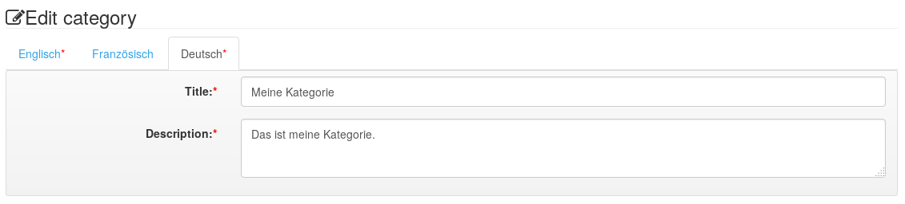

# Generator reference

This reference goes through all available model elements as well as their properties, describing what the generator does with this information and which things are still missing in the created implementation. Also it shows which artifacts are created from which model elements.

Most screenshots in this section are taken from the example application called *RecipeManager*.

## Describing behavioural aspects

As Zikula uses Symfony and the Doctrine ORM layer, the data layer in ModuleStudio allows to precisely express the different concepts and available functions. For example you can use a huge amount of validation constraints and special field types.

From each entity in the data layer there are entity classes and repository classes created. Therewith the contained fields as well as their properties are accordingly reflected. For many data types and basic properties, like *unique*, *readonly* or *notnull* this happens with a one to one adaption. Several things are shortened for convenience in ModuleStudio though. Furthermore there are some additional data types, like for example for users, email addresses, urls and file uploads. An email field is treated by the generator as a string field in Doctrine which has the email validator activated.

Validators are generally not explicitly written in MOST, but simply defined using properties. So there are for example attributes like *ipaddress* for string fields or *past* and *future* for date and time fields.

The different types of relations in Doctrine are all offered, too. For inheritance relationships the strategy can be selected (single table, joined). All other connection types store a name for the two entities on both sides (source alias and target alias) as well as the referenced fields (source field and target field). Because the primary id fields of entities are not part of the model, but automatically added before the generation, the string `id` is allowed and also set per default. By changing these fields it is possible to describe also relations referencing other fields. Beside this it is possible to have multiple relationships between the same entities and also self relations, as long as their alias settings are unique. Finally you can also define how the cascading behaviour should look like, again supporting all options offered by Doctrine.

The ModuleStudio DSL also supports several behavioural extensions for Doctrine, like for example trees, translatable fields, slugs and loggable entities. There are also some Zikula-specific additions by the way, like Attributable and Categorisable.

Event listeners or subscribers are not explicitly described in the models, but some base implementations are already generated though which can be implemented in the empty subclasses if needed.

## Application layer

### Language elements

#### Named object

This is the common base class of almost all model elements.

It includes the following properties:

* **name** - The name of the element.
* **documentation** - A description for documenting the element.

Documentation is used in several places of generated applications. For example if any documentation is defined for an entity this will be shown right after the heading of the corresponding view template. So you could for example add a description for the *person* entity explaining what persons are and what information they store. If a user then navigates to the persons list he knows immediately what he is looking at. Documentation for single fields is used in editing forms to provide additional help.

In general documentation entries are generated as Gettext calls to support translations. For example `This is a test.` results in `This is a test.`. For entities and variable containers there is also a special expert feature available: you can use Twig variables in the documentation field. So `These are {{myVar}} and {{   otherVar  }}.` results in `{% trans with {'%myVar%': myVar|default, '%otherVar%': otherVar|default} %}These are %myVar% and %otherVar%.`.

#### Application

Represents an application described by the model.

It includes the following basic properties which are mainly, but not only used to create meaningful file headers:

* **vendor** - The vendor of the application. Usually this is the name of a company or institution. The vendor and name of an application are combined to a unique name. This makes it possible to have for example multiple News modules installed from different vendors.
* **author** - The author of the application. Usually this is the full name of the developer.
* **email** - The email address of the developer.
* **license** - The license of this application. Defaults to LGPL. If either GPL or LGPL are used the generator creates corresponding license files, too.
* **prefix** - A prefix for all database tables of this application. Will be used in entity classes.
* **url** - The homepage of the developer.
* **version** - The application version. Must conform to the pattern `x.y.z` - for example `1.0.0` which is also the default value. Will be used in the composer file of the created application.

An application may furthermore have the following references:

* **entities** - Allows referencing one or more [data objects](#data-object).
* **referredApplications** - Allows referencing other applications. See [below](#referred-application).
* **relations** - Allows referencing one or more [relationships](#relationship).
* **variables** - Allows referencing one or more [variables](#variables).

In addition, an application can configure several further properties to customise generator settings. You can control which features should be generated and take influence on some behavioural aspects of the generator.

* **targetCoreVersion** - The targeted Zikula core version. See [below](#core-version).
* **capabilities** - A comma-separated list of capability names the application offers. Capabilities are used in Zikula to express certain functions a module is offering. This allows for a loose coupling between modules. For example you can let `MyProductsModule` depend on `MyCustomerModule`, but this is a very tight coupling. With capabilities you could instead let the products module query Zikula for `any module which is able to handle customers`. You can read more about this in the [CapabilityApi description](https://docs.ziku.la/Development/Extensions/capabilityapi.html). Note the generator uses these just for specifying them in the generated composer file. There is no further support for the capabilities you want to provide yet.
* **isSystemModule** - A boolean specifying whether the model describes a system module or not. Default value is `false`.
* **amountOfExampleRows** - The amount of example rows to create for entities in this application. Default value is `0`. Note that if you activate the `categorisable` property for an entity the generated installer relies on that you did not remove the default categories of Zikula.
* **generateAccountApi** - A boolean specifying whether account panel integration should be generated or not. Default value is `true`.
* **generateSearchApi** - A boolean specifying whether search integration should be generated or not. Requires at least one string or text field in any entity. Default value is `true`.
* **generateMailzApi** - A boolean specifying whether Mailz support should be generated or not. Default value is `false`. This has no effect for Zikula 2.x because the Mailz module has not been migrated yet.
* **generateListBlock** - A boolean specifying whether a generic list block should be generated or not. Default value is `true`.
* **generateDetailBlock** - A boolean specifying whether a generic detail view block should be generated or not. Requires at least one entity containing a display action. Default value is `true`.
* **generateModerationBlock** - A boolean specifying whether a moderation block should be generated or not. Requires at least one entity with a workflow including approval. Default value is `true`.
* **generateListContentType** - A boolean specifying whether a content type for collection lists should be generated or not. Default value is `true`.
* **generateDetailContentType** - A boolean specifying whether a content type for single objects should be generated or not. Requires at least one entity containing a display action. Default value is `true`.
* **generateNewsletterPlugin** - A boolean specifying whether a Newsletter plug-in should be generated or not. Default value is `false`. This has no effect for Zikula 2.x because the Newsletter module has not been migrated yet.
* **generateModerationPanel** - A boolean specifying whether a moderation panel should be generated or not. Requires at least one entity with a workflow including approval. Default value is `true`.
* **generatePendingContentSupport** - A boolean specifying whether support for pending content should be generated or not. Requires at least one entity with a workflow including approval. Default value is `true`.
* **generateExternalControllerAndFinder** - A boolean specifying whether a controller for external calls providing a generic finder component should be generated or not. Default value is `true`. Works only for entities containing either a [display action](#display-action) or at least one [upload field](#upload-field) supporting images.
* **generateScribitePlugins** - A boolean specifying whether support for several [Scribite editors](https://github.com/zikula-modules/Scribite/) should be generated or not. Requires external controller with finder component. Default value is `true`. At the moment CKEditor, Quill, Summernote and TinyMCE are supported.
* **generateTagSupport** - A boolean specifying whether tag support should be generated or not. Requires at least one entity containing a display action. Default value is `false`. This has no effect for Zikula 2.x because the Tag module has not been migrated yet.
* **generateMultiHookNeedles** - A boolean specifying whether MultiHook needles should be generated or not. Default value is `false`.
* **generateRssTemplates** - A boolean specifying whether RSS view templates should be generated or not. Default value is `true`.

* **generateAtomTemplates** - A boolean specifying whether Atom view templates should be generated or not. Default value is `true`.

* **generateCsvTemplates** - A boolean specifying whether CSV view templates should be generated or not. Default value is `true`.
* **generateXmlTemplates** - A boolean specifying whether XML display and view templates should be generated or not. Default value is `true`.

* **generateJsonTemplates** - A boolean specifying whether JSON templates should be generated or not. Default value is `true`.

* **generateKmlTemplates** - A boolean specifying whether KML templates should be generated or not. Requires geographical flag on corresponding entities. Default value is `true`.
* **generateIcsTemplates** - A boolean specifying whether ICS (iCalendar) templates should be generated or not. Requires start date and end date fields on corresponding entities. Default value is `true`.
* **generatePdfSupport** - A boolean specifying whether support for exporting PDF files should be generated or not. Default value is `false`.
* **authenticationMethod** - Allows to generate a skeleton for an authentication method implementation. Default value is `NONE` which means that no authentication method should be provided by the generated application. `REMOTE` represents a ReEntrant method while `LOCAL` stands for a NonReEntrant method. See [this documentation](https://docs.ziku.la/AccessControl/Authentication/Dev/authenticationmethodinterface.html) for more details about this.
* **filterHookProvider** - Allows to specify whether a [filter hook provider](https://docs.ziku.la/Development/Hooks/index.html) should be generated for the application. Default value is `DISABLED`. Allowed values are explained [here](#hook-provider-mode). The generated filter hook provider only adds some dummy output and therefore needs to be customised in the empty child class.
* **generateOnlyBaseClasses** - A boolean specifying whether only base classes should be generated. May be useful for doing simple upgrades without structural changes. Default value is `false`.
* **skipFiles** - Comma-separated blacklist with each entry representing a file path which should not be generated. The file pathes are relative from the application's root folder, for example `Resources/views/Person/display.html.twig`. Default value is an empty string.
* **markFiles** - Comma-separated list with file pathes which should be marked by special file names. The file pathes are relative from the application's root folder, for example `Resources/views/Person/display.html.twig`. Instead of the original name each file is generated using the pattern `filename.generated.extension`. This setting can be useful for doing bigger merges comparing the generated version with a customised one. Default value is an empty string.
* **timestampAllGeneratedFiles** - A boolean specifying whether the generated by message should contain a timestamp in all files or only in the Bootstrap file. Default value is `false`.
* **versionAllGeneratedFiles** - A boolean specifying whether the generated by message should contain the ModuleStudio version in all files or only in the Bootstrap file. Default value is `true`.
* **separateAdminTemplates** - A boolean specifying whether admin and user templates should be generated independently from each other. Default value is `false` which causes that only one (combined) version for each template is generated.
* **generatePoweredByBacklinksIntoFooterTemplates** - A boolean specifying whether generated footer templates should contain backlinks to the ModuleStudio website. Default value is `true`.
* **generateTests** - A boolean specifying whether test cases should be generated or not. Default value is `true`. At the moment only some stubs are created though (see [generator issue #6 on GitHub](https://github.com/Guite/MostGenerator/issues/6)).
* **writeModelToDocs** - A boolean specifying whether the model file and it's diagram image are written into the application's docs folder or not. Default value is `true`.
* **generateTechnicalDocumentation** - A boolean specifying whether stand-alone HTML files with technical documentation should be generated or not. Default value is `true`. At the moment two reports are generated: _structural overview_ and _technical complexity_ - both in English and German.
* **viewActionsPosition** - Allows to specify whether and where item actions should be available in view pages. Default value is `START`. Available options are explained [below](#item-actions-position).
* **viewActionsStyle** - Allows to specify the style used by the included item actions in view pages. Default value is `DROPDOWN`. Available options are explained [below](#item-actions-style).
* **viewActionsWithIcons** - A boolean specifying whether item actions in view pages should contain an icon in addition to their label or not. Default value is `true`.
* **displayActionsPosition** - Allows to specify whether and where item actions should be available in display pages. Default value is `START`. Available options are explained [below](#item-actions-position).
* **displayActionsStyle** - Allows to specify the style used by the included item actions in display pages. Default value is `DROPDOWN`. Available options are explained [below](#item-actions-style).
* **displayActionsWithIcons** - A boolean specifying whether item actions in display pages should contain an icon in addition to their label or not. Default value is `true`.

#### Core version

Specifies the Zikula version for which the application should be generated.

Can be one of the following options:

* `ZK30` - Targets the last stable Zikula 3.0.x version.
* `ZK3DEV` - Targets the last unstable Zikula 3.x version.
* `ZK20` - Targets the last stable Zikula 2.0.x version. This is the default value.
* `ZK2DEV` - Targets the last unstable Zikula 2.x version and may include changes for the next upcoming 2.x core release.
* `ZK15` - Targets the last stable Zikula 1.5.x version.
* `ZK15DEV` - Targets the last unstable Zikula 1.5.x version and may include changes for the next upcoming 1.5.x core release.

#### Item actions position

Specifies the placement of item actions.

Can be one of the following options:

* `NONE` - No item actions are available at all.
* `START` - Default value. Item actions are included at the beginning, for example in the first table column on view pages or the top area on display pages.
* `END` - Item actions are included at the end, for example in the last table column on view pages or the bottom area on display pages.
* `BOTH` - Combines `START` and `END`. Only allowed for display pages.

#### Item actions style

Specifies the style used for item actions.

Can be one of the following options:

* `LINK` - Normal links/anchors with a label and optionally an icon.
* `ICON` - Normal links/anchors with an icon only (no label, but tooltips).
* `BUTTON` - Links/anchors styled as buttons with a label and optionally an icon.
* `BUTTON_GROUP` - Links/anchors styled as a button group with a label and optionally an icon.
* `DROPDOWN` - Default value. A drop-down menu containing normal links/anchors with a label and optionally an icon.

For all options except `ICON` the links contain a label and optionally an additional icon (depending on the `withIcons` flags). 

#### Referred application

Represents an application whose model file is being imported (e.g. to reference other entities or other extensions which are incorporated by api calls).

An application reference has the following fields:

* **minimumVersion** - The minimum version this reference applies for. Must conform to the pattern `x.y.z`.
* **maximumVersion** - The maximum version this reference applies for. Must conform to the pattern `x.y.z`.
* **importURI** - URI to imported model file.
* **dependencyType** - The type of dependency which should be used for the referred application. See [below](#application-dependency-type).

#### Application dependency type

Specifies the kind of dependency to a certain application.

Can be one of the following options:

* `REQUIREMENT` - The module is required, for example to join related entities.
* `RECOMMENDATION` - The module is recommended, for example to provide enhanced integration functionality.
* `CONFLICT` - The module is in conflict with the modeled one, for example due to overlapping functionality.

The generator uses this value in the corresponding module dependency created in the `composer.json` file.

#### Hook provider mode

Specifies a kind of hook provider to generate.

Can be one of the following options:

* `DISABLED` - Default value. No hook provider is generated for the corresponding setting.
* `ENABLED` - Defines that a hook provider is generated for the corresponding setting.
* `ENABLED_SELF` - Defines that a hook provider is generated for the corresponding setting which is allowed to hook to its own hook subscribers. For example an UI hook provider could allow to attach comments to other comments.

## Data layer

The data layer in ModuleStudio has been designed for a precise description of entities and associations. To understand all the elements and properties please read the [Doctrine 2 documentation](https://www.doctrine-project.org/projects/doctrine-orm/en/2.6/index.html) before.

### Language elements

#### Data object

This abstract class collects properties which are shared by [mapped superclasses](#mapped-superclass) and [entities](#entity).

A data object has no properties, but may have the following references:

* **application** - Reference to the owning element.
* **fields** - Allows referencing one or more [fields](#field).

#### Mapped superclass

Represents a mapped superclass like described [here](https://www.doctrine-project.org/projects/doctrine-orm/en/2.6/reference/inheritance-mapping.html#inheritance-mapping).

A mapped superclass has no properties or references in addition to the common [data object](#data-object) settings.

#### Entity

Represents an entity in the data layer which is mapped to a database table.

It has the following properties:

* **actions** - Allows referencing one or more [actions](#action).
* **attributable** - A boolean specifying whether this entity should have attributes or not. If set to `true` the generator creates an additional entity for managing the attributes. During [edit actions](#edit-action) it is possible to input values for three predefined attributes. These will also be shown again on [display pages](#display-action). There is no included support yet for arbitrary attributes like they are known from the Categories administration area. While the display side is ready for that, the edit page needs some dynamic support for creating new attributes on the fly.
* **categorisable** - A boolean specifying whether this entity should have categories or not. If set to `true` the generator creates an additional entity for managing the categories. During [edit actions](#edit-action) it is possible to select a desired category. This category will also be shown again on [display pages](#display-action) and in quick navigation forms of [view pages](#view-action). Generated applications also support filtering by categories as well as multiple category registries / properties / trees, however the implementation uses only `Main` per default. Also category-based permissions are supported. Note that if you activate the `categorisable` property for an entity the generated installer relies on that you did not remove the default categories of Zikula.
* **categorisableMultiSelection** - A boolean specifying whether multiple categories can be selected or not.
* **changeTrackingPolicy** - How change detection is being done (see [below](#entity-change-tracking-policy)). The default value is `DEFERRED_IMPLICIT`.
* **displayPattern** - Pattern for displaying instances of this entity. In earlier ModuleStudio versions one had to mark one field as `leading`. However, this was not flexible enough in practice. With the display pattern you can specify arbitrary expressions which are used as textual representation for instances of this entity. For most cases you may want to declare just one field, which is done like `#title#`. A more complex example would be `#lastName#, #firstName# (#age# years)`. Of course all fields must exist in the entity with exactly the names used within the display pattern.
* **formAwareHookProvider** - Allows to specify whether a [form aware hook provider](https://docs.ziku.la/Development/Hooks/index.html) should be generated for the entity. Default value is `DISABLED`. Allowed values are explained [here](#hook-provider-mode). The generated form aware hook providers only add some dummy form fields and therefore need to be customised in the empty child classes.
* **geographical** - A boolean specifying whether the geographical extension is used or not. If set to `true` the generator will create two additional fields named `latitude` and `longitude`. Also it will consider them in all important application areas and provide an export for the *kml* format (if `generateKmlTemplates` setting has not been set to `false`). During the creation of a new entity with geographical support a nice geolocation feature can be used to ask the user for his current location (this needs to be activated in the application settings though; in addition you need to use HTTPS to make this work in most browsers). Also there is an included integration of the [Leaflet library](http://leafletjs.com/) allowing you to utilise comprehensive map interaction functionality in your application.

* **hasArchive** - Whether the workflow should include an archived state with automatic archiving. Requires a [datetime](#datetime-field) field which has been designated as end date. See [workflow types](#entity-workflow-type) for more information. The default value is `false`.
* **hasTray** - Whether the workflow should include a suspended state. See [workflow types](#entity-workflow-type) for more information. The default value is `false`.
* **identifierStrategy** - Whether and which [identifier strategy](#entity-identifier-strategy) is applied. The default value is `AUTO`.
* **leading** - A boolean specifying whether this is the primary (and default) entity or not.
* **lockType** - Whether and which [locking strategy](#entity-lock-type) is applied. The default value is `PAGELOCK`.
* **loggable** - A boolean specifying whether the [Loggable extension](https://github.com/Atlantic18/DoctrineExtensions/blob/master/doc/loggable.md) for tracking changes and managing versions is used or not. If loggable is activated the DSL will also require adding a `version` field and [optimistic locking](#entity-lock-type) because it is handy to have the current version stored in the entity directly. The generator will create an additional entity for managing the log entries if set to `true`. Furthermore there is a history page generated which will be available as soon as more than one version of an entity exists. On this history page changes are shown for each version. If the entity has a display action there is a preview link to display each version. You can also preview multiple versions at the same time and arrange the windows next to each other for easy comparison. Also there are functions to revert an entity to a previous version and to compare different versions using a diff view. Finally if there are deleted entities there is a possibility to inspect and undelete them.

* **nameMultiple** - Plural form of the name. The generator uses this for collections, list views and other areas where multiple entities are used.
* **onAccountDeletionCreator** - Controls how an app should change the creator when users are deleted. Only relevant if `standardFields` is enabled. Default value is `ADMIN`. The available options are listed [here](#account-deletion-handler).
* **onAccountDeletionLastEditor** - Controls how an app should change the last editor when users are deleted. Only relevant if `standardFields` is enabled. Default value is `ADMIN`. The available options are listed [here](#account-deletion-handler).
* **ownerPermission** - Whether users should be able to manage and edit their own data. Defines also whether the workflow should include a *deferred* state. See [workflow types](#entity-workflow-type) for more information. The default value is `false`. If `ownerPermission` is enabled the *edit* permission level allows editing and deleting only for "own" content. For editing also content from other users at least the *add* level is required then. In addition, the generator creates configuration options which allow to enable a *private mode*. This extends the owner-based filter also to viewing and accessing data. So with the private option enabled, every user may only see his own data.
* **readOnly** - A boolean specifying whether this entity is read only or not. If set to `true` creating new entities will still be possible, but not editing them.
* **skipHookSubscribers** - Whether hook subscriber support should be skipped for this entity. The default value is `false`. If you set this option to `true` no support for hooks is generated for the corresponding entity.
* **slugLength** - Length of slug field. Defaults to `255`. An entity is [sluggable](https://github.com/Atlantic18/DoctrineExtensions/blob/master/doc/sluggable.md) as soon as at least one of its fields has set `sluggablePosition` to a value greater than `0`. Depending on the `tree` setting (explained below) and existing relationships slug support will automatically be extended to utilise tree slug handlers or relative slug handlers. Relative slugs will only be used for now if both entities (connected by the corresponding relationship) have sluggable fields. If there are multiple relationships found where both sides are sluggable the first one will be used for each direction (relative slug handler vs. inversed relative slug handler).
* **slugSeparator** - Separator which will separate words in slug. Default value is `-` like in Zikula, too.
* **slugStyle** - Which [slug style](#entity-slug-style) is used. Default value is `LOWERCASE`.
* **slugUnique** - A boolean specifying if the slug is unique or not. Default value is `true`.
* **slugUpdatable** - A boolean specifying if the slug can be changed or not. Default value is `true`.
* **tree** - Whether and which tree strategy is applied. Default value is `NONE`. More information about what the generator creates for trees can be found in the the section about [tree types](#entity-tree-type).

* **standardFields** - A boolean specifying whether the standard fields extension is used or not. If set to `true` the entity will get four additional fields for storing the id of the user who created the item (`createdBy` join to `UserEntity`), the id of the user who did the last update (`updatedBy` join to `UserEntity`), as well as the creation and update dates (`createdDate` and `updatedDate`). This information will be included on [display](#display-action) and [edit](#edit-action) actions.
* **uiHooksProvider** - Allows to specify whether a [UI hooks provider](https://docs.ziku.la/Development/Hooks/index.html) should be generated for the entity. Default value is `DISABLED`. Allowed values are explained [here](#hook-provider-mode). The generated UI hook providers allow for attaching entities to the subscriber areas which also includes the inline creation (and automatic assignment) of new entities. All assignments are stored in an additional database table so it is possible to attach the same entity to several different data objects (for example an image could be added to three news articles). Owning data objects are linked from the entity display pages, too. Existing assignments are automatically removed when the owning data object is deleted or the owning module is removed from the system.
* **workflow** - The workflow which is applied to this entity. The default value is `NONE`. See [workflow types](#entity-workflow-type) for more information.

An entity has the following references in addition to the common [data object](#data-object) settings:

* **indexes** - Allows referencing one or more [indexes](#entity-index).

#### Field

Represents a field in the data layer.

This base class has the following children at the moment:

* [Derived fields](#derived-field) correspond to normal columns which are stored in a database.
* [Calculated fields](#calculated-field) correspond to fields which can calculate their values based on other fields.

A field may have the following references:

* **entity** - Reference to the owning [data object](#data-object).
* **varContainer** - Reference to the owning [variable container](#variables).
* **displayType** - Controls display-related settings for [view](#view-action) and [display](#display-action) pages. See [below](#field-display-type). The default value is `ALL`.

In the following sections all field types are explained in detail. Note that not all properties have an effect if a field is added to a variable container. For example several Doctrine extensions, like tree or translatable, work only with entities and not with variables.

#### Field display type

Specifies where a specific field is shown and/or used.

Can be one of the following options:

* `NONE` - The field is neither shown on view nor display pages. It may also not be used for sorting on view pages.
* `SORTING` - The field is neither shown on view nor display pages. It may be used for sorting on view pages though.
* `VIEW` - The field is shown on view pages, but not on display pages. It may not be used for sorting on view pages.
* `VIEW_SORTING` - The field is shown on view pages, but not on display pages. It may be used for sorting on view pages.
* `DISPLAY` - The field is not shown on view pages, but on display pages. It may not be used for sorting on view pages.
* `DISPLAY_SORTING` - The field is not shown on view pages, but on display pages. It may be used for sorting on view pages.
* `VIEW_DISPLAY` - The field is shown on both view and display pages. It may not be used for sorting on view pages though.
* `ALL` - Default value. The field is shown on both view and display pages. It may also be used for sorting on view pages.

Note that this setting is ignored for [array fields](#array-field) and [object fields](#object-field). These are never shown on view pages.

#### Derived field

Represents a field in the data layer which is mapped to a database column. A derived field comes straight from the data source.

A derived field has the following properties in addition to the common [field](#field) settings: 

* **cssClass** - Optional specification of arbitrary css classes, used for [edit pages](#edit-action).
* **dbName** - Name of the database column represented by this field. The default value is an empty string which means that the field name is used for the column, too. This property is primarily interesting for avoiding changes in the database schema when migrating legacy apps.
* **defaultValue** - The default value of the field. This default value is used when instantiating a new entity instance, for example for creating new entities with the [edit action](#edit-action).
* **mandatory** - A boolean specifying whether this field is mandatory or not. The default value is `true`.
* **nullable** - A boolean specifying whether the field may be null or not. The default value is `false`. A nullable field may not be mandatory at the same time.
* **primaryKey** - A boolean specifying whether this is a primary key field or not. Default value is `false`. Usually there is no need to enable this for any fields as the generator adds primary and foreign key fields automatically.
* **readonly** - A boolean specifying whether this a read only field or not. The default value is `false`. If set to `true` then this field may not be changed during editing.
* **sortableGroup** - A boolean specifying whether this field acts as grouping criteria for the [Sortable extension](https://github.com/Atlantic18/DoctrineExtensions/blob/master/doc/sortable.md). The default value is `false`.
* **translatable** - A boolean specifying whether this field is translatable or not. The default value is `false`. If at least one field in an entity is translatable the generator creates an additional class for managing the translation entities (see [Translatable extension](https://github.com/Atlantic18/DoctrineExtensions/blob/master/doc/translatable.md) for more details). Overall support for translations in the application should get you started. For customisation you can override `TranslatableHelper` methods.

* **unique** - A boolean specifying whether this field is unique or not. The default value is `false`. If set to `true` then an additional validator cares for enforcing the unique constraint on client and server side.
* **visible** - Whether this field is visible in edit forms or not. Default value is `true`.

All fields are implemented as entity class member vars. The following sections will look at the different field types in detail.

#### Calculated field

Represents a field which can dynamically compute it's value based on other fields.

A calculated field may have the following references in addition to the common [field](#field) settings: 

* **operands** - Allows referencing one or more [derived fields](#derived-field).

Calculated fields are not part of the model editor yet and will therefore be ignored by the generator.

#### Boolean field

Represents a field type for storing boolean values.

A boolean field has the following properties in addition to the common [derived field](#derived-field) settings:

* **ajaxTogglability** - Boolean indicating whether it is possible to switch this flag with ajax or not. If set to `true` all view and display pages will contain corresponding links instead of only simple state images.

The generator will treat boolean values as checkbox input elements in [edit pages](#edit-action). For the output in [view](#view-action) and [display](#display-action) templates the `yesno` modifier is used to show an image indicating the boolean value (green check or red cross).

#### Abstract integer field

Represents an abstract integer field for grouping different implementations of this field type.

An abstract integer field has the following properties in addition to the common [derived field](#derived-field) settings:

* **length** - The length of this field. This controls whether the Doctrine mapping type will be `integer` (5-11), `bigint` (> 11) or `smallint` (< 5). Default value is `11`.
* **sortablePosition** - A boolean specifying whether this field stores the position for the [Sortable extension](https://github.com/Atlantic18/DoctrineExtensions/blob/master/doc/sortable.md) or not. If set to `true` this field will be used as default sorting criteria. In [view pages](#view-action) there is a drag n drop functionality offered for easy reordering.

#### Integer field

Represents a field type for storing integer numbers.

An integer field has the following properties in addition to the common [abstract integer field](#abstract-integer-field) settings:

* **aggregateFor** - Aggregate field: one-to-many target alias and field name (syntax: `views.amount`) which causes the generator creating special methods for aggregation. More information can be found in [this article](https://www.doctrine-project.org/projects/doctrine-orm/en/2.6/cookbook/aggregate-fields.html).
* **counter** - A boolean whether this field should act as a counter. Default value is `false`. If set to `true` and the owning entity has a [display action](#display-action) each view of the detail page will be counted. This property can ideally be combined with `defaultValue "0", mandatory false, visible false`.
* **maxValue** - Maximum value. If set to a value other than `0` then a validator will enforce this constraint on client and server side.
* **minValue** - Minimum value. If set to a value other than `0` then a validator will enforce this constraint on client and server side.
* **percentage** - A boolean specifying whether this field represents a percentage value or not. Default value is `false`.
* **range** - A boolean specifying whether this field represents a range or not. Default value is `false`. In [edit forms](#edit-action) a range field is represented as a slider.
* **unit** - An optional field unit which will be used in both [edit forms](#edit-action) and [display pages](#display-action). For example a field named `effort` could use a `unit` named `hours`. Units will be translated.
* **version** - A boolean specifying whether this field should act as a version. Default value is `false`. If set to `true` the owning entity will need to use [optimistic locking](#entity-lock-type). If you need to track changes and manage versions you also need to activate `loggable` for the corresponding [entity](#entity).

In [edit pages](#edit-action) the generator will use integer input elements as well as validation on client and server side. For the output in [view](#view-action) and [display](#display-action) templates the value will just be shown.

#### Number field

Represents a field type for storing decimal and floating numbers.

A number field has the following properties in addition to the common [derived field](#derived-field) settings:

* **aggregationField** - A boolean specifying whether this field should act as an aggregate field. Default value is `false`. If set to `true` the generator creates special methods for aggregation. More information can be found in [this article](https://www.doctrine-project.org/projects/doctrine-orm/en/2.6/cookbook/aggregate-fields.html).
* **currency** - A boolean specifying whether this field should be treated as currency. Default value is `false`. If set to `true` the generator will use the `localizedcurrency` filter instead of `localizednumber` during output.
* **length** - The length of this field. Default value is `10`.
* **maxValue** - Maximum value. If set to a value other than `0` then a validator will enforce this constraint on client and server side.
* **minValue** - Minimum value. If set to a value other than `0` then a validator will enforce this constraint on client and server side.
* **numberType** - Allows to define the number type for this field. Default value is `DECIMAL`. The available options are explained [below](#number-field-type).
* **percentage** - A boolean specifying whether this field represents a percentage value or not. Default value is `false`.
* **scale** - The amount of digits after the dot. Default value is `2`.
* **unit** - An optional field unit which will be used in both [edit forms](#edit-action) and [display pages](#display-action). For example a field named `effort` could use a `unit` named `hours`. Units will be translated.

In [edit pages](#edit-action) the generator will use number input elements as well as validation on client and server side. For the output in [view](#view-action) and [display](#display-action) templates the value will just be shown using a formatting filter.

#### Number field type

Represents different types for a number field.

Can be one of the following options:

* `DECIMAL` - Default value. Represents a decimal number.
* `FLOAT` - Represents a floating number.

#### Abstract string field

Represents an abstract string field for grouping different implementations of this field type.

An abstract string field has the following properties in addition to the common [derived field](#derived-field) settings:

* **fixed** - A boolean specifying whether this field has a fixed length or not. Default value is `false`.
* **minLength** - Minimum length. If set to a value other than `0` then a validator will enforce this constraint on client and server side.
* **regexp** - Regular expression to validate against. Possible example values are `/^\w+/` and `/\d/`.
* **regexpOpposite** - A boolean specifying the logical way of checking `regexp`. Default value is `false`. If set to `true` then validation will pass only if the given string does *not* match the pattern.

If one of these properties is set to `true` a corresponding validator will check this constraint on client and server level.

* **sluggablePosition** - Position of this field in the created slugs. A value of `0` (default) means that this field is not part of the slug at all. If at least one field in an entity has a sluggable position greater than `0` then this entity is considered as sluggable. In this case a permalink is built automatically from all fields in ascending position. See the slug properties on [entity](#entity) level for slug-related configuration options.

#### String field

Represents a field type for storing string values.

A string field has the following properties in addition to the common [abstract string field](#abstract-string-field) settings:

* **isbn** - Allows to define whether this field represents a number in [ISBN (International Standard Book Number)](https://en.wikipedia.org/wiki/Isbn). Default value is `NONE`. You can choose from different [validation options](#isbn-style).
* **issn** - Allows to define whether this field represents a number in [ISSN (International Standard Serial Number)](https://en.wikipedia.org/wiki/Issn). Default value is `NONE`. You can choose from different [validation options](#issn-style).
* **ipAddress** - Allows to define whether this field represents an IP address. Default value is `NONE`. You can choose the covered [ip address scope](#ip-address-scope).
* **ipTraceable** - Which [ipTraceable type](#entity-iptraceable-type) is used. Default value is `NONE`.
* **ipTraceableChangeTriggerField** - Optional name of field to use as change trigger (if type is `CHANGE`. Can also be `workflowState` or the name of an incoming relation (syntax `sourceAlias.field`).
* **ipTraceableChangeTriggerValue** - Optional value of field to use as change trigger (if type is `CHANGE`).
* **length** - The length of this field. Default value is `255`.
* **role** - Allows to define a semantic role for this field. Default value is `NONE`. The available options are explained [below](#string-role).
* **unit** - An optional field unit which will be used in both [edit forms](#edit-action) and [display pages](#display-action). For example a field named `effort` could use a `unit` named `hours`. Units will be translated.

In [edit pages](#edit-action) the generator will use single-line input elements for string fields - except you defined something else (using options like `role` or `isbn`). Other validations are added together and applied as well.

#### String role

Represents different semantic roles a [string field](#string-field) can have.

Can be one of the following options:

* `NONE` - Default value. Means that the corresponding [string field](#string-field) just represents a string without special semantic.
* `BIC` - A [BIC (business identifier code)](https://en.wikipedia.org/wiki/Business_Identifier_Code).
* `COLOUR` - A html color code (like `#003399`). A colour picker is used in [edit pages](#edit-action) for convenient selection of colour codes.
* `COUNTRY` - A [ISO 3166-1 alpha-2](https://en.wikipedia.org/wiki/ISO_3166-1#Current_codes) country code. A country selector is used in [edit pages](#edit-action). For the output in [view](#view-action) and [display](#display-action) templates an output modifier is used to display the full country name instead of the unreadable country code. If the field is not `mandatory` the edit selector provides a placeholder entry named *All*.
* `CREDIT_CARD` - A credit card number. By default all available card schemes provided by [Symfony validator](https://symfony.com/doc/current/reference/constraints/CardScheme.html#schemes) are allowed.
* `CURRENCY` - A [3-letter ISO 4217](https://en.wikipedia.org/wiki/ISO_4217) currency name. Possible example values are `USD` or `EUR`. In [edit forms](#edit-action) it will be rendered as a currency selector. If the field is not `mandatory` the edit selector provides a placeholder entry named *All*.
* `DATE_INTERVAL` - An interval of time which is persisted as a [ISO 8601](https://en.wikipedia.org/wiki/ISO_8601#Durations) duration string. Only applicable for Zikula 2 and 3 targets.
* `IBAN` - A bank account number in [IBAN (International Bank Account Number)](https://en.wikipedia.org/wiki/International_Bank_Account_Number) format.
* `ICON` - A [Font Awesome](https://fontawesome.com/) icon. An icon selector is provided on [edit pages](#edit-action).
* `LANGUAGE` - An [Unicode language](http://site.icu-project.org/) identifier. Possible example values are `fr` or `zh-Hant`. A language selector is used in [edit pages](#edit-action). For the output in [view](#view-action) and [display](#display-action) templates an output modifier is used to display the full name instead of the unreadable language code. If the field is not `mandatory` the edit selector provides a placeholder entry named *All*.
* `LOCALE` - A locale. Possible example values are `fr` ([ISO 639-1 code](https://en.wikipedia.org/wiki/List_of_ISO_639-1_codes)) or `fr_FR` (ISO 639-1 followed by [ISO 3166-1 alpha-2](https://en.wikipedia.org/wiki/ISO_3166-1#Current_codes) country code). The field will be rendered as a locale selector in [edit forms](#edit-action). If the field is not `mandatory` the edit selector provides a placeholder entry named *All*.
* `PASSWORD` - A password. For this a password input element will be used instead of a normal one in [edit pages](#edit-action). Password fields are not shown on [view](#view-action) and [display](#display-action) pages for security reasons.
* `PHONE_NUMBER` - A telephone number.
* `TIME_ZONE` - A time zone. In [edit forms](#edit-action) such fields will be rendered using a time zone selector.
* `UUID` - An [UUID (Universally Unique Identifier)](https://en.wikipedia.org/wiki/Universally_unique_identifier).
* `WEEK` - An [ISO 8601](https://en.wikipedia.org/wiki/ISO_week_date) week number. Possible example value is `2011-W17`. Used in Zikula 3 only, represented by a [week form type](https://symfony.com/blog/new-in-symfony-4-4-week-form-type).

#### ISBN style

Represents different ISBN formats to be validated for a [string field](#string-field).

Can be one of the following options:

* `NONE` - Default value. Means that the corresponding [string field](#string-field) should not represent an ISBN.
* `ISBN10` - ISBN-10 code.
* `ISBN13` - ISBN-13 code.
* `ALL` - Both ISBN-10 and ISBN-13 codes.
 
#### ISSN style

Represents different ISSN formats to be validated for a [string field](#string-field).

Can be one of the following options:

* `NONE` - Default value. Means that the corresponding [string field](#string-field) should not represent an ISSN.
* `NORMAL` - Normal ISSN validation, allows lower case x at the end and non hyphenated ISSN values.
* `CASE_SENSITIVE` - Requires an upper case X at the end.
* `REQUIRE_HYPHEN` - Requires a hyphenated ISSN value.
* `STRICT` - Combines `CASE_SENSITIVE` and `REQUIRE_HYPHEN`.

#### Ip address scope

Represents different ways how to validate a given IP address.

Can be one of the following options:

* `NONE` - Default value. Means that the corresponding [string field](#string-field) should not represent an IP address.
* `IP4` - Validates for IPv4 addresses in all ranges.
* `IP6` - Validates for IPv6 addresses in all ranges.
* `ALL` - Validates all IP formats in all ranges.
* `IP4_NO_PRIV` - Validates for IPv4 addresses without private ranges.
* `IP6_NO_PRIV` - Validates for IPv6 addresses without private ranges.
* `ALL_NO_PRIV` - Validates all IP formats without private ranges.
* `IP4_NO_RES` - Validates for IPv4 addresses without reserved ranges.
* `IP6_NO_RES` - Validates for IPv6 addresses without reserved ranges.
* `ALL_NO_RES` - Validates all IP formats without reserved ranges.
* `IP4_PUBLIC` - Validates for IPv4 addresses using only public ranges (without private and reserved ranges).
* `IP6_PUBLIC` - Validates for IPv6 addresses using only public ranges (without private and reserved ranges).
* `ALL_PUBLIC` - Validates all IP formats using only public ranges (without private and reserved ranges).

#### Entity ipTraceable type

Represents different events for triggering the [IpTraceable extension](https://github.com/Atlantic18/DoctrineExtensions/blob/master/doc/ip_traceable.md).

Can be one of the following options:

* `NONE` - No IpTraceable extension (default).
* `UPDATE` - On update.
* `CREATE` - On create.
* `CHANGE` - On property change.

The generator transforms these values to the corresponding implementation as is. There are no differences made between the different ipTraceable types. So beside the actual entity class there won't be any code parts affected based on which ipTraceable type you use.

#### Text field

Represents a field type for storing larger text.

A text field has the following properties in addition to the common [abstract string field](#abstract-string-field) settings:

* **length** - The length of this field. Default value is `2000`.

In [edit pages](#edit-action) the generator will use multi-line input elements (textarea).

#### User field

Extension of [abstract integer field](#abstract-integer-field) for storing user identifiers.

An user field has the following properties in addition to the common [abstract integer field](#abstract-integer-field) settings:

* **blameable** - Which [blameable type](#entity-blameable-type) is used. Default value is `NONE`.
* **blameableChangeTriggerField** - Optional name of field to use as change trigger (if type is `CHANGE`. Can also be `workflowState` or the name of an incoming relation (syntax `sourceAlias.field`).
* **blameableChangeTriggerValue** - Optional value of field to use as change trigger (if type is `CHANGE`).
* **onAccountDeletion** - Controls how an application should change the field when users are deleted. Default value is `GUEST`. The available options are listed [here](#account-deletion-handler).

In [edit pages](#edit-action) the generator will implement an auto completion element allowing searching users by their name. For the output in [view](#view-action) and [display](#display-action) templates the user name is shown and linked to the corresponding user profile in case a profile module has been set in the Settings module administration.

#### Entity blameable type

Represents different events for triggering the [Blameable extension](https://github.com/Atlantic18/DoctrineExtensions/blob/master/doc/blameable.md).

Can be one of the following options:

* `NONE` - No Blameable extension (default).
* `UPDATE` - On update.
* `CREATE` - On create.
* `CHANGE` - On property change.

The generator transforms these values to the corresponding implementation as is. There are no differences made between the different blameable types. So beside the actual entity class there won't be any code parts affected based on which blameable type you use.

#### Email field

Represents a field type for storing email addresses.

An email field has the following properties in addition to the common [abstract string field](#abstract-string-field) settings:

* **checkMX** - A boolean to specify whether the MX record's validity of the given email's host is checked or not. Default value is `false`. This setting is considered **deprecated** and will be removed in a future version. It does not have any effect in Zikula 3 anymore.
* **checkHost** - A boolean to specify whether the MX or A or AAAA record's validity of given email's host is checked or not. Default value is `false`. This setting is considered **deprecated** and will be removed in a future version. It does not have any effect in Zikula 3 anymore.
* **length** - The length of this field. Default value is `255`.
* **validationMode** - Defines the pattern the email address is validated against. Valid values are [shown here](#email-validation-mode). Default value is `HTML5`. This setting is only used in Zikula 3 and does not have any effect in earlier target core versions.

In [edit pages](#edit-action) the generator will use email input elements as well as validation on client and server side. For the output in [view](#view-action) and [display](#display-action) pages an icon will be shown linking the email address.

#### Email validation mode

Represents different pattern an email address is validated against.

Can be one of the following options:

* `LOOSE` - A simple regular expression. Allows all values with an "@" symbol in, and a "." in the second host part of the email address.
* `STRICT` - Uses the [egulias/email-validator](https://packagist.org/packages/egulias/email-validator) library to perform an RFC compliant validation.
* `HTML5` - This matches the pattern used for the [HTML5 email input element](https://www.w3.org/TR/html5/sec-forms.html#email-state-typeemail).

#### Url field

Represents a field type for storing urls.

An url field has the following properties in addition to the common [abstract string field](#abstract-string-field) settings:

* **checkDNS** - A boolean to specify whether to check if the associated host exists or not. Default value is `false`. This setting is considered **deprecated** and will be removed in a future version. It does not have any effect in Zikula 3 anymore.
* **length** - The length of this field. Default value is `255`.

In [edit pages](#edit-action) the generator will use url input elements as well as validation on client and server side. For the output in [view](#view-action) and [display](#display-action) pages an icon will be shown linking the url.

#### Upload field

Represents a field type for storing upload files.

An upload field has the following properties in addition to the common [abstract string field](#abstract-string-field) settings:

* **allowedExtensions** - List of file extensions to be accepted during the upload, separated by a comma with a space char. Default value is `gif, jpeg, jpg, png`. If you want to allow all extensions, just use `*`.
* **length** - The length of this field. Default value is `255`.
* **maxSize** - A string for a maximum file size. Default is an empty string for no limit. Examples: `4096` (bytes), `200k` (kilobytes), `2M` (megabytes), `32Ki` (kikibytes), `8Mi` (mebibytes). Read more about that [here](https://symfony.com/doc/current/reference/constraints/File.html#maxsize).
* **mimeTypes** - A string containing a comma separated list of allowed mime types. Default is `image/*`. Example: `application/pdf, application/x-pdf`. If you want to allow all mime types, just use `*`.
* **multiple** - A boolean specifying whether this field allows multiple files or not. Default value is `false`. Note the UI has not been completely adapted for this yet (see [#123](https://github.com/Guite/MostGenerator/issues/123)).
* **namingScheme** - Defines how uploaded files [are named](#upload-naming-scheme). Default value is `ORIGINALWITHCOUNTER`.
* **subFolderName** - Name of sub folder for storing uploaded files. If this is empty (default) the field name will be used as folder name.

Image-specific settings (use **only** if you did not change `allowedExtensions`):

* **minWidth** - An integer for a minimum width. Default is `0` for no constraint. If set, the width of the image file must be greater than or equal to this value in pixels.
* **maxWidth** - An integer for a maximum width. Default is `0` for no constraint. If set, the width of the image file must be less than or equal to this value in pixels.
* **minHeight** - An integer for a minimum height. Default is `0` for no constraint. If set, the height of the image file must be greater than or equal to this value in pixels.
* **maxHeight** - An integer for a maximum height. Default is `0` for no constraint. If set, the height of the image file must be less than or equal to this value in pixels.
* **minPixels** - An integer for a minimum amount of pixels. Default is `0` for no constraint. If set, the image's amount of pixels must be greater than or equal to this value. Only applicable for Zikula 2 and 3 targets.
* **maxPixels** - An integer for a maximum amount of pixels. Default is `0` for no constraint. If set, the image's amount of pixels must be less than or equal to this value. Only applicable for Zikula 2 and 3 targets.
* **minRatio** - A float for a minimum aspect ratio (width / height). Default is `0.00` for no constraint. If set, the aspect ratio of the image file must be greater than or equal to this value. If you for example want to ensure that only images are accepted which have a 16:9 format (like a width of 640 pixels and a height of 360 pixels) set both `minRatio` and `maxRatio` to `1.77`.
* **maxRatio** - A float for a maximum aspect ratio (width / height). Default is `0.00` for no constraint. If set, the aspect ratio of the image file must be less than or equal to this value. If you for example want to ensure that only images are accepted which have a 16:9 format (like a width of 640 pixels and a height of 360 pixels) set both `minRatio` and `maxRatio` to `1.77`.
* **allowSquare** - A boolean specifying whether square dimension is allowed or not. Default value is `true`. If this option is `false`, the image cannot be a square. If you want to force a square image, then set `allowLandscape` and `allowPortrait` both to `false`.
* **allowLandscape** - A boolean specifying whether landscape dimension is allowed or not. Default value is `true`. If this option is `false`, the image cannot be landscape oriented. 
* **allowPortrait** - A boolean specifying whether portrait dimension is allowed or not. Default value is `true`. If this option is `false`, the image cannot be portrait oriented.
* **detectCorrupted** - A boolean specifying whether image contents are validated or not. Default value is `false`. If this option is `true`, the image contents are validated to ensure that the image is not corrupted. This validation is done with PHP's [imagecreatefromstring](https://secure.php.net/manual/en/function.imagecreatefromstring.php) function, which requires the [PHP GD extension](https://secure.php.net/manual/en/book.image.php) to be enabled. **Note:** as this property has been introduced in Symfony 3.1, it is only supported for Zikula 2 targets.

In [edit pages](#edit-action) the generator will use upload input elements. If a field is mandatory the upload will be required when creating a new entity, but not when editing an existing one. If a field is optional (not mandatory) then it will be possible to delete existing uploads on editing.

For the output in [view](#view-action) and [display](#display-action) pages a download link is shown together with the file size. If the file is an image then a small version of
it is shown instead of a text link (on edit pages too by the way).

If an application has any upload fields the generator creates an additional helper class containing methods for image processing. The generated application uses it to determine arguments for creating thumbnail preview images on demand with the help of the [Imagine library](https://imagine.readthedocs.io/en/latest/).
Generated applications use the [LiipImagineBundle](https://symfony.com/doc/current/bundles/LiipImagineBundle/index.html) which also provides a Twig extension for generating and embedding thumbnails.

For upload fields with images there are additional settings generated at the configuration page. These allow enabling automatic shrinking of too large images down to configurable maximum dimensions.

For every upload field `foo` there will be another [array field](#array-field) created which is named `fooMeta`. This field stores some meta information about the uploaded files for convenience, like the file size, the image format (`portrait`, `landscape`, `square`) and the image dimensions. Also EXIF data is saved in this array.

Also for every upload field `foo` there exists another field named `fooUrl` which can be used for linking or embedding the original file in an absolute way which works also if short urls point to a virtual subfolder.

#### Upload naming scheme

Represents different schemes for naming uploaded files.

Can be one of the following options:

* `ORIGINALWITHCOUNTER` - Keep the original file name. Add a counter suffix if required to avoid duplicated file names.
* `RANDOMCHECKSUM` - Use a random checksum. This results in quite cryptic filenames.
* `FIELDNAMEWITHCOUNTER` - Use the field name as a prefix together with a counter. For example `image1`, `image2`, and so on.
* `USERDEFINEDWITHCOUNTER` - Let the user optionally define a custom file name. Falls back to `ORIGINALWITHCOUNTER`.

Within the generated upload helper class one of those strategies will be selected depending on the currently treated upload field.

#### List field

Represents a field type for realising a selection of list values.

A list field has the following properties in addition to the common [abstract string field](#abstract-string-field) settings:

* **expanded** - A boolean to enable radio buttons (for single-valued lists) or checkboxes (for multi-valued lists) instead of a select field. The default value is `false`.
* **length** - The length of this field. Default value is `255`.
* **multiple** - A boolean specifying whether multiple items can be selected concurrently or not. The default value is `false`.
* **min** - Minimum amount of values enforced to be selected (only if `multiple` is set to `true`). The default value is `0`.
* **max** - Maximum amount of values enforced to be selected (only if `multiple` is set to `true`). The default value is `0`.

A list field may have the following references:

* **items** - Allows referencing one or more [items](#list-field-item).

The generator creates an additional class for handling the available list items centrally. Based on this information [edit pages](#edit-action) provide either a drop-down list (for single or multiple values depending on the `multiple` property), radio buttons (if `multiple` is set to `false` and `expanded` is set to `true`) or a checkbox list (if `multiple` and `expanded` are both set to `true`). For the output in [view](#view-action) and [display](#display-action) templates there is a filter generated which cares for showing the names instead of the raw option values.

#### List field item

Represents an entry for a [list field](#list-field).

It includes the following properties:

* **default** - A boolean specifying whether this entry is selected by default or not. The default value is `false`.
* **image** - Optional name of a font awesome icon without `fa-` prefix, for example `pencil`.
* **name** - Name of the item.
* **value** - The value of this item. If not value exists, the name is used as value, too.

See the [list field](#list-field) section for a description of what the generator does with those elements.

#### Array field

Represents a field type for storing arrays.

An array field has the following properties in addition to the common [derived field](#derived-field) settings:

* **arrayType** - Which [array type](#array-type) is used. Default value is `ARRAY`.
* **min** - Minimum amount of items enforced to be present. The default value is `0`.
* **max** - Maximum amount of items enforced to be present. The default value is `0` which means that no certain amount is enforced.

The generator will exclude arrays for the output in [view](#view-action) templates. For [edit pages](#edit-action) and [display](#display-action) templates there is a simple implementation provided which might be sufficient for flat (non-nested) arrays though.

#### Object field

Represents a field type for storing objects.

An object field has no fields or references in addition to the common [derived field](#derived-field) settings.

The generator will exclude objects in [edit pages](#edit-action) as well as for the output in [view](#view-action) and [display](#display-action) templates.

#### Datetime field

Represents a field type for storing either datetime values with the format `YYYY-MM-DD H:i:s` or date values with the format `YYYY-MM-DD` or time values with the format `H:i:s`.

A datetime field has the following properties in addition to the common [derived field](#derived-field) settings:

* **components** - Which [date/time components](#datetime-components) are activated. Default value is `DATE_TIME`.
* **future** - A boolean specifying whether the value must be in the future or not. Default value is `false`.
* **immutable** - A boolean specifying whether the value is immutable or not. Default value is `false`. If set to true `DateTimeImmutable` is used instead of `DateTime`. This setting is only reflected in the ORM for Zikula 3+ because it requires Doctrine DBAL 2.6 which was not available in earlier Zikula core versions.
* **past** - A boolean specifying whether the value must be in the past or not. Default value is `false`.
* **startDate** - A boolean specifying whether this field should be treated as a start date. Default value is `false`. If set to `true` this field is included into determining public visibility of the corresponding objects.
* **endDate** - A boolean specifying whether this field should be treated as an end date. Default value is `false`. If set to `true` this field is included into determining public visibility of the corresponding objects.
* **timestampable** - Which [timestampable type](#entity-timestampable-type) is used. Default value is `NONE`.
* **timestampableChangeTriggerField** - Optional name of field to use as change trigger (if type is `CHANGE`. Can also be `workflowState` or the name of an incoming relation (syntax `sourceAlias.field`).
* **timestampableChangeTriggerValue** - Optional value of field to use as change trigger (if type is `CHANGE`).
* **validatorAddition** - Additional validation constraint without the `Assert` annotation. Example values are `LessThanOrEqual("+15 minutes")` or `LessThan("-18 years UTC")` or `Range(min = "first day of January", max = "first day of January next year")`. For more details information see [this blog post](https://symfony.com/blog/new-in-symfony-2-6-date-support-for-validator-constraints).

Note you can also use `now` as default value for date and time fields which results in that always the current timestamp is used for setting the initial value.

The `past` and `future` properties are implemented as client-side and server-side validators.

The generator will treat input values as date and/or time input elements in [edit pages](#edit-action). For the output in [view](#view-action) and [display](#display-action) templates a modifier is used to format the value according to the current locale.

#### DateTime components

Represents different types of [date and time fields](#datetime-field).

Can be one of the following options:

* `DATE_TIME` - Field stores date with time (default).
* `DATE` - Field stores date only.
* `TIME` - Field stores time only.

#### Entity identifier strategy

Represents different strategies for identifier generation.

Can be one of the following options:

* `NONE` - No explicit strategy.
* `AUTO` - Choose automatically.
* `SEQUENCE` - Uses a database sequence.
* `TABLE` - Uses a single-row database table and a hi/lo algorithm.
* `IDENTITY` - Obtains IDs from special identity columns (auto_increment).
* `UUID` - Generates universally unique identifiers.
* `CUSTOM` - Custom strategy.

The generator transforms these values to the corresponding implementation as is. There are no differences made between the different strategies. So beside the actual entity class there won't be any code parts affected based on which identifier strategy you use.

#### Entity change tracking policy

Represents different policies defining how changes are determined.

Can be one of the following options:

* `DEFERRED_IMPLICIT` - Compare properties during commit (default). Convenient, but not good for performance.
* `DEFERRED_EXPLICIT` - Scan only entities marked for change detection. Better performance, but no dirty checking.
* `NOTIFY` - Assume that entities inform listeners about their changes.

The generator transforms these values to the corresponding implementation as is. For `notify` the generator creates according notification calls within the entity setter methods.

#### Entity lock type

Represents different locking strategies for entities.

Can be one of the following options:

* `NONE` - No locking support.
* `OPTIMISTIC` - Optimistic locking.
* `PESSIMISTIC_READ` - Pessimistic read locking.
* `PESSIMISTIC_WRITE` - Pessimistic write locking.
* `PAGELOCK` - Use PageLock module (default).
* `PAGELOCK_OPTIMISTIC` - Use PageLock module combined with optimistic locking.
* `PAGELOCK_PESSIMISTIC_READ` - Use PageLock module combined with pessimistic read locking.
* `PAGELOCK_PESSIMISTIC_WRITE` - Use PageLock module combined with pessimistic write locking.

The generator transforms these values to the corresponding implementation as is. If you use optimistic locking the entity needs an [integer](#integer-field) with `version` set to `true`.

If you choose an option including the PageLock module the form handlers generated for the [edit pages](#edit-action) will call a locking service of the PageLock extension in order to incorporate these features.

#### Entity tree type

Represents different tree strategies for entities (see [Tree extension](https://github.com/Atlantic18/DoctrineExtensions/blob/master/doc/tree.md) for more details).

Can be one of the following options:

* `NONE` - No tree (default).
* `NESTED` - Nested set.
* `CLOSURE` - Closure.

If an entity has a tree type other than `NONE` then the generator creates several additional artifacts, like for example:

* An additional template for managing the tree in a hierarchy view.
* An additional view plug-in for creating markup for [jsTree](https://www.jstree.com/).
* An additional template included in display pages for showing different types of relatives (parents, children, and so on).
* Some ajax functions used by the hierarchy view.
* For closure: separate classes for the closure entities.

#### Entity slug style

Represents different slug styles for the creation of permalinks.

Can be one of the following options:

* `LOWERCASE` - Lowercase (default).
* `UPPERCASE` - Uppercase.
* `CAMEL` - Camelcase.

The generator transforms these values to the corresponding implementation as is. There are no differences made between the different slug styles. So beside the actual entity class there won't be any code parts affected based on which slug style you use.

#### Array type

Represents different types of arrays used by Doctrine 2.

Can be one of the following options:

* `ARRAY` - A normal array (default).
* `SIMPLE_ARRAY` - A simple array represented by a comma-separated text field.
* `JSON_ARRAY` - A JSON array.

The generator transforms these values to the corresponding implementation as is. There are no differences made between the different array field types. So beside the actual entity class there won't be any code parts affected based on which array type you use.

#### Entity timestampable type

Represents different events for triggering the [Timestampable extension](https://github.com/Atlantic18/DoctrineExtensions/blob/master/doc/timestampable.md).

Can be one of the following options:

* `NONE` - No Timestampable extension (default).
* `UPDATE` - On update.
* `CREATE` - On create.
* `CHANGE` - On property change.

The generator transforms these values to the corresponding implementation as is. There are no differences made between the different timestampable types. So beside the actual entity class there won't be any code parts affected based on which timestampable type you use.

#### Account deletion handler

Represents the kind of reaction to perform if users are deleted, but still referenced in some data of the generated application.

Can be one of the following options:

* `ADMIN` - Sets the corresponding user id to `2` (admin user).
* `GUEST` - Sets the corresponding user id to `1` (guest).
* `DELETE` - Deletes the entity.

#### Entity index

Represents an entity index.

It includes the following properties:

* **type** - The index type (see [below](#entity-index-type).

An index may have the following references:

* **entity** - Reference to the owning [entity](#entity).
* **items** - Allows referencing one or more [index items](#entity-index-item).

#### Entity index type

Represents different types of [entity indexes](#entity-index).

Can be one of the following options:

* `NORMAL` - Normal index (default).
* `UNIQUE` - Unique constraint.

The generator transforms these values to the corresponding implementation as is. There are no differences made between the different index types. So beside the actual entity class there won't be any code parts affected based on which index type you use.

#### Entity index item

Represents a part of an [index](#entity-index), referencing to an equally-named [field](#field).

An index item may have the following references:

* **index** - Reference to the owning element.

#### Relationship

Base class for all types of associations between entities.

A relationship may have the following references:

* **application** - Reference to the owning element.
* **source** - Allows referencing a [target data object](#data-object).
* **sourceAlias** - The alias for the source entity, required to have multiple associations between the same entities. The name should reflect the cardinality on the source side (singular or plural forms) depending on the relationship type. As with all names mixed case is preferred, for example `personAddresses`.
* **target** - Allows referencing a [source data object](#data-object).
* **targetAlias** - The alias for the target entity, required to have multiple associations between the same entities. The name should reflect the cardinality on the target side (singular or plural forms) depending on the relationship type. As with all names mixed case is preferred, for example `personAddresses`.

#### Join relationship

Collects all foreign key and join relationships.

It includes the following properties in addition to the common [relationship](#relationship) settings:

* **cascade** - The [cascade type](#cascade-type) used on application level from source view. The default value is `NONE`.
* **cascadeReverse** - The [cascade type](#cascade-type) used on application level from target view (only for `bidirectional` relationships). The default value is `NONE`.
* **expandedSource** - A boolean to enable usage of radio buttons (for single-valued relations) or checkboxes (for multi-valued relations) instead of a select field. The default value is `false`.
* **expandedTarget** - A boolean to enable usage of radio buttons (for single-valued relations) or checkboxes (for multi-valued relations) instead of a select field. The default value is `false`.
* **fetchType** - The [fetch type](#relation-fetch-type) for this association. The default value is `LAZY`.
* **nullable** - A boolean specifying whether the field for this relationship may be null or not. The Default value is `true`.
* **onDelete** - String for optional update cascade options on database level (for example `RESTRICT` or `SETNULL`).
* **onDelete** - String for optional delete cascade options on database level (for example `RESTRICT` or `SETNULL`).
* **sourceEditing** - The [edit mode](#relation-edit-mode) for target elements during editing the source side of this association. The default value is `CHOOSE` for many to one as well as many to many relationships and `NONE` for other join relationships.
* **sourceField** - Name of the source entity field(s) used for the join. The default value is `id` which means that the source entity is joined by it's primary key. It is possible to change that value for custom join conditions. Furthermore it is possible to use multiple field names separated by a comma with a space char in order to join entities with multiple keys.
* **targetEditing** - The [edit mode](#relation-edit-mode) for source elements during editing the target side of this association. The default value is `NONE` for many to many relationships and `CHOOSE` for other join relationships.
* **targetField** - Name of the target entity field(s) used for the join. The default value is `id` which means that the target entity is joined by it's primary key. It is possible to change that value for custom join conditions. Furthermore it is possible to use multiple field names separated by a comma with a space char in order to join entities with multiple keys.
* **unique** - A boolean specifying whether the field for this relationship is unique or not. The default value is `false`.
* **useAutoCompletion** - If set to any value except `NONE` the generator will create an auto completion field instead of a normal form field (dropdowns, checkboxes, radio buttons) for the corresponding side(s) of the relationship. For more information see the [available options](#auto-completion-usage).

The generator transforms most of these settings to the corresponding implementation as is. The only thing which is used outside of the entity classes are the [edit mode](#relation-edit-mode) and [auto completion usage](#auto-completion-usage) which control how relationships are handled in [edit actions](#edit-action).

Join relationships are automatically incorporated into the DQL queries which are placed in the entity repository classes. You can override these methods for changing selection details if required.

#### One to one relationship

Represents one-to-one relationships.

It includes the following properties in addition to the common [join relationship](#join-relationship) settings:

* **bidirectional** - A boolean specifying whether this relationship is bidirectional or not. The default value is `false`.
* **inheritPermissions** - A boolean specifying whether the source visibility should affect the target visibility or not (only for `bidirectional` relationships). The default value is `false`. If set to `true` the target can only be accessed if normal permissions are given and access to the source is also granted.
* **orphanRemoval** - Default value is `false`. If set to `true` orphans get removed automatically.
* **primaryKey** - A boolean specifying whether the foreign key of this relation should act as a primary key. The default value is `false`. Please note that this has not been tested yet and probably won't be supported properly yet by the controller layers in the generated application.

#### One to many relationship

Represents one-to-many relationships.

It includes the following properties in addition to the common [join relationship](#join-relationship) settings:

* **bidirectional** - A boolean specifying whether this relationship is bidirectional or not. The default value is `false`.
* **indexBy** - Set to target field name (must be unique) to specify the index by criteria for the relation. Please note that this has not be tested very well yet. More information can be found in [this article](https://www.doctrine-project.org/projects/doctrine-orm/en/2.6/tutorials/working-with-indexed-associations.html).
* **inheritPermissions** - A boolean specifying whether the source visibility should affect the target visibility or not (only for `bidirectional` relationships). The default value is `false`. If set to `true` the target can only be accessed if normal permissions are given and access to the source is also granted.
* **orderBy** - Set to target field name(s) to specify the sorting criteria for the outgoing relation. Some examples are shown [below](#ordering-many-valued-relationship-sides).
* **orphanRemoval** - Default value is `false`. If set to `true` orphans get removed automatically.
* **minTarget** - Minimum amount of items enforced to be present on the target side. The default value is `0`.
* **maxTarget** - Maximum amount of items enforced to be present on the target side. The default value is `0` which means that no certain amount is enforced.

#### Many to one relationship

Represents many-to-one relationships.

It includes the following properties in addition to the common [join relationship](#join-relationship) settings:

* **primaryKey** - A boolean specifying whether the foreign key of this relation should act as a primary key. The default value is `false`. Please note that this has not been tested yet and probably won't be supported properly yet by the controller layers in the generated application.
* **sortableGroup** - A boolean specifying whether the foreign key of this relation acts as grouping criteria for the [Sortable extension](https://github.com/Atlantic18/DoctrineExtensions/blob/master/doc/sortable.md). The default value is `false`.

#### Many to many relationship

Represents many-to-many relationships.

It includes the following properties in addition to the common [join relationship](#join-relationship) settings:

* **bidirectional** - A boolean specifying whether this relationship is bidirectional or not. The default value is `false`.
* **indexBy** - Set to target field name (must be unique) to specify the index by criteria for the relation. Please note that this has not be tested very well yet. More information can be found in [this article](https://www.doctrine-project.org/projects/doctrine-orm/en/2.6/tutorials/working-with-indexed-associations.html).
* **inheritPermissions** - The [permission inheritance type](#many-to-many-permission-inheritance-type) specifying whether and how the source visibility should affect the target visibility (only for `bidirectional` relationships). The default value is `NONE`.
* **orderBy** - Set to target field name(s) to specify the sorting criteria for the outgoing relation. Some examples are shown [below](#ordering-many-valued-relationship-sides).
* **orderByReverse** - Set to source field name(s) to specify the sorting criteria for the incoming relation. Some examples are shown [below](#ordering-many-valued-relationship-sides).
* **orphanRemoval** - Default value is `false`. If set to `true` orphans get removed automatically.
* **refClass** - Specifies the reference class created for the linking table (for example `personAddress`). The generator creates additional classes for this reference-managing entity.
* **minSource** - Minimum amount of items enforced to be present on the source side. The default value is `0`.
* **maxSource** - Maximum amount of items enforced to be present on the source side. The default value is `0` which means that no certain amount is enforced.
* **minTarget** - Minimum amount of items enforced to be present on the target side. The default value is `0`.
* **maxTarget** - Maximum amount of items enforced to be present on the target side. The default value is `0` which means that no certain amount is enforced.

#### Cascade type

Represents different cascade types on application level.

Can be one of the following options:

* `NONE` (default)
* `PERSIST`
* `REMOVE`
* `MERGE`
* `DETACH`
* `PERSIST_REMOVE`
* `PERSIST_MERGE`
* `PERSIST_DETACH`
* `REMOVE_MERGE`
* `REMOVE_DETACH`
* `MERGE_DETACH`
* `PERSIST_REMOVE_MERGE`
* `PERSIST_REMOVE_DETACH`
* `PERSIST_MERGE_DETACH`
* `ALL`

The cascade type is implemented as defined in the association's annotation within the corresponding entity classes. At the moment there are no other code parts depending on that.

#### Ordering many valued relationship sides

As shown in the [Doctrine documentation](https://www.doctrine-project.org/projects/doctrine-orm/en/2.6/tutorials/ordered-associations.html) an `OrderBy` annotation can be used to specify an implicit sorting criteria which will be appended to DQL queries.

Fields are used with their unqualified names and must exist in the referenced source or target entity. If the referenced entity uses the `geographical` extension you can also use `latitude` and `longitude`. If it uses the `standardFields` extension you can also use `createdDate`, `createdBy`, `updatedDate` and `updatedBy`.

ModuleStudio offers different syntax variants for using this for single and multiple fields:

* Order by a single field: `mySortField`
* Order by a single field with direction: `mySortField:desc` or `mySortField:DESC`
* Order by multiple fields: `lastName, firstName`
* Order by multiple fields with direction: `score:desc, lastName:asc` or `score:DESC, lastName`

The sorting direction is optional and defaults to `ASC`.

#### Many to many permission inheritance type

Defines whether and how the source visibility should affect the target visibility (only for `bidirectional` many to many relationships).

Can be one of the following options:

* `NONE` - Use no permission inheritance (default). The target can be accessed if normal permissions are given.
* `AFFIRMATIVE` - The target can only be accessed if normal permissions are given and access to at least one source is also granted.
* `UNANIMOUS` - The target can only be accessed if normal permissions are given and access to all sources is also granted.

#### Auto completion usage

Defines whether and which sides of a relationship will be handled by an auto completion field instead of normal form fields (dropdowns, checkboxes, radio buttons) during editing.

Can be one of the following options:

* `NONE` - Use no auto completion.
* `ONLY_SOURCE_SIDE` - Use auto completion when selecting entities of the source side (editing of the target side).
* `ONLY_TARGET_SIDE` - Use auto completion when selecting entities of the target side (editing of the source side).
* `BOTH_SIDES` - Use auto completion on both sides.

#### Relation fetch type

Represents different fetch types for [join relationships](#join-relationship).

Can be one of the following options:

* `LAZY` - Lazy (default).
* `EAGER` - Eager.
* `EXTRA_LAZY` - Extra lazy.

The generator transforms these values to the corresponding implementation. There are no differences made yet between the different fetch types as the generator uses DQL for almost all selections. So beside the actual entity class there won't be any code parts affected based on which fetch type you use.

#### Relation edit mode

Represents different edit modes for each side of [join relationships](#join-relationship).

Can be one of the following options:

* `NONE` - Editing the other side does nothing regarding elements from this side.
* `CHOOSE` - Editing the other side includes choosing elements from this side.
* `INLINE` - Editing the other side includes choosing, creating and editing elements from this side.
* `EMBEDDED` - Editing the other side allows embedded creation and editing of an element from this side.

For each entity the generator creates some templates to be included in the [edit templates](#edit-action) of related entities (for example a display list and another one for edit). Depending on which edit mode is defined for a relationship the corresponding edit template (choose or edit) is included or not.

* `NONE` means that there is no possibility to take influence on the association.
* `CHOOSE` means that it is possible to select a related entity (using dropdowns, radio buttons, checkboxes or auto completion).
* `INLINE` means the same as `CHOOSE` plus that it is also possible to create and edit related entities during editing the main entity.
* `EMBEDDED` means that the edit form for the related entity will be incorporated into the edit form of the main entity.

Example for inline editing:

Embedded editing is limited to single-valued relationship sides at the moment. So you can for example embed editing a category into editing an article, but not multiple categories.

#### Inheritance relationship

Represents inheritance relationships for describing entity class hierarchies.

It includes the following properties in addition to the common [relationship](#relationship) settings:

* **discriminatorColumn** - Name of the field used for storing the entity type.
* **strategy** - The inheritance strategy used for data storage. The default value is `SINGLE_TABLE`.

#### Inheritance strategy type

The strategy type defines which kind of inheritance strategy should be used.

Can be one of the following options:

* `SINGLE_TABLE` - Simple inheritance: share everything and store it in the parent table (default).
* `JOINED` - Concrete inheritance: each entity stores everything in its own table.

The generator transforms these values to the corresponding implementation. There are no differences made yet between the different strategies. So beside the actual entity class there won't be any code parts affected based on which strategy you use.

#### Variables

Container class for carrying module variables.

It includes the following properties:

* **composite** - Whether this container should act as a composite variable or not. Default value is `false`. See below for a detailed description of what this property does.
* **sortOrder** - The sorting position for when using multiple variable sections. Default value is `1`.

A var container may have the following references:

* **application** - Reference to the owning element.
* **fields** - Allows referencing one or more [fields](#field).

As soon as at least one variable container exists the generator creates an additional `config` controller to let the site administrator manage available settings. For each variable the generator creates an according input element in the config page. Also the variable is handled properly in the installer class which takes care for initialisation and removal on uninstallation.

If a model contains multiple variable containers the config page will use a tabbed panel containing a tab for each container, sorted by the `sortOrder` field, like shown in the following screenshot. This allows separating settings in bigger models into logical semantic groups.

By default a variable container serves only for grouping the contained variables. If the `composite` flag is enabled though behaviour is different. In this case the variable container results in a module variable itself which is persisted as an array containing all single variables as elements.

For example imagine you want to create two variables for a payment method and a payment url.

Option 1: create a variable container named `payment` with `composite=false` and two variables `paymentMethod` and `paymentUrl` in it. This results in two module variables `paymentMethod = ''` and `paymentUrl = ''`.

Option 2: create a variable container named `payment` with `composite=true` and two variables `method` and `url` in it. This results in one module variable `payment = ['method' => '', 'url' => '']`.

## Controller layer

### Language elements

#### Action

An action represents a controller function which can be called by the user. Zikula uses Symfony routing for that. An action can either be contained in a controller element or in an entity which corresponds to an entity-related controller.

The following action types are available:

* **Index action** - default function.
* **View action** - processes a collection of entities.
* **Display action** - shows a certain entity in detail.
* **Edit action** - an action for editing an entity.
* **Delete action** - an action for deleting an entity.
* **Custom action** - for custom actions, like e[mySpecialFunction.

An action may have the following references:

* **entity** - Reference to the owning [entity](#entity) controller.

The generator creates sensitive default implementations for all action types except custom actions which do only return an empty template.

It is possible to create special versions for all templates by adding a suffix which will be assigned by the `tpl` parameter. For example you can call `displayMyVersion.html.twig` by adding `&tpl=myVersion` to the url. Note this additional override capability is mainly intended for all actions which have a template for each entity and has therefore not been considered for index and custom actions yet.

#### Index action

An index action implementation does either do a simple redirect to the view function or (if no view action is available) fetch a simple template file.

#### View action

The view implementation offers a generic list view of multiple items which can be sorted and filtered. Also there are alternative template formats created for atom, csv, json, rss, xml and maybe kml support. Just add `&userssext=1` to the url or, even easier with shorturls, change `persons.html` to `persons.rss`.

#### Display action

A display action results in a generic detail view of an entity. Again there are alternative formats supported, like for example csv, json and xml.

#### Edit action

The edit implementation creates form pages for changing entities and their relations. Beside the form handler classes this involves form types and corresponding template files.

Note it is possible to change entity form field default values by setting request variables when creating new entities. For example the GET parameter `set_xyz=123` sets the entity field `xyz` to `123` before rendering the form.

#### Delete action

For a delete action the generator creates the well-known confirmation page asking the user whether he really wants to delete the given entity.

#### Custom action

A custom action is only created as a mockup which contains the permission check as well as some other stuff which is always required, like returning the output from a template fetched by the view.

## Workflow layer

The workflow layer is not very configurable yet. At the moment there are three predefined workflows available which can be defined in the model for each [entity](#entity).

### Entity workflow type

Represents different workflows for entities.

Can be one of the following options:

* `NONE` - No approval (default).
* `STANDARD` - Single approval.
* `ENTERPRISE` - Double approval.

In total there are nine different workflow states which are explained below. Note that you can arrange many states by corresponding properties in the model.

1. **Initial** - pseudo-state for content which is just created and not persisted yet.
2. **Deferred** - content has not been submitted yet or has been waiting, but was rejected. Only available if the entity has set the `ownerPermission` property to `true`. Allows users to manage their contributions. Otherwise rejected content would be deleted.
3. **Waiting** - content has been submitted and waits for approval. Only available for `STANDARD` and `ENTERPRISE`. Fetched for pending content integration and moderation panel.
4. **Accepted** - content has been submitted and accepted, but still waits for approval. Only available for `ENTERPRISE`. Fetched for pending content integration and moderation panel.
5. **Approved** - content has been approved and is available online.
6. **Suspended** - content has been approved, but is temporarily offline. Only available if the entity has set the `hasTray` property to `true`.
7. **Archived** - content has reached the end and became archived. Only available if the entity has set the `hasArchive` property to `true`. Requires a [datetime](#datetime-field) field being designated as end date.
8. **Trashed** - content has been marked as deleted, but is still persisted in the database.
9. **Deleted** - pseudo-state for content which has been deleted from the database.

The following image shows an overview of all possible workflow states and actions.

For storing the current state for a certain object ModuleStudio adds an additional field named `workflowState` to each entity before starting the generation. This can also be used for easy filtering. In fact ModuleStudio adds it as a [list field](#list-field) which contains a [list field item](#list-field-item) for each state.

Note that it is easily possible to model [date or datetime fields](#datetime-field) which set their value automatically depending on a certain workflow state. Just set their [timestampable type](#entity-timestampable-type) to `CHANGE` and set `workflowState` as change trigger field. Also set the change trigger value to the name of the desired state. So you could for example create an approval date by using `approved` for the trigger value property.

For all entities having another workflow than `NONE` there are configuration options in the generated configuration page for selecting user groups for moderation. If these settings are not applied, the default group for administrators is used as fallback. With the help of this information, email notifications are sent between creator and moderators on state changes. For moderators there is a textarea field provided in the form for specifying additional remarks, like a reason for deny (particularly useful for `reject` and `demote` / `disapprove` actions).

### Workflow customisation

If you need to use a more custom workflow or if you want to let several entities in multiple modules the same workflow you can do the following:

1. Open the configuration page of one module. The configuration form has one tab for workflow-related settings. Within this tab you find links to a graphical workflow editor which allows to create a custom workflow based on an existing one. Of course you can also just use a text editor instead if you know the details (see below).
2. When you are finished you need to save this workflow in `app/Resources/workflows/`.
3. All entities using your custom workflow must not occur in any other workflows. So you need to customise or remove the generated workflow files within the corresponding modules.

### Further resources

* [Symfony workflow component](https://symfony.com/doc/current/workflow.html)
* [Zikula workflow additions](https://docs.ziku.la/Configuration/Workflows/index.html)

